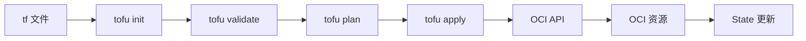

# apply 与 destroy 的内部机制

点击 apply 之后，OpenTofu 在背后到底做了什么？

## 核心要点

* apply 会向 OCI API 发送 create/update 请求，OCI 异步准备资源，Provider 等待完成，OpenTofu 把真实 OCID 和属性写回 State
* OpenTofu 会对比“代码引用、State、OCI 实际状态”三者，计算下一次的差异
* destroy 大致按依赖图的逆序发出删除请求；非空 Bucket、卷挂载、数据库状态、保护设置、外部依赖都可能导致删除失败

---

## 本章测验

本章共 5 道单项选择题。

### 第 1 题

apply 执行时，OpenTofu 最终会把真实的 OCID 和属性写到哪里？

- A. .tf 配置文件，覆盖原有代码
- B. 只打印在终端，不做任何持久化
- C. State 文件
- D. Provider 的本地缓存目录，State 不会更新

选择答案后查看结果

正确答案：C

答案解析：文档描述 apply 会向 OCI API 发送请求，OCI 异步准备资源，Provider 等待完成后，OpenTofu 把真实 OCID 和属性写入 State。

### 第 2 题

下一次 plan 计算差异时，OpenTofu 会对比哪三者？

- A. 只对比代码本身的两个版本
- B. 只对比 State 文件的两个历史版本
- C. 只对比 OCI 控制台的两次截图
- D. 代码引用、State、OCI 实际状态

选择答案后查看结果

正确答案：D

答案解析：文档明确说明是“代码引用、State、OCI”三者比较来计算下一次的差异，而不是只比较其中某一方的历史记录。

### 第 3 题

destroy 删除资源的顺序大致遵循什么规律？

- A. 依赖图的逆序
- B. 完全随机的顺序
- C. 严格按照文件名字母顺序
- D. 总是从最后一个创建的资源开始，但顺序与依赖关系无关

选择答案后查看结果

正确答案：A

答案解析：文档说明 destroy 大致按照依赖图的逆序发出删除请求，这与依赖图创建时的正向顺序相反。

### 第 4 题

以下哪种情况最可能导致 destroy 失败？

- A. 资源本身已经是 count=0 的状态
- B. Object Storage 的 Bucket 中仍然存有对象，没有清空
- C. 该资源从未被成功创建过
- D. 资源标签使用了中文字符

选择答案后查看结果

正确答案：B

答案解析：非空 Bucket 是文档中明确提到的典型删除失败场景之一，需要先清空 Object 才能删除 Bucket。

### 第 5 题

为什么说“OCI 外部手动添加的依赖”会给 destroy 带来风险？

- A. 因为这类依赖会自动被 OpenTofu 转换成新的 resource 块
- B. 因为 OCI 会强制禁止任何手动操作
- C. 因为这些依赖不在代码和 State 的追踪范围内，OpenTofu 无法预先知道它们的存在
- D. 因为这种情况在实际使用中从不会发生

选择答案后查看结果

正确答案：C

答案解析：文档提到 destroy 时，OCI 外部添加的依赖、删除保护、非同步数据库状态都可能导致代码从表面上无法完全预知，需要手动介入处理。

<!-- QUIZ_DATA_START
{
  "chapter": "11",
  "questions": [
    {
      "id": 1,
      "question": "apply 执行时，OpenTofu 最终会把真实的 OCID 和属性写到哪里？",
      "options": {
        "A": ".tf 配置文件，覆盖原有代码",
        "B": "只打印在终端，不做任何持久化",
        "C": "State 文件",
        "D": "Provider 的本地缓存目录，State 不会更新"
      },
      "answer": "C",
      "explanation": "文档描述 apply 会向 OCI API 发送请求，OCI 异步准备资源，Provider 等待完成后，OpenTofu 把真实 OCID 和属性写入 State。"
    },
    {
      "id": 2,
      "question": "下一次 plan 计算差异时，OpenTofu 会对比哪三者？",
      "options": {
        "A": "只对比代码本身的两个版本",
        "B": "只对比 State 文件的两个历史版本",
        "C": "只对比 OCI 控制台的两次截图",
        "D": "代码引用、State、OCI 实际状态"
      },
      "answer": "D",
      "explanation": "文档明确说明是“代码引用、State、OCI”三者比较来计算下一次的差异，而不是只比较其中某一方的历史记录。"
    },
    {
      "id": 3,
      "question": "destroy 删除资源的顺序大致遵循什么规律？",
      "options": {
        "A": "依赖图的逆序",
        "B": "完全随机的顺序",
        "C": "严格按照文件名字母顺序",
        "D": "总是从最后一个创建的资源开始，但顺序与依赖关系无关"
      },
      "answer": "A",
      "explanation": "文档说明 destroy 大致按照依赖图的逆序发出删除请求，这与依赖图创建时的正向顺序相反。"
    },
    {
      "id": 4,
      "question": "以下哪种情况最可能导致 destroy 失败？",
      "options": {
        "A": "资源本身已经是 count=0 的状态",
        "B": "Object Storage 的 Bucket 中仍然存有对象，没有清空",
        "C": "该资源从未被成功创建过",
        "D": "资源标签使用了中文字符"
      },
      "answer": "B",
      "explanation": "非空 Bucket 是文档中明确提到的典型删除失败场景之一，需要先清空 Object 才能删除 Bucket。"
    },
    {
      "id": 5,
      "question": "为什么说“OCI 外部手动添加的依赖”会给 destroy 带来风险？",
      "options": {
        "A": "因为这类依赖会自动被 OpenTofu 转换成新的 resource 块",
        "B": "因为 OCI 会强制禁止任何手动操作",
        "C": "因为这些依赖不在代码和 State 的追踪范围内，OpenTofu 无法预先知道它们的存在",
        "D": "因为这种情况在实际使用中从不会发生"
      },
      "answer": "C",
      "explanation": "文档提到 destroy 时，OCI 外部添加的依赖、删除保护、非同步数据库状态都可能导致代码从表面上无法完全预知，需要手动介入处理。"
    }
  ]
}
QUIZ_DATA_END -->
