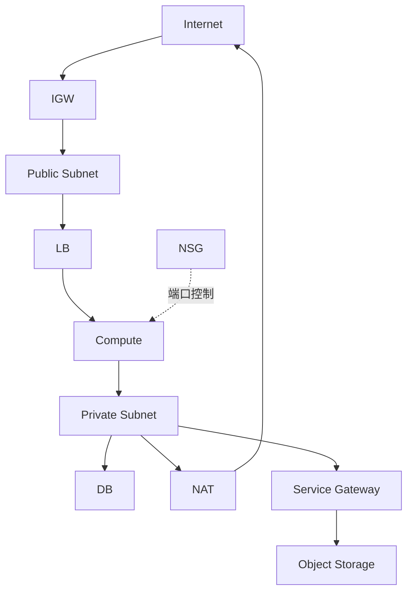

# Network 总览：VCN / Subnet / Gateway

这套网络架构里，流量到底是怎么进出的？

## 核心要点

* VCN 是私有 IP 空间的边界，Subnet 把 VCN 划分成 Public 和 Private 两部分
* Internet Gateway 提供 Public Subnet 的公网出入口，NAT Gateway 只允许 Private Subnet 单向对外访问，Service Gateway 让 Private Subnet 走内网路径访问 OCI 服务（如 Object Storage）
* 创建顺序是 Compartment → VCN → Gateway/Route Table → Subnet → NSG → VNIC；删除时要先断开挂载的 VNIC/LB/Bastion，再依次删除 Subnet、Gateway、VCN

---

## 本章测验

本章共 5 道单项选择题。

### 第 1 题

VCN 的主要作用是什么？

- A. 直接对外提供公网 DNS 解析服务
- B. 自动为所有资源分配公网 IP
- C. 作为存储 Object 的容器
- D. 定义私有 IP 空间的边界

选择答案后查看结果

正确答案：D

答案解析：文档把 VCN 定义为“Private IP 空间的边界”，是网络架构中最基础的隔离单位。

### 第 2 题

NAT Gateway 与 Internet Gateway 的关键区别是什么？

- A. NAT Gateway 只允许 Private Subnet 单向对外访问，Internet Gateway 提供双向的公网出入口
- B. NAT Gateway 比 Internet Gateway 速度更快，但功能完全相同
- C. 两者是完全相同的资源，只是命名不同
- D. Internet Gateway 只能用于 Private Subnet

选择答案后查看结果

正确答案：A

答案解析：Internet Gateway 服务于 Public Subnet 的双向公网访问，NAT Gateway 则专门让 Private Subnet 能够单向发起对外访问，而不接受外部主动连接。

### 第 3 题

Service Gateway 解决的是什么问题？

- A. 让 Public Subnet 拥有更高的带宽上限
- B. 让 Private Subnet 能够通过内网路径访问 OCI 服务，比如 Object Storage
- C. 替代 NSG 完成端口级别的访问控制
- D. 为 Compute 实例自动安装操作系统补丁

选择答案后查看结果

正确答案：B

答案解析：文档说明 Service Gateway 提供的是 Private Subnet 到 OCI Service（如 Object Storage）的私有访问路径，不需要经过公网。

### 第 4 题

按照文档建议的创建顺序，Subnet 应该在哪个环节之后创建？

- A. 在 NSG 和 VNIC 之后
- B. 在 Compartment 之前
- C. 在 Gateway 和 Route Table 之后
- D. 在 Compute 实例创建完成之后

选择答案后查看结果

正确答案：C

答案解析：文档给出的顺序是 Compartment → VCN → Gateway/Route Table → Subnet → NSG → VNIC，Subnet 排在 Gateway/Route Table 之后、NSG 之前。

### 第 5 题

删除网络资源时，为什么必须先断开挂载的 VNIC、LB、Bastion？

- A. 因为 VNIC、LB、Bastion 与网络资源完全没有关联
- B. 因为 OCI 会自动忽略这些依赖，不影响删除
- C. 因为这只是一种可选的优化步骤，不这样做也没有影响
- D. 因为这些资源依赖于 Subnet，如果不先解除依赖，Subnet 和 VCN 就无法被顺利删除

选择答案后查看结果

正确答案：D

答案解析：文档指出删除顺序要先断开挂载在 Subnet 上的 VNIC、LB、Bastion 等依赖资源，然后才能依次删除 Subnet、Gateway、VCN，否则会因为依赖关系而删除失败。

<!-- QUIZ_DATA_START
{
  "chapter": "12",
  "questions": [
    {
      "id": 1,
      "question": "VCN 的主要作用是什么？",
      "options": {
        "A": "直接对外提供公网 DNS 解析服务",
        "B": "自动为所有资源分配公网 IP",
        "C": "作为存储 Object 的容器",
        "D": "定义私有 IP 空间的边界"
      },
      "answer": "D",
      "explanation": "文档把 VCN 定义为“Private IP 空间的边界”，是网络架构中最基础的隔离单位。"
    },
    {
      "id": 2,
      "question": "NAT Gateway 与 Internet Gateway 的关键区别是什么？",
      "options": {
        "A": "NAT Gateway 只允许 Private Subnet 单向对外访问，Internet Gateway 提供双向的公网出入口",
        "B": "NAT Gateway 比 Internet Gateway 速度更快，但功能完全相同",
        "C": "两者是完全相同的资源，只是命名不同",
        "D": "Internet Gateway 只能用于 Private Subnet"
      },
      "answer": "A",
      "explanation": "Internet Gateway 服务于 Public Subnet 的双向公网访问，NAT Gateway 则专门让 Private Subnet 能够单向发起对外访问，而不接受外部主动连接。"
    },
    {
      "id": 3,
      "question": "Service Gateway 解决的是什么问题？",
      "options": {
        "A": "让 Public Subnet 拥有更高的带宽上限",
        "B": "让 Private Subnet 能够通过内网路径访问 OCI 服务，比如 Object Storage",
        "C": "替代 NSG 完成端口级别的访问控制",
        "D": "为 Compute 实例自动安装操作系统补丁"
      },
      "answer": "B",
      "explanation": "文档说明 Service Gateway 提供的是 Private Subnet 到 OCI Service（如 Object Storage）的私有访问路径，不需要经过公网。"
    },
    {
      "id": 4,
      "question": "按照文档建议的创建顺序，Subnet 应该在哪个环节之后创建？",
      "options": {
        "A": "在 NSG 和 VNIC 之后",
        "B": "在 Compartment 之前",
        "C": "在 Gateway 和 Route Table 之后",
        "D": "在 Compute 实例创建完成之后"
      },
      "answer": "C",
      "explanation": "文档给出的顺序是 Compartment → VCN → Gateway/Route Table → Subnet → NSG → VNIC，Subnet 排在 Gateway/Route Table 之后、NSG 之前。"
    },
    {
      "id": 5,
      "question": "删除网络资源时，为什么必须先断开挂载的 VNIC、LB、Bastion？",
      "options": {
        "A": "因为 VNIC、LB、Bastion 与网络资源完全没有关联",
        "B": "因为 OCI 会自动忽略这些依赖，不影响删除",
        "C": "因为这只是一种可选的优化步骤，不这样做也没有影响",
        "D": "因为这些资源依赖于 Subnet，如果不先解除依赖，Subnet 和 VCN 就无法被顺利删除"
      },
      "answer": "D",
      "explanation": "文档指出删除顺序要先断开挂载在 Subnet 上的 VNIC、LB、Bastion 等依赖资源，然后才能依次删除 Subnet、Gateway、VCN，否则会因为依赖关系而删除失败。"
    }
  ]
}
QUIZ_DATA_END -->
