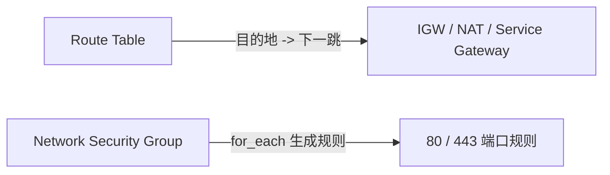

# Route Table 与 NSG

路由规则和安全组规则具体是怎么写的？

## 核心要点

* Route Table 定义“目的地（destination）→ 下一跳（next hop）”的对应关系，主要参数包括 compartment_id、vcn_id、cidr_block、route_table_id 和 Gateway 的 network_entity_id
* NSG 是基于 VNIC 的有状态防火墙，本项目用 for_each 为 80、443 端口分别生成规则，用 dynamic 生成可选的 Service Gateway 路由
* 常见错误：CIDR 重叠、Subnet 范围超出 VCN、Route 目的地重复、Service CIDR 与 Region 不匹配、依赖的 VNIC 仍然残留

---

## 本章测验

本章共 5 道单项选择题。

### 第 1 题

Route Table 的核心作用是什么？

- A. 定义目的地和下一跳网络实体之间的对应关系
- B. 直接为 Compute 实例分配公网 IP
- C. 存储 Object Storage 中的静态文件
- D. 自动为所有子网生成 NSG 规则

选择答案后查看结果

正确答案：A

答案解析：文档明确 Route Table 的角色是“Destination 与 Next Hop 的对应关系”，负责指导流量该往哪个网络出口走。

### 第 2 题

NSG 属于哪一种类型的防火墙？

- A. 基于整个 Region 的无状态防火墙
- B. 基于 VNIC 的有状态（Stateful）防火墙
- C. 只能应用于 Object Storage 的访问控制
- D. 一种仅在 destroy 阶段生效的安全机制

选择答案后查看结果

正确答案：B

答案解析：文档把 NSG 描述为“VNIC 单位的 Stateful Firewall”，是绑定在网络接口上的有状态安全组。

### 第 3 题

本项目中，为 80 和 443 端口分别生成 NSG 规则用的是什么语法？

- A. 直接手写两条完全独立、互不相关的 resource 块
- B. count 加上固定数字 2
- C. for_each
- D. dynamic 块嵌套三层

选择答案后查看结果

正确答案：C

答案解析：根据前面语法章节的内容，这种“为集合中每个稳定 Key 分别创建资源”的场景正是 for_each 的典型用法，项目用它为 80、443 端口分别生成规则。

### 第 4 题

以下哪一项不属于文档中列出的典型网络错误？

- A. CIDR 地址段重叠
- B. Subnet 范围超出所属 VCN 的地址范围
- C. Route 目的地重复
- D. Compute 实例的操作系统版本过旧

选择答案后查看结果

正确答案：D

答案解析：文档列出的典型错误集中在网络配置层面：CIDR 重叠、Subnet 超出范围、Route 目的地重复、Service CIDR 与 Region 不匹配、依赖 VNIC 残留，操作系统版本问题不在此列，属于 Compute 相关话题。

### 第 5 题

如果删除 VCN 时报错提示存在依赖的 VNIC，最可能的原因和解决方向是什么？

- A. 还有资源挂在这个网络上，需要先清理这些依赖资源
- B. 这是系统随机产生的错误，多试几次即可自动消失
- C. 需要立刻重新创建整个 Tenancy
- D. VNIC 报错与 VCN 删除完全无关，可以忽略

选择答案后查看结果

正确答案：A

答案解析：文档明确提到典型错误包括“依赖 VNIC 残存”，说明还有资源挂在网络上，需要先处理这些依赖，才能顺利完成删除。

<!-- QUIZ_DATA_START
{
  "chapter": "13",
  "questions": [
    {
      "id": 1,
      "question": "Route Table 的核心作用是什么？",
      "options": {
        "A": "定义目的地和下一跳网络实体之间的对应关系",
        "B": "直接为 Compute 实例分配公网 IP",
        "C": "存储 Object Storage 中的静态文件",
        "D": "自动为所有子网生成 NSG 规则"
      },
      "answer": "A",
      "explanation": "文档明确 Route Table 的角色是“Destination 与 Next Hop 的对应关系”，负责指导流量该往哪个网络出口走。"
    },
    {
      "id": 2,
      "question": "NSG 属于哪一种类型的防火墙？",
      "options": {
        "A": "基于整个 Region 的无状态防火墙",
        "B": "基于 VNIC 的有状态（Stateful）防火墙",
        "C": "只能应用于 Object Storage 的访问控制",
        "D": "一种仅在 destroy 阶段生效的安全机制"
      },
      "answer": "B",
      "explanation": "文档把 NSG 描述为“VNIC 单位的 Stateful Firewall”，是绑定在网络接口上的有状态安全组。"
    },
    {
      "id": 3,
      "question": "本项目中，为 80 和 443 端口分别生成 NSG 规则用的是什么语法？",
      "options": {
        "A": "直接手写两条完全独立、互不相关的 resource 块",
        "B": "count 加上固定数字 2",
        "C": "for_each",
        "D": "dynamic 块嵌套三层"
      },
      "answer": "C",
      "explanation": "根据前面语法章节的内容，这种“为集合中每个稳定 Key 分别创建资源”的场景正是 for_each 的典型用法，项目用它为 80、443 端口分别生成规则。"
    },
    {
      "id": 4,
      "question": "以下哪一项不属于文档中列出的典型网络错误？",
      "options": {
        "A": "CIDR 地址段重叠",
        "B": "Subnet 范围超出所属 VCN 的地址范围",
        "C": "Route 目的地重复",
        "D": "Compute 实例的操作系统版本过旧"
      },
      "answer": "D",
      "explanation": "文档列出的典型错误集中在网络配置层面：CIDR 重叠、Subnet 超出范围、Route 目的地重复、Service CIDR 与 Region 不匹配、依赖 VNIC 残留，操作系统版本问题不在此列，属于 Compute 相关话题。"
    },
    {
      "id": 5,
      "question": "如果删除 VCN 时报错提示存在依赖的 VNIC，最可能的原因和解决方向是什么？",
      "options": {
        "A": "还有资源挂在这个网络上，需要先清理这些依赖资源",
        "B": "这是系统随机产生的错误，多试几次即可自动消失",
        "C": "需要立刻重新创建整个 Tenancy",
        "D": "VNIC 报错与 VCN 删除完全无关，可以忽略"
      },
      "answer": "A",
      "explanation": "文档明确提到典型错误包括“依赖 VNIC 残存”，说明还有资源挂在网络上，需要先处理这些依赖，才能顺利完成删除。"
    }
  ]
}
QUIZ_DATA_END -->
