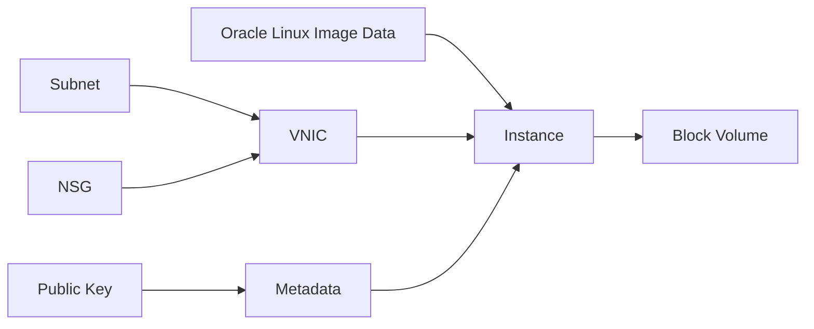

# Compute 实例

一台虚拟机是怎么从镜像、网卡、密钥拼装出来的？

## 核心要点

* 资源类型是 `oci_core_instance`，主要参数包括 availability_domain、shape、shape_config、source_details、create_vnic_details、metadata
* Compute、Boot Volume、公网 IPv4、出站流量都可能产生费用；即使是 Free Tier 对应的 Shape，也要确认账户余量、区域容量、镜像兼容性，本项目默认禁用 Compute
* 创建时需要设置 enable_compute=true 并配置 SSH 公钥，确认 plan 中的 Shape/Boot Volume/公网 IP；典型错误包括容量不足、Shape 在该可用区未提供、镜像不兼容、配额超限、SSH 密钥错误

---

## 本章测验

本章共 5 道单项选择题。

### 第 1 题

创建 Compute 实例使用的资源类型是什么？

- A. oci_core_vcn
- B. oci_core_instance
- C. oci_objectstorage_bucket
- D. oci_database_autonomous_database

选择答案后查看结果

正确答案：B

答案解析：文档明确说明 Compute Instance 对应的 OpenTofu 资源类型是 `oci_core_instance`。

### 第 2 题

以下哪一项不属于创建 Compute 实例的主要参数？

- A. availability_domain
- B. shape
- C. backend_set_policy（负载均衡后端集策略）
- D. create_vnic_details

选择答案后查看结果

正确答案：C

答案解析：backend_set_policy 属于 Load Balancer 模块的概念，不是 Compute 实例本身的主要参数；Compute 的主要参数是 availability_domain、shape、shape_config、source_details、create_vnic_details、metadata。

### 第 3 题

为什么文档强调“Free Tier 对应的 Shape 也不一定完全免费”？

- A. 因为 Free Tier 这个概念在 OCI 中根本不存在
- B. 因为只有付费账户才能创建任何 Compute 实例
- C. 因为 Free Tier 只对 Object Storage 有效，对 Compute 完全无效
- D. 因为还要看账户残余额度、区域容量、镜像兼容性等具体条件

选择答案后查看结果

正确答案：D

答案解析：文档提醒“本 Lab 的 E4 Flex 不一定免费”，需要确认账户残量、区域容量、镜像对应情况，Free Tier 的条件因账户和区域而变化。

### 第 4 题

本项目对 Compute 资源的默认设置是什么？

- A. 默认禁用（enable_compute 需要显式设为 true）
- B. 默认启用，且无法关闭
- C. 默认只在特定小时段自动启用
- D. 默认启用但强制免费

选择答案后查看结果

正确答案：A

答案解析：文档说明启用 Compute 需要显式设置 enable_compute=true，并配置 SSH 公钥，说明其默认状态是关闭的，这也是本 Lab“高费用资源默认禁用”原则的体现。

### 第 5 题

删除挂载了额外 Block Volume 的 Compute 实例前，应该先做什么？

- A. 直接删除 Compute 实例，Volume 会被自动一并清除且不会出错
- B. 先解除额外的 Volume Attachment
- C. 先删除整个 VCN
- D. 先把 Region 切换到另一个区域

选择答案后查看结果

正确答案：B

答案解析：文档提醒删除时需要先解除额外的 Volume Attachment，否则会因为依赖关系而导致删除失败，这与前面 Destroy 内部机制章节讲的依赖清理原则是一致的。

<!-- QUIZ_DATA_START
{
  "chapter": "14",
  "questions": [
    {
      "id": 1,
      "question": "创建 Compute 实例使用的资源类型是什么？",
      "options": {
        "A": "oci_core_vcn",
        "B": "oci_core_instance",
        "C": "oci_objectstorage_bucket",
        "D": "oci_database_autonomous_database"
      },
      "answer": "B",
      "explanation": "文档明确说明 Compute Instance 对应的 OpenTofu 资源类型是 `oci_core_instance`。"
    },
    {
      "id": 2,
      "question": "以下哪一项不属于创建 Compute 实例的主要参数？",
      "options": {
        "A": "availability_domain",
        "B": "shape",
        "C": "backend_set_policy（负载均衡后端集策略）",
        "D": "create_vnic_details"
      },
      "answer": "C",
      "explanation": "backend_set_policy 属于 Load Balancer 模块的概念，不是 Compute 实例本身的主要参数；Compute 的主要参数是 availability_domain、shape、shape_config、source_details、create_vnic_details、metadata。"
    },
    {
      "id": 3,
      "question": "为什么文档强调“Free Tier 对应的 Shape 也不一定完全免费”？",
      "options": {
        "A": "因为 Free Tier 这个概念在 OCI 中根本不存在",
        "B": "因为只有付费账户才能创建任何 Compute 实例",
        "C": "因为 Free Tier 只对 Object Storage 有效，对 Compute 完全无效",
        "D": "因为还要看账户残余额度、区域容量、镜像兼容性等具体条件"
      },
      "answer": "D",
      "explanation": "文档提醒“本 Lab 的 E4 Flex 不一定免费”，需要确认账户残量、区域容量、镜像对应情况，Free Tier 的条件因账户和区域而变化。"
    },
    {
      "id": 4,
      "question": "本项目对 Compute 资源的默认设置是什么？",
      "options": {
        "A": "默认禁用（enable_compute 需要显式设为 true）",
        "B": "默认启用，且无法关闭",
        "C": "默认只在特定小时段自动启用",
        "D": "默认启用但强制免费"
      },
      "answer": "A",
      "explanation": "文档说明启用 Compute 需要显式设置 enable_compute=true，并配置 SSH 公钥，说明其默认状态是关闭的，这也是本 Lab“高费用资源默认禁用”原则的体现。"
    },
    {
      "id": 5,
      "question": "删除挂载了额外 Block Volume 的 Compute 实例前，应该先做什么？",
      "options": {
        "A": "直接删除 Compute 实例，Volume 会被自动一并清除且不会出错",
        "B": "先解除额外的 Volume Attachment",
        "C": "先删除整个 VCN",
        "D": "先把 Region 切换到另一个区域"
      },
      "answer": "B",
      "explanation": "文档提醒删除时需要先解除额外的 Volume Attachment，否则会因为依赖关系而导致删除失败，这与前面 Destroy 内部机制章节讲的依赖清理原则是一致的。"
    }
  ]
}
QUIZ_DATA_END -->
