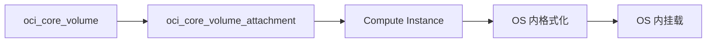

# Block Volume

独立于实例存在的磁盘，创建之后还需要做什么？

## 核心要点

* Block Volume 类似 AWS 的 EBS、Azure 的 Managed Disks，是独立于实例、可单独保留的块存储
* 资源类型是 `oci_core_volume` 和 `oci_core_volume_attachment`，主要参数包括可用区、容量、VPU、实例 OCID、挂载类型
* OpenTofu 完成 Attach 之后并不会自动格式化或挂载文件系统，仍需要在操作系统内手动确认设备、创建文件系统、执行挂载

---

## 本章测验

本章共 5 道单项选择题。

### 第 1 题

Block Volume 大致相当于 AWS 和 Azure 的哪个概念？

- A. AWS 的 S3 和 Azure 的 Blob Storage
- B. AWS 的 EC2 和 Azure 的 Virtual Machines
- C. AWS 的 EBS 和 Azure 的 Managed Disks
- D. AWS 的 RDS 和 Azure 的 SQL Database

选择答案后查看结果

正确答案：C

答案解析：文档明确把 Block Volume 对应到 AWS EBS、Azure Managed Disks，都是独立于计算实例存在的块存储服务。

### 第 2 题

创建并挂载 Block Volume 需要用到哪两个资源类型？

- A. oci_objectstorage_bucket 和 oci_core_instance
- B. oci_core_vcn 和 oci_core_subnet
- C. oci_kms_vault 和 oci_kms_key
- D. oci_core_volume 和 oci_core_volume_attachment

选择答案后查看结果

正确答案：D

答案解析：文档明确列出创建 Block Volume 使用 `oci_core_volume`，挂载到实例上使用 `oci_core_volume_attachment`。

### 第 3 题

OpenTofu 完成 Attach 操作之后，磁盘是否已经可以直接存放数据？

- A. 不能，还需要在操作系统内手动格式化并挂载文件系统
- B. 可以，Attach 完成后数据可以直接写入，无需任何额外操作
- C. 不能，因为 Attach 操作本身就会失败
- D. 可以，但只能存放只读文件

选择答案后查看结果

正确答案：A

答案解析：文档特别强调 OpenTofu 完成 Volume Attach 后不会自动 Format/Mount，操作系统层面仍需要手动确认设备、创建文件系统、执行挂载才能真正使用。

### 第 4 题

为什么本项目默认禁用 Block Volume？

- A. 因为 Block Volume 在技术上无法与 Compute 实例配合使用
- B. 因为容量和性能相关的使用会产生费用
- C. 因为 Block Volume 只能在特定国家使用
- D. 因为 Block Volume 与 OpenTofu 完全不兼容

选择答案后查看结果

正确答案：B

答案解析：文档说明 Block Volume 会“根据容量和性能产生费用”，因此和 Compute、Load Balancer、Database 等一样，被列为默认禁用的资源。

### 第 5 题

如果删除 Block Volume 时遇到失败，应该重点检查什么？

- A. 直接检查 Object Storage 的 Bucket 权限
- B. 检查 DNS Zone 是否已经完成委任
- C. Attachment 状态以及操作系统层面的 I/O 情况
- D. 检查 Notifications Topic 是否已经确认订阅

选择答案后查看结果

正确答案：C

答案解析：文档提示“删除失败时确认 Attachment 与 OS I/O”，这是 Block Volume 相关问题排查的重点，而不是 Object Storage 或 DNS 相关内容。

<!-- QUIZ_DATA_START
{
  "chapter": "15",
  "questions": [
    {
      "id": 1,
      "question": "Block Volume 大致相当于 AWS 和 Azure 的哪个概念？",
      "options": {
        "A": "AWS 的 S3 和 Azure 的 Blob Storage",
        "B": "AWS 的 EC2 和 Azure 的 Virtual Machines",
        "C": "AWS 的 EBS 和 Azure 的 Managed Disks",
        "D": "AWS 的 RDS 和 Azure 的 SQL Database"
      },
      "answer": "C",
      "explanation": "文档明确把 Block Volume 对应到 AWS EBS、Azure Managed Disks，都是独立于计算实例存在的块存储服务。"
    },
    {
      "id": 2,
      "question": "创建并挂载 Block Volume 需要用到哪两个资源类型？",
      "options": {
        "A": "oci_objectstorage_bucket 和 oci_core_instance",
        "B": "oci_core_vcn 和 oci_core_subnet",
        "C": "oci_kms_vault 和 oci_kms_key",
        "D": "oci_core_volume 和 oci_core_volume_attachment"
      },
      "answer": "D",
      "explanation": "文档明确列出创建 Block Volume 使用 `oci_core_volume`，挂载到实例上使用 `oci_core_volume_attachment`。"
    },
    {
      "id": 3,
      "question": "OpenTofu 完成 Attach 操作之后，磁盘是否已经可以直接存放数据？",
      "options": {
        "A": "不能，还需要在操作系统内手动格式化并挂载文件系统",
        "B": "可以，Attach 完成后数据可以直接写入，无需任何额外操作",
        "C": "不能，因为 Attach 操作本身就会失败",
        "D": "可以，但只能存放只读文件"
      },
      "answer": "A",
      "explanation": "文档特别强调 OpenTofu 完成 Volume Attach 后不会自动 Format/Mount，操作系统层面仍需要手动确认设备、创建文件系统、执行挂载才能真正使用。"
    },
    {
      "id": 4,
      "question": "为什么本项目默认禁用 Block Volume？",
      "options": {
        "A": "因为 Block Volume 在技术上无法与 Compute 实例配合使用",
        "B": "因为容量和性能相关的使用会产生费用",
        "C": "因为 Block Volume 只能在特定国家使用",
        "D": "因为 Block Volume 与 OpenTofu 完全不兼容"
      },
      "answer": "B",
      "explanation": "文档说明 Block Volume 会“根据容量和性能产生费用”，因此和 Compute、Load Balancer、Database 等一样，被列为默认禁用的资源。"
    },
    {
      "id": 5,
      "question": "如果删除 Block Volume 时遇到失败，应该重点检查什么？",
      "options": {
        "A": "直接检查 Object Storage 的 Bucket 权限",
        "B": "检查 DNS Zone 是否已经完成委任",
        "C": "Attachment 状态以及操作系统层面的 I/O 情况",
        "D": "检查 Notifications Topic 是否已经确认订阅"
      },
      "answer": "C",
      "explanation": "文档提示“删除失败时确认 Attachment 与 OS I/O”，这是 Block Volume 相关问题排查的重点，而不是 Object Storage 或 DNS 相关内容。"
    }
  ]
}
QUIZ_DATA_END -->
