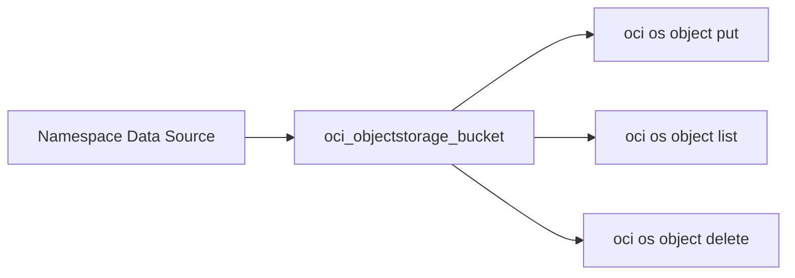

# Object Storage

以 Bucket / Key 形式保存对象的存储服务是怎么配置的？

## 核心要点

* Object Storage 对应 AWS S3、Azure Blob Storage，资源类型是 `oci_objectstorage_bucket`，主要参数是 Namespace、Bucket 名称、存储层级、访问类型、版本控制
* 本项目采用 NoPublicAccess、关闭版本控制、开启 Object Event，费用重点在存储容量、请求次数、下载流量、以及版本控制带来的历史版本累积
* 创建顺序是先查询 Namespace 这个 Data Source，再创建 Bucket；删除前必须清空所有 Object、未完成的分段上传、以及所有对象版本

---

## 本章测验

本章共 5 道单项选择题。

### 第 1 题

Object Storage 大致对应 AWS 和 Azure 的哪个服务？

- A. AWS 的 EBS 和 Azure 的 Managed Disks
- B. AWS 的 RDS 和 Azure 的 SQL Database
- C. AWS 的 Route 53 和 Azure 的 DNS
- D. AWS 的 S3 和 Azure 的 Blob Storage

选择答案后查看结果

正确答案：D

答案解析：文档把 Object Storage 对应到 AWS S3 和 Azure Blob Storage，都是以 Bucket/Key 形式保存对象的存储服务。

### 第 2 题

创建 Bucket 之前，通常需要先查询哪个 Data Source？

- A. Namespace
- B. Availability Domain 列表
- C. Route Table
- D. NSG 规则集合

选择答案后查看结果

正确答案：A

答案解析：文档说明创建顺序是“Namespace Data Source → Bucket”，需要先获取 Namespace 才能正确创建 Bucket。

### 第 3 题

本项目对 Object Storage 的默认安全设置是怎样的？

- A. 完全公开访问，任何人都可以直接下载
- B. NoPublicAccess，且版本控制处于关闭状态
- C. 默认开启版本控制且不可关闭
- D. 默认要求所有对象都必须加密两次

选择答案后查看结果

正确答案：B

答案解析：文档明确说明本 Lab 使用 NoPublicAccess，Versioning 无效，同时开启 Object Event。

### 第 4 题

删除一个非空的 Bucket 会发生什么？

- A. Bucket 会连同其中的对象一起被自动强制删除，不会报错
- B. 只会删除 Bucket 的元数据，对象本身会保留在原地
- C. 删除会失败，需要先清空所有 Object、未完成的分段上传和对象版本
- D. 系统会自动把对象转移到另一个新建的 Bucket 中

选择答案后查看结果

正确答案：C

答案解析：文档明确说明删除顺序是要先清空全部 Object、Multipart Upload、Object Version，之后才能删除 Bucket，非空 Bucket 是典型的删除失败原因。

### 第 5 题

对于 Object Storage 的费用，文档提醒重点关注的不是 Bucket 本身，而是什么？

- A. Bucket 的显示名称长度
- B. 创建 Bucket 时选择的地区时区设置
- C. Bucket 的创建时间是白天还是夜间
- D. 存储容量、请求次数、下载流量，以及版本控制带来的历史版本增加

选择答案后查看结果

正确答案：D

答案解析：文档提醒“比起 Bucket 自身，更要注意保存容量、Request、Retrieval、Outbound Traffic、以及版本控制导致的世代增加”这些实际产生费用的因素。

<!-- QUIZ_DATA_START
{
  "chapter": "16",
  "questions": [
    {
      "id": 1,
      "question": "Object Storage 大致对应 AWS 和 Azure 的哪个服务？",
      "options": {
        "A": "AWS 的 EBS 和 Azure 的 Managed Disks",
        "B": "AWS 的 RDS 和 Azure 的 SQL Database",
        "C": "AWS 的 Route 53 和 Azure 的 DNS",
        "D": "AWS 的 S3 和 Azure 的 Blob Storage"
      },
      "answer": "D",
      "explanation": "文档把 Object Storage 对应到 AWS S3 和 Azure Blob Storage，都是以 Bucket/Key 形式保存对象的存储服务。"
    },
    {
      "id": 2,
      "question": "创建 Bucket 之前，通常需要先查询哪个 Data Source？",
      "options": {
        "A": "Namespace",
        "B": "Availability Domain 列表",
        "C": "Route Table",
        "D": "NSG 规则集合"
      },
      "answer": "A",
      "explanation": "文档说明创建顺序是“Namespace Data Source → Bucket”，需要先获取 Namespace 才能正确创建 Bucket。"
    },
    {
      "id": 3,
      "question": "本项目对 Object Storage 的默认安全设置是怎样的？",
      "options": {
        "A": "完全公开访问，任何人都可以直接下载",
        "B": "NoPublicAccess，且版本控制处于关闭状态",
        "C": "默认开启版本控制且不可关闭",
        "D": "默认要求所有对象都必须加密两次"
      },
      "answer": "B",
      "explanation": "文档明确说明本 Lab 使用 NoPublicAccess，Versioning 无效，同时开启 Object Event。"
    },
    {
      "id": 4,
      "question": "删除一个非空的 Bucket 会发生什么？",
      "options": {
        "A": "Bucket 会连同其中的对象一起被自动强制删除，不会报错",
        "B": "只会删除 Bucket 的元数据，对象本身会保留在原地",
        "C": "删除会失败，需要先清空所有 Object、未完成的分段上传和对象版本",
        "D": "系统会自动把对象转移到另一个新建的 Bucket 中"
      },
      "answer": "C",
      "explanation": "文档明确说明删除顺序是要先清空全部 Object、Multipart Upload、Object Version，之后才能删除 Bucket，非空 Bucket 是典型的删除失败原因。"
    },
    {
      "id": 5,
      "question": "对于 Object Storage 的费用，文档提醒重点关注的不是 Bucket 本身，而是什么？",
      "options": {
        "A": "Bucket 的显示名称长度",
        "B": "创建 Bucket 时选择的地区时区设置",
        "C": "Bucket 的创建时间是白天还是夜间",
        "D": "存储容量、请求次数、下载流量，以及版本控制带来的历史版本增加"
      },
      "answer": "D",
      "explanation": "文档提醒“比起 Bucket 自身，更要注意保存容量、Request、Retrieval、Outbound Traffic、以及版本控制导致的世代增加”这些实际产生费用的因素。"
    }
  ]
}
QUIZ_DATA_END -->
