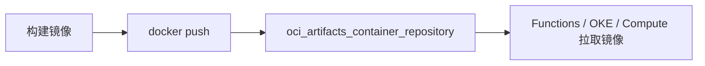

# Container Registry

容器镜像仓库在这套架构里扮演什么角色？

## 核心要点

* OCIR（Container Registry）用于保存 OCI 镜像，并分发给 Functions、OKE、Compute 等使用，对应 AWS ECR、Azure Container Registry
* 资源类型是 `oci_artifacts_container_repository`，主要参数是 display_name、is_public、is_immutable
* 本项目将仓库设置为 private、可变（非 immutable），且不会真的推送镜像；需要关注存储、数据传输以及漏洞扫描等相关费用

---

## 本章测验

本章共 5 道单项选择题。

### 第 1 题

Container Registry 主要用来做什么？

- A. 保存 OCI 镜像，并分发给 Functions、OKE、Compute 等服务使用
- B. 直接托管虚拟机操作系统镜像用于 Compute 启动
- C. 存储 Object Storage 的 Bucket 元数据
- D. 管理 VCN 内部的路由规则

选择答案后查看结果

正确答案：A

答案解析：文档说明 OCIR 保存 OCI Image，并将其分发给 Functions、OKE、Compute 等服务，这是它的核心定位。

### 第 2 题

Container Registry 大致对应 AWS 和 Azure 的哪个服务？

- A. AWS 的 Lambda 和 Azure 的 Functions
- B. AWS 的 ECR 和 Azure 的 Container Registry
- C. AWS 的 IAM 和 Azure 的 Active Directory
- D. AWS 的 CloudFront 和 Azure 的 CDN

选择答案后查看结果

正确答案：B

答案解析：文档明确把 Container Registry 对应到 AWS ECR 和 Azure Container Registry，都是容器镜像仓库服务。

### 第 3 题

创建仓库使用的资源类型和主要参数分别是什么？

- A. `oci_core_instance`，主要参数是 shape 和 image_id
- B. `oci_objectstorage_bucket`，主要参数是 namespace 和 storage_tier
- C. `oci_artifacts_container_repository`，主要参数是 display_name、is_public、is_immutable
- D. `oci_kms_vault`，主要参数是 vault_type

选择答案后查看结果

正确答案：C

答案解析：文档列出资源类型为 `oci_artifacts_container_repository`，主要参数是 display_name、is_public、is_immutable。

### 第 4 题

本项目对 Container Registry 的默认配置是怎样的？

- A. 公开（public）且不可变（immutable），并已推送了示例镜像
- B. 完全禁用，代码中不涉及任何相关资源
- C. 只允许通过 Web 控制台手动创建，代码中无法涉及
- D. 私有（private）且可变（非 immutable），并且不会真正推送镜像

选择答案后查看结果

正确答案：D

答案解析：文档说明本 Lab 将仓库设置为 private、mutable，并且不会真的 push 镜像，属于默认启用但保持轻量、无实际内容的配置。

### 第 5 题

使用 Container Registry 需要额外关注哪些费用相关的因素？

- A. 存储、数据传输，以及漏洞扫描等相关费用
- B. 仅需要关注仓库的显示名称长度限制
- C. 只需要关注创建仓库的时间点
- D. 不需要关注任何费用，Container Registry 永远免费

选择答案后查看结果

正确答案：A

答案解析：文档提到需要确认 Storage、Data Transfer、Vulnerability Scan 等费用，这些都是实际使用中可能产生成本的因素。

<!-- QUIZ_DATA_START
{
  "chapter": "17",
  "questions": [
    {
      "id": 1,
      "question": "Container Registry 主要用来做什么？",
      "options": {
        "A": "保存 OCI 镜像，并分发给 Functions、OKE、Compute 等服务使用",
        "B": "直接托管虚拟机操作系统镜像用于 Compute 启动",
        "C": "存储 Object Storage 的 Bucket 元数据",
        "D": "管理 VCN 内部的路由规则"
      },
      "answer": "A",
      "explanation": "文档说明 OCIR 保存 OCI Image，并将其分发给 Functions、OKE、Compute 等服务，这是它的核心定位。"
    },
    {
      "id": 2,
      "question": "Container Registry 大致对应 AWS 和 Azure 的哪个服务？",
      "options": {
        "A": "AWS 的 Lambda 和 Azure 的 Functions",
        "B": "AWS 的 ECR 和 Azure 的 Container Registry",
        "C": "AWS 的 IAM 和 Azure 的 Active Directory",
        "D": "AWS 的 CloudFront 和 Azure 的 CDN"
      },
      "answer": "B",
      "explanation": "文档明确把 Container Registry 对应到 AWS ECR 和 Azure Container Registry，都是容器镜像仓库服务。"
    },
    {
      "id": 3,
      "question": "创建仓库使用的资源类型和主要参数分别是什么？",
      "options": {
        "A": "`oci_core_instance`，主要参数是 shape 和 image_id",
        "B": "`oci_objectstorage_bucket`，主要参数是 namespace 和 storage_tier",
        "C": "`oci_artifacts_container_repository`，主要参数是 display_name、is_public、is_immutable",
        "D": "`oci_kms_vault`，主要参数是 vault_type"
      },
      "answer": "C",
      "explanation": "文档列出资源类型为 `oci_artifacts_container_repository`，主要参数是 display_name、is_public、is_immutable。"
    },
    {
      "id": 4,
      "question": "本项目对 Container Registry 的默认配置是怎样的？",
      "options": {
        "A": "公开（public）且不可变（immutable），并已推送了示例镜像",
        "B": "完全禁用，代码中不涉及任何相关资源",
        "C": "只允许通过 Web 控制台手动创建，代码中无法涉及",
        "D": "私有（private）且可变（非 immutable），并且不会真正推送镜像"
      },
      "answer": "D",
      "explanation": "文档说明本 Lab 将仓库设置为 private、mutable，并且不会真的 push 镜像，属于默认启用但保持轻量、无实际内容的配置。"
    },
    {
      "id": 5,
      "question": "使用 Container Registry 需要额外关注哪些费用相关的因素？",
      "options": {
        "A": "存储、数据传输，以及漏洞扫描等相关费用",
        "B": "仅需要关注仓库的显示名称长度限制",
        "C": "只需要关注创建仓库的时间点",
        "D": "不需要关注任何费用，Container Registry 永远免费"
      },
      "answer": "A",
      "explanation": "文档提到需要确认 Storage、Data Transfer、Vulnerability Scan 等费用，这些都是实际使用中可能产生成本的因素。"
    }
  ]
}
QUIZ_DATA_END -->
