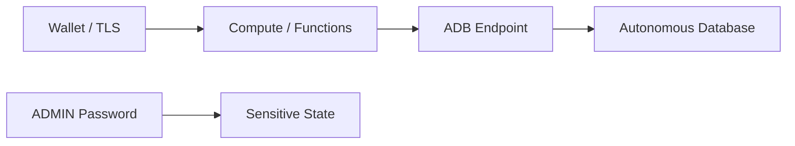

# Autonomous Database

全自动运维的 Oracle 数据库，配置时要注意什么？

## 核心要点

* Autonomous Database 自动完成打补丁、备份、调优等运维工作，位于应用的私有数据层，目的上类似 AWS RDS/Aurora、Azure SQL，但 Engine 和运维模型并不相同
* 资源类型是 `oci_database_autonomous_database`，主要参数是 db_name、db_workload、CPU、Storage、admin_password、Free Tier 指定；本项目配置为 1 OCPU/1 TB、关闭 Auto Scaling，希望使用 Free Tier，但指定并不等于保证免费
* 密码必须写在不进 Git 管理的 terraform.tfvars 中；由于配额、区域可用性、账户已有数据库数量等因素，本项目默认禁用该资源

---

## 本章测验

本章共 5 道单项选择题。

### 第 1 题

Autonomous Database 与 AWS RDS/Aurora、Azure SQL 的关系是？

- A. 三者是完全一样的产品，只是名字不同
- B. 目的类似，但 Engine 和运维模型并不完全相同
- C. Autonomous Database 是 RDS 的一个内部子模块
- D. 两者没有任何可比性，属于完全不同的类别

选择答案后查看结果

正确答案：B

答案解析：文档特别强调“目的相似，但 Engine 和运维模式不是同一件事”，这与前面 AWS/Azure 对照章节的原则一致。

### 第 2 题

创建 Autonomous Database 使用的主要参数不包括以下哪一项？

- A. db_name
- B. db_workload
- C. vcn_cidr（VCN 的 CIDR 地址段）
- D. admin_password

选择答案后查看结果

正确答案：C

答案解析：vcn_cidr 是 Network 模块的参数，Autonomous Database 的主要参数是 db_name、db_workload、CPU、Storage、admin_password、Free Tier 指定。

### 第 3 题

指定 Free Tier 是否等于一定免费？

- A. 等于，只要在代码里写了 Free Tier 就绝对不会产生任何费用
- B. 等于，Free Tier 是全局统一保证，与账户状态无关
- C. 这个问题在 Autonomous Database 场景下没有意义
- D. 不等于，指定只是希望使用 Free Tier，具体仍取决于账户的 Always Free 额度等条件

选择答案后查看结果

正确答案：D

答案解析：文档明确指出“指定了 Free Tier 也不保证一定免费”，需要确认账户的 Always Free 额度、区域、已有数据库数量、配额等条件。

### 第 4 题

admin_password 这个敏感值应该放在哪里管理？

- A. 不进 Git 版本控制的 terraform.tfvars 文件中
- B. 直接硬编码写进模块的 main.tf 文件并提交到仓库
- C. 以明文形式写在 README 里方便查阅
- D. 写在 Provider 的 alias 名称里

选择答案后查看结果

正确答案：A

答案解析：文档提醒创建前需要在不进 Git 管理的 terraform.tfvars 中指定密码，避免密码泄露到版本控制历史中。

### 第 5 题

为什么本项目默认禁用 Autonomous Database？

- A. 因为 OCI 目前完全不提供 Autonomous Database 这个服务
- B. 因为需要确认账户的 Always Free 额度、区域、已有数据库和配额情况，费用风险较高
- C. 因为该资源在语法上还不被 OpenTofu 支持
- D. 因为它与 Compute 模块存在语法冲突，无法共存

选择答案后查看结果

正确答案：B

答案解析：文档说明由于需要确认账户的 Always Free 枠、Region、既存 DB、Quota，这类高费用风险资源被列为默认禁用，需要用户显式开启。

<!-- QUIZ_DATA_START
{
  "chapter": "18",
  "questions": [
    {
      "id": 1,
      "question": "Autonomous Database 与 AWS RDS/Aurora、Azure SQL 的关系是？",
      "options": {
        "A": "三者是完全一样的产品，只是名字不同",
        "B": "目的类似，但 Engine 和运维模型并不完全相同",
        "C": "Autonomous Database 是 RDS 的一个内部子模块",
        "D": "两者没有任何可比性，属于完全不同的类别"
      },
      "answer": "B",
      "explanation": "文档特别强调“目的相似，但 Engine 和运维模式不是同一件事”，这与前面 AWS/Azure 对照章节的原则一致。"
    },
    {
      "id": 2,
      "question": "创建 Autonomous Database 使用的主要参数不包括以下哪一项？",
      "options": {
        "A": "db_name",
        "B": "db_workload",
        "C": "vcn_cidr（VCN 的 CIDR 地址段）",
        "D": "admin_password"
      },
      "answer": "C",
      "explanation": "vcn_cidr 是 Network 模块的参数，Autonomous Database 的主要参数是 db_name、db_workload、CPU、Storage、admin_password、Free Tier 指定。"
    },
    {
      "id": 3,
      "question": "指定 Free Tier 是否等于一定免费？",
      "options": {
        "A": "等于，只要在代码里写了 Free Tier 就绝对不会产生任何费用",
        "B": "等于，Free Tier 是全局统一保证，与账户状态无关",
        "C": "这个问题在 Autonomous Database 场景下没有意义",
        "D": "不等于，指定只是希望使用 Free Tier，具体仍取决于账户的 Always Free 额度等条件"
      },
      "answer": "D",
      "explanation": "文档明确指出“指定了 Free Tier 也不保证一定免费”，需要确认账户的 Always Free 额度、区域、已有数据库数量、配额等条件。"
    },
    {
      "id": 4,
      "question": "admin_password 这个敏感值应该放在哪里管理？",
      "options": {
        "A": "不进 Git 版本控制的 terraform.tfvars 文件中",
        "B": "直接硬编码写进模块的 main.tf 文件并提交到仓库",
        "C": "以明文形式写在 README 里方便查阅",
        "D": "写在 Provider 的 alias 名称里"
      },
      "answer": "A",
      "explanation": "文档提醒创建前需要在不进 Git 管理的 terraform.tfvars 中指定密码，避免密码泄露到版本控制历史中。"
    },
    {
      "id": 5,
      "question": "为什么本项目默认禁用 Autonomous Database？",
      "options": {
        "A": "因为 OCI 目前完全不提供 Autonomous Database 这个服务",
        "B": "因为需要确认账户的 Always Free 额度、区域、已有数据库和配额情况，费用风险较高",
        "C": "因为该资源在语法上还不被 OpenTofu 支持",
        "D": "因为它与 Compute 模块存在语法冲突，无法共存"
      },
      "answer": "B",
      "explanation": "文档说明由于需要确认账户的 Always Free 枠、Region、既存 DB、Quota，这类高费用风险资源被列为默认禁用，需要用户显式开启。"
    }
  ]
}
QUIZ_DATA_END -->
