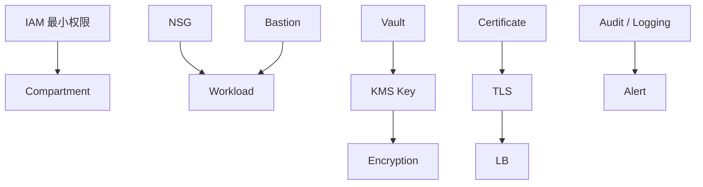

# Vault 与 Key Management

密钥管理边界和实际加密用的密钥，是两个不同的概念吗？

## 核心要点

* Vault 是密钥的管理边界，KMS Key 是真正用于加密操作的密钥材料逻辑资源，类似 AWS KMS、Azure Key Vault
* 资源类型是 `oci_kms_vault` 和 `oci_kms_key`，主要参数包括 Vault Type、Management Endpoint、算法、密钥长度、保护模式
* 由于存在计费和删除等待期，本项目默认禁用；删除时要先禁用/预约删除 Key，并确认没有依赖资源仍在引用它

---

## 本章测验

本章共 5 道单项选择题。

### 第 1 题

Vault 和 KMS Key 之间最准确的关系描述是什么？

- A. Vault 和 Key 是完全相同的资源类型，只是叫法不同
- B. Key 是比 Vault 更高层级的边界，Vault 包含在 Key 内部
- C. Vault 只用于存储密码，Key 只用于存储证书
- D. Vault 是密钥的管理边界，Key 是实际用于加密操作的密钥材料逻辑资源

选择答案后查看结果

正确答案：D

答案解析：文档明确区分：Vault 是“Key 的管理境界”，KMS Key 是“暗号化操作に使う Key Material 的逻辑 Resource”，二者层级不同。

### 第 2 题

创建 Vault 与 Key 使用的资源类型分别是什么？

- A. oci_kms_vault 和 oci_kms_key
- B. oci_core_vcn 和 oci_core_subnet
- C. oci_objectstorage_bucket 和 oci_core_volume
- D. oci_bastion_bastion 和 oci_dns_zone

选择答案后查看结果

正确答案：A

答案解析：文档列出资源类型为 `oci_kms_vault` 和 `oci_kms_key`，分别对应管理边界和实际密钥材料。

### 第 3 题

Vault/Key 大致对应 AWS 和 Azure 的哪个服务？

- A. AWS 的 IAM 和 Azure 的 Active Directory
- B. AWS 的 KMS 和 Azure 的 Key Vault
- C. AWS 的 CloudTrail 和 Azure 的 Activity Log
- D. AWS 的 Route 53 和 Azure 的 DNS

选择答案后查看结果

正确答案：B

答案解析：文档说明 Vault/Key 类似 AWS KMS、Azure Key Vault，都是密钥管理服务。

### 第 4 题

为什么本项目默认禁用 Vault/Key？

- A. 因为 Vault/Key 目前在所有区域都不可用
- B. 因为该资源会自动删除所有其它已创建的资源
- C. 因为存在相关计费，而且删除时有等待期
- D. 因为 Vault/Key 与 OpenTofu 的 Provider 版本不兼容

选择答案后查看结果

正确答案：C

答案解析：文档提到 Vault/Key 涉及“课金与删除待機”，属于需要谨慎对待的资源，所以默认禁用，需要用户明确知晓相关成本再开启。

### 第 5 题

删除 Key 之前需要确认什么？

- A. 直接删除即可，不需要任何前置检查
- B. 只需要确认 Key 的显示名称拼写正确
- C. 只需要确认 Region 与 Provider 配置一致即可，无需检查依赖
- D. 先禁用或预约删除 Key，并确认没有依赖资源仍在引用它

选择答案后查看结果

正确答案：D

答案解析：文档提示要“先无效化・削除予约 Key，并确认依赖资源没有在引用它”，这与其它资源删除前检查依赖的原则是一致的。

<!-- QUIZ_DATA_START
{
  "chapter": "20",
  "questions": [
    {
      "id": 1,
      "question": "Vault 和 KMS Key 之间最准确的关系描述是什么？",
      "options": {
        "A": "Vault 和 Key 是完全相同的资源类型，只是叫法不同",
        "B": "Key 是比 Vault 更高层级的边界，Vault 包含在 Key 内部",
        "C": "Vault 只用于存储密码，Key 只用于存储证书",
        "D": "Vault 是密钥的管理边界，Key 是实际用于加密操作的密钥材料逻辑资源"
      },
      "answer": "D",
      "explanation": "文档明确区分：Vault 是“Key 的管理境界”，KMS Key 是“暗号化操作に使う Key Material 的逻辑 Resource”，二者层级不同。"
    },
    {
      "id": 2,
      "question": "创建 Vault 与 Key 使用的资源类型分别是什么？",
      "options": {
        "A": "oci_kms_vault 和 oci_kms_key",
        "B": "oci_core_vcn 和 oci_core_subnet",
        "C": "oci_objectstorage_bucket 和 oci_core_volume",
        "D": "oci_bastion_bastion 和 oci_dns_zone"
      },
      "answer": "A",
      "explanation": "文档列出资源类型为 `oci_kms_vault` 和 `oci_kms_key`，分别对应管理边界和实际密钥材料。"
    },
    {
      "id": 3,
      "question": "Vault/Key 大致对应 AWS 和 Azure 的哪个服务？",
      "options": {
        "A": "AWS 的 IAM 和 Azure 的 Active Directory",
        "B": "AWS 的 KMS 和 Azure 的 Key Vault",
        "C": "AWS 的 CloudTrail 和 Azure 的 Activity Log",
        "D": "AWS 的 Route 53 和 Azure 的 DNS"
      },
      "answer": "B",
      "explanation": "文档说明 Vault/Key 类似 AWS KMS、Azure Key Vault，都是密钥管理服务。"
    },
    {
      "id": 4,
      "question": "为什么本项目默认禁用 Vault/Key？",
      "options": {
        "A": "因为 Vault/Key 目前在所有区域都不可用",
        "B": "因为该资源会自动删除所有其它已创建的资源",
        "C": "因为存在相关计费，而且删除时有等待期",
        "D": "因为 Vault/Key 与 OpenTofu 的 Provider 版本不兼容"
      },
      "answer": "C",
      "explanation": "文档提到 Vault/Key 涉及“课金与删除待機”，属于需要谨慎对待的资源，所以默认禁用，需要用户明确知晓相关成本再开启。"
    },
    {
      "id": 5,
      "question": "删除 Key 之前需要确认什么？",
      "options": {
        "A": "直接删除即可，不需要任何前置检查",
        "B": "只需要确认 Key 的显示名称拼写正确",
        "C": "只需要确认 Region 与 Provider 配置一致即可，无需检查依赖",
        "D": "先禁用或预约删除 Key，并确认没有依赖资源仍在引用它"
      },
      "answer": "D",
      "explanation": "文档提示要“先无效化・削除予约 Key，并确认依赖资源没有在引用它”，这与其它资源删除前检查依赖的原则是一致的。"
    }
  ]
}
QUIZ_DATA_END -->
