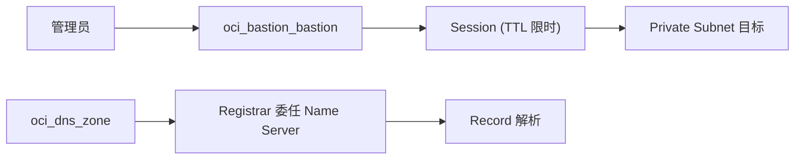

# Bastion 与 DNS

怎么安全地进入 Private Subnet，域名又是怎么被解析的？

## 核心要点

* Bastion 为 Private Subnet 中的目标创建限时 Session 入口，使用 `oci_bastion_bastion`，需要指定 Target Subnet、Client CIDR、TTL，Session 本身是连接时另外创建的资源
* Client CIDR 不应该设置成 0.0.0.0/0；常见失败原因包括 Bastion Plugin/Agent、NSG、目标 IP、IAM 权限、Session TTL
* DNS 使用 `oci_dns_zone` 定义权威 Zone，创建 Zone 本身并不完成互联网委任，还需要在域名注册商处设置 Name Server 才能生效

---

## 本章测验

本章共 5 道单项选择题。

### 第 1 题

Bastion 的主要作用是什么？

- A. 为 Private Subnet 中的目标提供限时的 Session 访问入口
- B. 为公开网站提供内容分发加速
- C. 自动为 Compute 实例安装安全补丁
- D. 作为 Object Storage 的备用存储层

选择答案后查看结果

正确答案：A

答案解析：文档说明 Bastion 是“Private Subnet 的 Target 提供时间限制 Session 的入口”，用于安全地访问私有子网内的资源。

### 第 2 题

配置 Bastion 时，Client CIDR 应该避免设置成什么？

- A. 管理员所在办公网络的具体 CIDR 段
- B. 0.0.0.0/0（对所有来源开放）
- C. 一个明确限定的小范围地址段
- D. 内部跳板机所在子网的 CIDR

选择答案后查看结果

正确答案：B

答案解析：文档明确提醒“Client CIDR を 0.0.0.0/0 にしません”，即不应该把访问来源设置成对所有 IP 开放，这会带来严重的安全风险。

### 第 3 题

Session 资源与 Bastion 资源之间的关系是什么？

- A. Session 与 Bastion 是同一个资源，创建 Bastion 时会自动包含所有未来的 Session
- B. Session 资源完全不需要创建，直接可以连接
- C. Session 是在实际连接时另外创建的资源，与 Bastion 本身分开
- D. Bastion 创建后 Session 永久有效，不受 TTL 限制

选择答案后查看结果

正确答案：C

答案解析：文档说明 Session 资源是在连接时另外创建的，Bastion 本身只是入口，Session 有自己的 TTL 时间限制。

### 第 4 题

DNS 的 `oci_dns_zone` 资源创建完成后，是否意味着域名已经可以在互联网上正常解析？

- A. 是的，创建 Zone 后立刻就能在全球范围内正常解析
- B. 不需要，OCI 会自动帮你联系注册商完成一切设置
- C. 只有付费用户才需要额外设置 Name Server，免费用户不需要
- D. 不是，还需要在域名注册商处设置 Name Server 完成委任

选择答案后查看结果

正确答案：D

答案解析：文档明确指出“仅仅创建 Zone 并不能完成互联网的委任，还需要在 Registrar 处设置 Name Server”，这是很多学习者容易忽略的一步。

### 第 5 题

如果对一个自己并不拥有的域名（如示例中的 example.invalid）创建 DNS Zone，会发生什么？

- A. 无法正常完成解析，因为域名所有权不在自己手中
- B. 系统会自动帮你从原持有者手中转移域名所有权
- C. 只要创建了 Zone，任何域名都能立刻正常解析
- D. OCI 会自动分配一个全新的免费域名替代它

选择答案后查看结果

正确答案：A

答案解析：文档明确提到“不拥有的域名无法完成疏通”，说明 DNS Zone 只是解析规则的容器，域名所有权和委任仍需要在注册商层面配合完成。

<!-- QUIZ_DATA_START
{
  "chapter": "21",
  "questions": [
    {
      "id": 1,
      "question": "Bastion 的主要作用是什么？",
      "options": {
        "A": "为 Private Subnet 中的目标提供限时的 Session 访问入口",
        "B": "为公开网站提供内容分发加速",
        "C": "自动为 Compute 实例安装安全补丁",
        "D": "作为 Object Storage 的备用存储层"
      },
      "answer": "A",
      "explanation": "文档说明 Bastion 是“Private Subnet 的 Target 提供时间限制 Session 的入口”，用于安全地访问私有子网内的资源。"
    },
    {
      "id": 2,
      "question": "配置 Bastion 时，Client CIDR 应该避免设置成什么？",
      "options": {
        "A": "管理员所在办公网络的具体 CIDR 段",
        "B": "0.0.0.0/0（对所有来源开放）",
        "C": "一个明确限定的小范围地址段",
        "D": "内部跳板机所在子网的 CIDR"
      },
      "answer": "B",
      "explanation": "文档明确提醒“Client CIDR を 0.0.0.0/0 にしません”，即不应该把访问来源设置成对所有 IP 开放，这会带来严重的安全风险。"
    },
    {
      "id": 3,
      "question": "Session 资源与 Bastion 资源之间的关系是什么？",
      "options": {
        "A": "Session 与 Bastion 是同一个资源，创建 Bastion 时会自动包含所有未来的 Session",
        "B": "Session 资源完全不需要创建，直接可以连接",
        "C": "Session 是在实际连接时另外创建的资源，与 Bastion 本身分开",
        "D": "Bastion 创建后 Session 永久有效，不受 TTL 限制"
      },
      "answer": "C",
      "explanation": "文档说明 Session 资源是在连接时另外创建的，Bastion 本身只是入口，Session 有自己的 TTL 时间限制。"
    },
    {
      "id": 4,
      "question": "DNS 的 `oci_dns_zone` 资源创建完成后，是否意味着域名已经可以在互联网上正常解析？",
      "options": {
        "A": "是的，创建 Zone 后立刻就能在全球范围内正常解析",
        "B": "不需要，OCI 会自动帮你联系注册商完成一切设置",
        "C": "只有付费用户才需要额外设置 Name Server，免费用户不需要",
        "D": "不是，还需要在域名注册商处设置 Name Server 完成委任"
      },
      "answer": "D",
      "explanation": "文档明确指出“仅仅创建 Zone 并不能完成互联网的委任，还需要在 Registrar 处设置 Name Server”，这是很多学习者容易忽略的一步。"
    },
    {
      "id": 5,
      "question": "如果对一个自己并不拥有的域名（如示例中的 example.invalid）创建 DNS Zone，会发生什么？",
      "options": {
        "A": "无法正常完成解析，因为域名所有权不在自己手中",
        "B": "系统会自动帮你从原持有者手中转移域名所有权",
        "C": "只要创建了 Zone，任何域名都能立刻正常解析",
        "D": "OCI 会自动分配一个全新的免费域名替代它"
      },
      "answer": "A",
      "explanation": "文档明确提到“不拥有的域名无法完成疏通”，说明 DNS Zone 只是解析规则的容器，域名所有权和委任仍需要在注册商层面配合完成。"
    }
  ]
}
QUIZ_DATA_END -->
