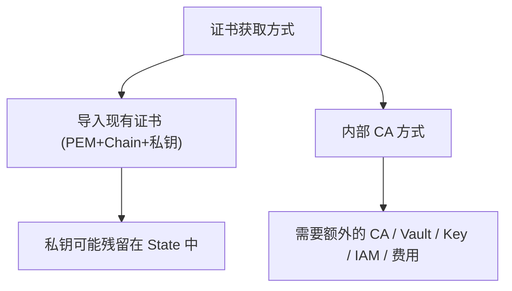

# Certificates：延伸主题

为什么这个项目选择不直接创建证书资源？

## 核心要点

* OCI Certificates 管理 TLS 证书与 CA 的生命周期，类似 AWS Certificate Manager、Azure Key Vault Certificates
* 导入证书方式（`oci_certificates_management_certificate`）需要提供 certificate_pem、证书链、私钥，这些可能会残留在 State 文件中，带来泄露风险
* 内部 CA 方式需要额外的 CA、Vault、Key、IAM 和费用支持；本项目为了避免这些风险，只做概念讲解，把它作为需要拥有域名和 Secret Backend 支撑的扩展课题

---

## 本章测验

本章共 5 道单项选择题。

### 第 1 题

OCI Certificates 大致对应 AWS 和 Azure 的哪个服务？

- A. AWS S3 和 Azure Blob Storage
- B. AWS Certificate Manager 和 Azure Key Vault Certificates
- C. AWS RDS 和 Azure SQL Database
- D. AWS Route 53 和 Azure DNS

选择答案后查看结果

正确答案：B

答案解析：文档明确把 OCI Certificates 对应到 AWS Certificate Manager、Azure Key Vault Certificates，都是负责证书生命周期管理的服务。

### 第 2 题

采用导入证书方式时，`certificate_pem` 等敏感数据可能带来什么风险？

- A. 会导致 Provider 版本自动降级
- B. 会让所有 NSG 规则失效
- C. 私钥等敏感内容可能残留在 State 文件中
- D. 会自动把证书公开发布到互联网

选择答案后查看结果

正确答案：C

答案解析：文档明确警告导入证书需要 certificate_pem、Chain、私钥，而这些内容“可能残留在 State 中”，是需要谨慎处理的安全风险点。

### 第 3 题

采用内部 CA 方式创建证书，需要额外准备哪些资源？

- A. 不需要任何额外资源，直接免费自动生成
- B. 只需要一个 Object Storage Bucket 即可完成全部工作
- C. 只需要修改 Provider 版本号就可以自动获得证书
- D. 额外的 CA、Vault、Key、IAM 和相应的费用支持

选择答案后查看结果

正确答案：D

答案解析：文档指出“内部 CA 方式は別途 CA、Vault、Key、IAM、料金が必要”，说明这种方式涉及的资源和成本相对复杂。

### 第 4 题

本项目对 Certificates 采取的态度是什么？

- A. 不创建真实资源，只做概念和扩展步骤的文档讲解
- B. 默认启用并自动完成证书导入的全部流程
- C. 完全从文档中移除，不做任何介绍
- D. 强制要求每个学习者必须自己申请一张真实证书才能继续学习

选择答案后查看结果

正确答案：A

答案解析：文档明确说明由于风险原因，本 Lab 不创建真实的 Certificates 资源，而是把它作为文档层面的概念讲解和拓展课题。

### 第 5 题

如果要把 Certificates 作为扩展课题去实践，文档建议先准备什么？

- A. 随便使用任意他人的域名即可开始
- B. 自己实际拥有的域名，以及配套的 Secret Backend
- C. 不需要任何准备，直接在本项目基础上运行即可自动生成
- D. 只需要提升账户的付费等级即可自动获得证书

选择答案后查看结果

正确答案：B

答案解析：文档中提到扩展课题是“所有 Domain と Secret Backend を用意し、OCI Certificates + HTTPS Listener を安全に追加する”，说明需要先具备真实域名所有权和安全的 Secret 存储方案。

<!-- QUIZ_DATA_START
{
  "chapter": "22",
  "questions": [
    {
      "id": 1,
      "question": "OCI Certificates 大致对应 AWS 和 Azure 的哪个服务？",
      "options": {
        "A": "AWS S3 和 Azure Blob Storage",
        "B": "AWS Certificate Manager 和 Azure Key Vault Certificates",
        "C": "AWS RDS 和 Azure SQL Database",
        "D": "AWS Route 53 和 Azure DNS"
      },
      "answer": "B",
      "explanation": "文档明确把 OCI Certificates 对应到 AWS Certificate Manager、Azure Key Vault Certificates，都是负责证书生命周期管理的服务。"
    },
    {
      "id": 2,
      "question": "采用导入证书方式时，`certificate_pem` 等敏感数据可能带来什么风险？",
      "options": {
        "A": "会导致 Provider 版本自动降级",
        "B": "会让所有 NSG 规则失效",
        "C": "私钥等敏感内容可能残留在 State 文件中",
        "D": "会自动把证书公开发布到互联网"
      },
      "answer": "C",
      "explanation": "文档明确警告导入证书需要 certificate_pem、Chain、私钥，而这些内容“可能残留在 State 中”，是需要谨慎处理的安全风险点。"
    },
    {
      "id": 3,
      "question": "采用内部 CA 方式创建证书，需要额外准备哪些资源？",
      "options": {
        "A": "不需要任何额外资源，直接免费自动生成",
        "B": "只需要一个 Object Storage Bucket 即可完成全部工作",
        "C": "只需要修改 Provider 版本号就可以自动获得证书",
        "D": "额外的 CA、Vault、Key、IAM 和相应的费用支持"
      },
      "answer": "D",
      "explanation": "文档指出“内部 CA 方式は別途 CA、Vault、Key、IAM、料金が必要”，说明这种方式涉及的资源和成本相对复杂。"
    },
    {
      "id": 4,
      "question": "本项目对 Certificates 采取的态度是什么？",
      "options": {
        "A": "不创建真实资源，只做概念和扩展步骤的文档讲解",
        "B": "默认启用并自动完成证书导入的全部流程",
        "C": "完全从文档中移除，不做任何介绍",
        "D": "强制要求每个学习者必须自己申请一张真实证书才能继续学习"
      },
      "answer": "A",
      "explanation": "文档明确说明由于风险原因，本 Lab 不创建真实的 Certificates 资源，而是把它作为文档层面的概念讲解和拓展课题。"
    },
    {
      "id": 5,
      "question": "如果要把 Certificates 作为扩展课题去实践，文档建议先准备什么？",
      "options": {
        "A": "随便使用任意他人的域名即可开始",
        "B": "自己实际拥有的域名，以及配套的 Secret Backend",
        "C": "不需要任何准备，直接在本项目基础上运行即可自动生成",
        "D": "只需要提升账户的付费等级即可自动获得证书"
      },
      "answer": "B",
      "explanation": "文档中提到扩展课题是“所有 Domain と Secret Backend を用意し、OCI Certificates + HTTPS Listener を安全に追加する”，说明需要先具备真实域名所有权和安全的 Secret 存储方案。"
    }
  ]
}
QUIZ_DATA_END -->
