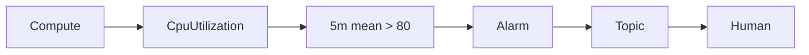

# Monitoring

系统的 CPU 用量是怎么一步步变成一条报警短信的？

## 核心要点

* OCI Monitoring 以时间序列保存和查询 Metric，当查询满足阈值条件时触发 Alarm，对应 AWS CloudWatch Metrics/Alarms、Azure Monitor Metrics/Alerts
* 本项目的 `oci_monitoring_alarm` 监控 oci_computeagent 命名空间下 `CpuUtilization[5m].mean() > 80`，并发送到 Notifications Topic；Compute 关闭时 Alarm 也会设置为 is_enabled=false
* 创建后可在控制台 Metric Explorer 中确认维度和数据点；如果 Alarm 迟迟不触发，需要检查资源是否真的在发布指标、以及 Namespace/Compartment/Dimension/Interval 是否匹配

---

## 本章测验

本章共 5 道单项选择题。

### 第 1 题

OCI Monitoring 的核心工作机制是什么？

- A. 直接扫描代码文件中的语法错误
- B. 自动重启所有处于异常状态的 Compute 实例
- C. 以时间序列保存和查询 Metric，当查询满足阈值条件时触发 Alarm
- D. 将所有日志内容原样转发到 Object Storage

选择答案后查看结果

正确答案：C

答案解析：文档说明 OCI Monitoring 是“Metric を時系列で保存・照会し、Query が閾値を満たすと Alarm を発火する”，这正是它的核心工作机制。

### 第 2 题

本项目中 Alarm 监控的具体查询条件是什么？

- A. Object Storage 的存储容量超过 80%
- B. 网络出站流量五分钟内超过 80 Mbps
- C. 数据库连接数超过 80 个
- D. oci_computeagent 命名空间下 CpuUtilization 五分钟平均值超过 80

选择答案后查看结果

正确答案：D

答案解析：文档明确给出查询表达式 `CpuUtilization[5m].mean() > 80`，命名空间是 oci_computeagent，这是本项目 Alarm 的具体监控条件。

### 第 3 题

当 Compute 处于禁用状态时，本项目的 Alarm 会怎样处理？

- A. 同步设置为 is_enabled=false
- B. Alarm 会继续保持启用状态并持续报警
- C. Alarm 资源会被自动转换成 Logging 资源
- D. 系统会自动创建一个新的 Compute 实例来满足监控需求

选择答案后查看结果

正确答案：A

答案解析：文档说明“Compute 無効時は Alarm も is_enabled=false にします”，即两者的启用状态是联动的，避免对不存在的资源产生无意义的报警。

### 第 4 题

如果 Alarm 迟迟没有变成 FIRING 状态，应该重点检查什么？

- A. 直接检查 Object Storage 的访问权限设置
- B. 资源是否真的在发布对应指标，以及 Namespace/Compartment/Dimension/Interval 是否匹配
- C. 检查 DNS Zone 是否已经完成委任
- D. 检查 Container Registry 的镜像标签是否正确

选择答案后查看结果

正确答案：B

答案解析：文档给出的排查方向是确认资源是否发布了 Metric，以及 Namespace、Compartment、Dimension、Interval 这些参数是否正确匹配，这些都是 Monitoring 相关的检查点。

### 第 5 题

Alarm 触发后，通知是通过什么方式送达的？

- A. 直接写入 Object Storage 的一个新对象
- B. 自动生成一份 PDF 报告发送到管理员邮箱附件
- C. 发送到 Notifications Topic
- D. 触发 Autonomous Database 的自动扩容

选择答案后查看结果

正确答案：C

答案解析：图中显示流程是 Compute → Metric → Query → Alarm → Topic → Human，说明 Alarm 触发后的下一步是发送到 Notifications Topic，再由 Topic 分发。

<!-- QUIZ_DATA_START
{
  "chapter": "23",
  "questions": [
    {
      "id": 1,
      "question": "OCI Monitoring 的核心工作机制是什么？",
      "options": {
        "A": "直接扫描代码文件中的语法错误",
        "B": "自动重启所有处于异常状态的 Compute 实例",
        "C": "以时间序列保存和查询 Metric，当查询满足阈值条件时触发 Alarm",
        "D": "将所有日志内容原样转发到 Object Storage"
      },
      "answer": "C",
      "explanation": "文档说明 OCI Monitoring 是“Metric を時系列で保存・照会し、Query が閾値を満たすと Alarm を発火する”，这正是它的核心工作机制。"
    },
    {
      "id": 2,
      "question": "本项目中 Alarm 监控的具体查询条件是什么？",
      "options": {
        "A": "Object Storage 的存储容量超过 80%",
        "B": "网络出站流量五分钟内超过 80 Mbps",
        "C": "数据库连接数超过 80 个",
        "D": "oci_computeagent 命名空间下 CpuUtilization 五分钟平均值超过 80"
      },
      "answer": "D",
      "explanation": "文档明确给出查询表达式 `CpuUtilization[5m].mean() > 80`，命名空间是 oci_computeagent，这是本项目 Alarm 的具体监控条件。"
    },
    {
      "id": 3,
      "question": "当 Compute 处于禁用状态时，本项目的 Alarm 会怎样处理？",
      "options": {
        "A": "同步设置为 is_enabled=false",
        "B": "Alarm 会继续保持启用状态并持续报警",
        "C": "Alarm 资源会被自动转换成 Logging 资源",
        "D": "系统会自动创建一个新的 Compute 实例来满足监控需求"
      },
      "answer": "A",
      "explanation": "文档说明“Compute 無効時は Alarm も is_enabled=false にします”，即两者的启用状态是联动的，避免对不存在的资源产生无意义的报警。"
    },
    {
      "id": 4,
      "question": "如果 Alarm 迟迟没有变成 FIRING 状态，应该重点检查什么？",
      "options": {
        "A": "直接检查 Object Storage 的访问权限设置",
        "B": "资源是否真的在发布对应指标，以及 Namespace/Compartment/Dimension/Interval 是否匹配",
        "C": "检查 DNS Zone 是否已经完成委任",
        "D": "检查 Container Registry 的镜像标签是否正确"
      },
      "answer": "B",
      "explanation": "文档给出的排查方向是确认资源是否发布了 Metric，以及 Namespace、Compartment、Dimension、Interval 这些参数是否正确匹配，这些都是 Monitoring 相关的检查点。"
    },
    {
      "id": 5,
      "question": "Alarm 触发后，通知是通过什么方式送达的？",
      "options": {
        "A": "直接写入 Object Storage 的一个新对象",
        "B": "自动生成一份 PDF 报告发送到管理员邮箱附件",
        "C": "发送到 Notifications Topic",
        "D": "触发 Autonomous Database 的自动扩容"
      },
      "answer": "C",
      "explanation": "图中显示流程是 Compute → Metric → Query → Alarm → Topic → Human，说明 Alarm 触发后的下一步是发送到 Notifications Topic，再由 Topic 分发。"
    }
  ]
}
QUIZ_DATA_END -->
