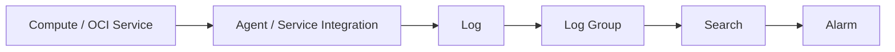

# Logging

日志是怎么被收集、归类、最终可以被搜索到的？

## 核心要点

* OCI Logging 在 Log Group 内管理 Service Log 和 Custom Log，对应 AWS CloudWatch Logs、Azure Monitor Logs/Log Analytics
* 本项目创建 `oci_logging_log_group` 和 `oci_logging_log`，主要参数是显示名称、Log 类型、来源、是否启用、保留时长；只创建 Log 资源并不会自动收集 Compute 的全部日志，还需要 Agent 或服务集成配合
* 确认时要在控制台 Log Search 里对齐时间范围与 Compartment；典型错误是 Agent 权限、来源配置不匹配、时间偏差、Log Group OCID 填错

---

## 本章测验

本章共 5 道单项选择题。

### 第 1 题

OCI Logging 的组织结构是怎样的？

- A. 所有日志都直接存放在 Tenancy 根目录下，没有分组概念
- B. 每条日志单独对应一个独立的 VCN
- C. 日志只能以 Object Storage Bucket 的形式存在
- D. 在 Log Group 内管理 Service Log 和 Custom Log

选择答案后查看结果

正确答案：D

答案解析：文档说明 OCI Logging 是“Log Group 内で Service Log と Custom Log を管理する”，Log Group 是整理和管理日志的基本单位。

### 第 2 题

本项目创建的两个主要资源类型是什么？

- A. oci_logging_log_group 和 oci_logging_log
- B. oci_monitoring_alarm 和 oci_ons_notification_topic
- C. oci_events_rule 和 oci_ons_subscription
- D. oci_core_instance 和 oci_core_volume

选择答案后查看结果

正确答案：A

答案解析：文档明确列出本 Lab 创建的资源是 `oci_logging_log_group` 和 `oci_logging_log`。

### 第 3 题

只创建了 Log 资源，是否意味着 Compute 的全部日志会自动被收集？

- A. 是的，创建 Log 资源后系统会自动收集所有相关日志，无需其它配置
- B. 不是，还需要 Unified Monitoring Agent、Service Log 设置或 Ingestion API 的配合
- C. 不是，因为 Logging 服务在 OCI 中根本不存在
- D. 是的，但仅限于每周日凌晨自动同步一次

选择答案后查看结果

正确答案：B

答案解析：文档特别强调“仅仅创建 Log 资源，并不代表 Compute 的全部日志会自动被收集”，还需要 Agent、Service Log 集成或 Ingestion API 配合才能真正把日志送进来。

### 第 4 题

确认日志是否正确收集，应该在控制台的哪个位置查看？

- A. Object Storage 的 Bucket 列表页面
- B. IAM 的用户权限管理页面
- C. Log Search，并且要对齐时间范围和 Compartment
- D. Compute 实例的 Boot Volume 详情页

选择答案后查看结果

正确答案：C

答案解析：文档说明确认方式是使用控制台的 Log Search，并且要对齐时间范围与 Compartment，才能正确检索到目标日志。

### 第 5 题

以下哪一项不属于文档中列出的典型 Logging 错误？

- A. Agent 的 IAM 权限不足
- B. Source 配置不一致
- C. 时刻偏差
- D. Load Balancer 的健康检查 URL 返回非 200 状态码

选择答案后查看结果

正确答案：D

答案解析：Load Balancer 健康检查返回非 200 属于 Load Balancer 相关的典型错误，Logging 的典型错误是 Agent IAM、Source 设置不一致、时刻偏差、Log Group OCID 填错等。

<!-- QUIZ_DATA_START
{
  "chapter": "24",
  "questions": [
    {
      "id": 1,
      "question": "OCI Logging 的组织结构是怎样的？",
      "options": {
        "A": "所有日志都直接存放在 Tenancy 根目录下，没有分组概念",
        "B": "每条日志单独对应一个独立的 VCN",
        "C": "日志只能以 Object Storage Bucket 的形式存在",
        "D": "在 Log Group 内管理 Service Log 和 Custom Log"
      },
      "answer": "D",
      "explanation": "文档说明 OCI Logging 是“Log Group 内で Service Log と Custom Log を管理する”，Log Group 是整理和管理日志的基本单位。"
    },
    {
      "id": 2,
      "question": "本项目创建的两个主要资源类型是什么？",
      "options": {
        "A": "oci_logging_log_group 和 oci_logging_log",
        "B": "oci_monitoring_alarm 和 oci_ons_notification_topic",
        "C": "oci_events_rule 和 oci_ons_subscription",
        "D": "oci_core_instance 和 oci_core_volume"
      },
      "answer": "A",
      "explanation": "文档明确列出本 Lab 创建的资源是 `oci_logging_log_group` 和 `oci_logging_log`。"
    },
    {
      "id": 3,
      "question": "只创建了 Log 资源，是否意味着 Compute 的全部日志会自动被收集？",
      "options": {
        "A": "是的，创建 Log 资源后系统会自动收集所有相关日志，无需其它配置",
        "B": "不是，还需要 Unified Monitoring Agent、Service Log 设置或 Ingestion API 的配合",
        "C": "不是，因为 Logging 服务在 OCI 中根本不存在",
        "D": "是的，但仅限于每周日凌晨自动同步一次"
      },
      "answer": "B",
      "explanation": "文档特别强调“仅仅创建 Log 资源，并不代表 Compute 的全部日志会自动被收集”，还需要 Agent、Service Log 集成或 Ingestion API 配合才能真正把日志送进来。"
    },
    {
      "id": 4,
      "question": "确认日志是否正确收集，应该在控制台的哪个位置查看？",
      "options": {
        "A": "Object Storage 的 Bucket 列表页面",
        "B": "IAM 的用户权限管理页面",
        "C": "Log Search，并且要对齐时间范围和 Compartment",
        "D": "Compute 实例的 Boot Volume 详情页"
      },
      "answer": "C",
      "explanation": "文档说明确认方式是使用控制台的 Log Search，并且要对齐时间范围与 Compartment，才能正确检索到目标日志。"
    },
    {
      "id": 5,
      "question": "以下哪一项不属于文档中列出的典型 Logging 错误？",
      "options": {
        "A": "Agent 的 IAM 权限不足",
        "B": "Source 配置不一致",
        "C": "时刻偏差",
        "D": "Load Balancer 的健康检查 URL 返回非 200 状态码"
      },
      "answer": "D",
      "explanation": "Load Balancer 健康检查返回非 200 属于 Load Balancer 相关的典型错误，Logging 的典型错误是 Agent IAM、Source 设置不一致、时刻偏差、Log Group OCID 填错等。"
    }
  ]
}
QUIZ_DATA_END -->
