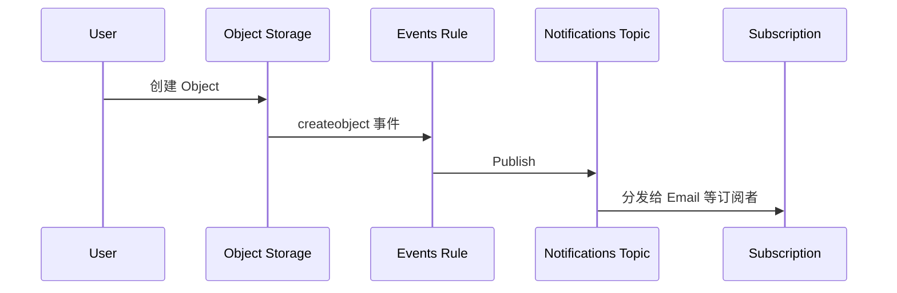

# Events 与 Notifications

一个对象被上传之后，是怎么一路触发到邮件通知的？

## 核心要点

* Events 检测 OCI 资源的状态变化并按条件触发 Action，Notifications 把消息 publish 到 Topic 再分发给 Subscription，对应 AWS EventBridge + SNS、Azure Event Grid + Service Bus
* 本项目用 `oci_events_rule` 检测 Object Storage 的对象创建事件，触发 `oci_ons_notification_topic`；如果 notification_email 为空，订阅相关资源的 count 为 0，因为邮件需要先确认
* Events 主要参数是 condition、Action Type、Topic ID、Enabled；Notifications 主要参数是 Topic 名称、协议、Endpoint；失败排查要关注事件类型是否完全匹配、Rule 所在 Compartment、Action 的 IAM 权限、以及未确认的订阅

---

## 本章测验

本章共 5 道单项选择题。

### 第 1 题

Events 和 Notifications 分别负责什么？

- A. Events 检测资源状态变化并触发 Action，Notifications 把消息发布到 Topic 再分发给订阅者
- B. Events 负责发送邮件，Notifications 负责检测资源状态变化
- C. 两者是完全相同的服务，只是名字不同
- D. Events 只能用于数据库，Notifications 只能用于网络

选择答案后查看结果

正确答案：A

答案解析：文档明确区分：Events 检测状态变化并触发 Action，Notifications 负责把消息 publish 到 Topic 再分发给 Subscription，二者分工不同但配合使用。

### 第 2 题

本项目中，触发 Events Rule 的具体条件是什么？

- A. Compute 实例的 CPU 使用率超过阈值
- B. Object Storage 中有对象被创建
- C. Autonomous Database 完成了一次备份
- D. 有人登录了 OCI 控制台

选择答案后查看结果

正确答案：B

答案解析：文档和时序图都显示触发条件是 Object Storage 的对象创建事件（createobject event）。

### 第 3 题

如果 notification_email 变量为空，会发生什么？

- A. 系统会自动使用管理员的默认邮箱进行订阅
- B. Events Rule 会因此完全无法创建
- C. 相关订阅资源的 count 为 0，也就是不会创建订阅
- D. Topic 会被自动删除

选择答案后查看结果

正确答案：C

答案解析：文档说明“Email は Confirmation が必要なため、notification_email が空なら count=0”，即邮箱为空时相关订阅资源不会被创建。

### 第 4 题

为什么 Email 订阅需要“Confirmation”这一步？

- A. 因为这是 OCI 平台的一个可选装饰性步骤，不确认也完全没有影响
- B. 因为确认步骤只是为了统计邮件打开率
- C. 因为不确认的话该邮箱会被永久拉入黑名单
- D. 因为邮件订阅需要收件人主动确认后才能正式生效

选择答案后查看结果

正确答案：D

答案解析：文档提到 Email 订阅需要 Confirmation，这意味着仅创建订阅资源还不够，收件人需要主动确认邮件才能真正开始接收通知，这也是排查“为什么收不到通知”的常见方向之一。

### 第 5 题

如果配置好了 Events Rule 却没有收到任何通知，排查方向不包括以下哪一项？

- A. 检查 Compute 实例使用的操作系统版本
- B. 检查 Event Type 是否完全一致
- C. 检查 Rule 所在的 Compartment
- D. 检查订阅是否处于未确认状态

选择答案后查看结果

正确答案：A

答案解析：文档给出的排查方向是 Event Type 完全一致性、Rule Compartment、Action IAM 权限、以及未确认的 Subscription，操作系统版本与 Events/Notifications 排查无关。

<!-- QUIZ_DATA_START
{
  "chapter": "25",
  "questions": [
    {
      "id": 1,
      "question": "Events 和 Notifications 分别负责什么？",
      "options": {
        "A": "Events 检测资源状态变化并触发 Action，Notifications 把消息发布到 Topic 再分发给订阅者",
        "B": "Events 负责发送邮件，Notifications 负责检测资源状态变化",
        "C": "两者是完全相同的服务，只是名字不同",
        "D": "Events 只能用于数据库，Notifications 只能用于网络"
      },
      "answer": "A",
      "explanation": "文档明确区分：Events 检测状态变化并触发 Action，Notifications 负责把消息 publish 到 Topic 再分发给 Subscription，二者分工不同但配合使用。"
    },
    {
      "id": 2,
      "question": "本项目中，触发 Events Rule 的具体条件是什么？",
      "options": {
        "A": "Compute 实例的 CPU 使用率超过阈值",
        "B": "Object Storage 中有对象被创建",
        "C": "Autonomous Database 完成了一次备份",
        "D": "有人登录了 OCI 控制台"
      },
      "answer": "B",
      "explanation": "文档和时序图都显示触发条件是 Object Storage 的对象创建事件（createobject event）。"
    },
    {
      "id": 3,
      "question": "如果 notification_email 变量为空，会发生什么？",
      "options": {
        "A": "系统会自动使用管理员的默认邮箱进行订阅",
        "B": "Events Rule 会因此完全无法创建",
        "C": "相关订阅资源的 count 为 0，也就是不会创建订阅",
        "D": "Topic 会被自动删除"
      },
      "answer": "C",
      "explanation": "文档说明“Email は Confirmation が必要なため、notification_email が空なら count=0”，即邮箱为空时相关订阅资源不会被创建。"
    },
    {
      "id": 4,
      "question": "为什么 Email 订阅需要“Confirmation”这一步？",
      "options": {
        "A": "因为这是 OCI 平台的一个可选装饰性步骤，不确认也完全没有影响",
        "B": "因为确认步骤只是为了统计邮件打开率",
        "C": "因为不确认的话该邮箱会被永久拉入黑名单",
        "D": "因为邮件订阅需要收件人主动确认后才能正式生效"
      },
      "answer": "D",
      "explanation": "文档提到 Email 订阅需要 Confirmation，这意味着仅创建订阅资源还不够，收件人需要主动确认邮件才能真正开始接收通知，这也是排查“为什么收不到通知”的常见方向之一。"
    },
    {
      "id": 5,
      "question": "如果配置好了 Events Rule 却没有收到任何通知，排查方向不包括以下哪一项？",
      "options": {
        "A": "检查 Compute 实例使用的操作系统版本",
        "B": "检查 Event Type 是否完全一致",
        "C": "检查 Rule 所在的 Compartment",
        "D": "检查订阅是否处于未确认状态"
      },
      "answer": "A",
      "explanation": "文档给出的排查方向是 Event Type 完全一致性、Rule Compartment、Action IAM 权限、以及未确认的 Subscription，操作系统版本与 Events/Notifications 排查无关。"
    }
  ]
}
QUIZ_DATA_END -->
