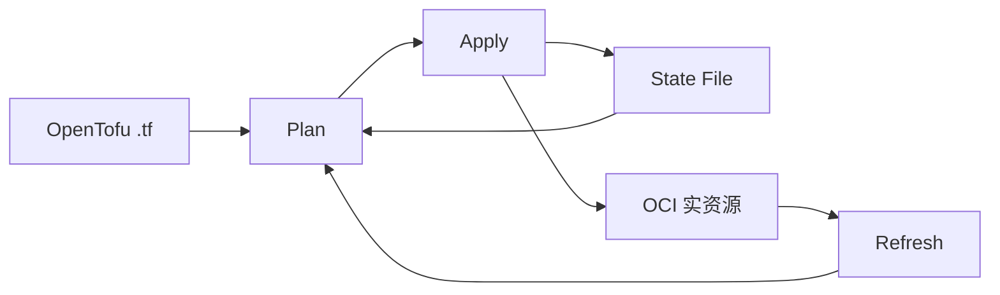

# OpenTofu State

State 文件到底记录了什么，为什么不能随便手动改？

## 核心要点

* State 文件把 OpenTofu 管理的 Address 和 OCI 资源的 OCID/属性对应起来，是 apply 后自动生成和更新的管理数据库，不是像 .tf 那样单纯描述期望状态
* 丢失 State 不会让 OCI 资源自动消失，但 OpenTofu 会失去对应关系，容易出现重复创建或“已存在”的失败；手动编辑 JSON 可能破坏依赖、Schema、Serial、Lineage
* State 可能包含密码、私有端点、生成的密钥等敏感信息，不应提交到 Git；`state list`/`state show`/`import`/`state rm` 各自用途不同，`state rm` 只是取消管理，不会删除 OCI 资源本身

---

## 本章测验

本章共 5 道单项选择题。

### 第 1 题

State 文件的本质是什么？

- A. 跟 .tf 文件功能完全相同，只是文件后缀不同
- B. 记录 OpenTofu 管理的 Address 与 OCI 资源 OCID/属性对应关系的管理数据库
- C. 只是一个纯粹用于展示的日志文件，不参与实际计算
- D. State 文件只在第一次 apply 时使用一次即失效

选择答案后查看结果

正确答案：B

答案解析：文档明确说明 State 是“OpenTofu 管理的地址与 OCI 资源 OCID/属性对应的管理数据库”，与描述期望状态的 .tf 文件角色不同。

### 第 2 题

如果 State 文件丢失，OCI 上已经创建的资源会怎样？

- A. 资源会被 OCI 自动全部清空删除
- B. 资源会自动转移到另一个新的 Tenancy
- C. 资源不会自动消失，但 OpenTofu 会失去与它们的对应关系
- D. State 丢失完全不会造成任何影响，可以直接忽略

选择答案后查看结果

正确答案：C

答案解析：文档明确指出“丧失 State 也不会让 OCI 资源自动消失，但 OpenTofu 会丧失与既有资源的对应关系”，容易导致重复创建或“已存在”类的报错。

### 第 3 题

为什么不建议手动编辑 State 的 JSON 内容？

- A. 因为 JSON 格式在 State 文件中是完全不被支持的
- B. 因为手动编辑会立刻导致所有 OCI 资源被物理删除
- C. 因为 State 文件本身是二进制格式，无法用文本编辑器打开
- D. 可能破坏依赖关系、Provider Schema、Serial、Lineage 等内部结构

选择答案后查看结果

正确答案：D

答案解析：文档提醒手动编辑 JSON 可能破坏 Dependency、Provider Schema、Serial、Lineage 这些内部结构，正确做法是使用备份和专用命令。

### 第 4 题

`tofu state rm` 命令的实际作用是什么？

- A. 把资源从管理对象中移除，但不会删除 OCI 上的实际资源
- B. 直接删除 OCI 上对应的真实资源
- C. 彻底清空整个 State 文件的全部内容
- D. 把资源转移到另一个 Region

选择答案后查看结果

正确答案：A

答案解析：文档明确说明 `state rm` 不会删除 OCI 资源，只是把它从管理对象中移除；如果 .tf 中仍保留对应配置，下一次 plan 可能会提议重新创建。

### 第 5 题

为什么 State 文件不应该提交到 Git？

- A. 因为 Git 平台完全不支持存储 JSON 格式的文件
- B. 因为它可能包含密码、私有端点、生成的密钥等敏感信息
- C. 因为提交 State 文件会导致 .tf 文件自动失效
- D. 因为 State 文件的体积太大，Git 无法处理任何大小的文件

选择答案后查看结果

正确答案：B

答案解析：文档明确提醒 State 可能包含 Password、private endpoint、Generated Secret 等敏感信息，团队协作时应使用带加密、版本控制、访问控制和锁机制的远程 Backend，而不是提交到 Git。

<!-- QUIZ_DATA_START
{
  "chapter": "26",
  "questions": [
    {
      "id": 1,
      "question": "State 文件的本质是什么？",
      "options": {
        "A": "跟 .tf 文件功能完全相同，只是文件后缀不同",
        "B": "记录 OpenTofu 管理的 Address 与 OCI 资源 OCID/属性对应关系的管理数据库",
        "C": "只是一个纯粹用于展示的日志文件，不参与实际计算",
        "D": "State 文件只在第一次 apply 时使用一次即失效"
      },
      "answer": "B",
      "explanation": "文档明确说明 State 是“OpenTofu 管理的地址与 OCI 资源 OCID/属性对应的管理数据库”，与描述期望状态的 .tf 文件角色不同。"
    },
    {
      "id": 2,
      "question": "如果 State 文件丢失，OCI 上已经创建的资源会怎样？",
      "options": {
        "A": "资源会被 OCI 自动全部清空删除",
        "B": "资源会自动转移到另一个新的 Tenancy",
        "C": "资源不会自动消失，但 OpenTofu 会失去与它们的对应关系",
        "D": "State 丢失完全不会造成任何影响，可以直接忽略"
      },
      "answer": "C",
      "explanation": "文档明确指出“丧失 State 也不会让 OCI 资源自动消失，但 OpenTofu 会丧失与既有资源的对应关系”，容易导致重复创建或“已存在”类的报错。"
    },
    {
      "id": 3,
      "question": "为什么不建议手动编辑 State 的 JSON 内容？",
      "options": {
        "A": "因为 JSON 格式在 State 文件中是完全不被支持的",
        "B": "因为手动编辑会立刻导致所有 OCI 资源被物理删除",
        "C": "因为 State 文件本身是二进制格式，无法用文本编辑器打开",
        "D": "可能破坏依赖关系、Provider Schema、Serial、Lineage 等内部结构"
      },
      "answer": "D",
      "explanation": "文档提醒手动编辑 JSON 可能破坏 Dependency、Provider Schema、Serial、Lineage 这些内部结构，正确做法是使用备份和专用命令。"
    },
    {
      "id": 4,
      "question": "`tofu state rm` 命令的实际作用是什么？",
      "options": {
        "A": "把资源从管理对象中移除，但不会删除 OCI 上的实际资源",
        "B": "直接删除 OCI 上对应的真实资源",
        "C": "彻底清空整个 State 文件的全部内容",
        "D": "把资源转移到另一个 Region"
      },
      "answer": "A",
      "explanation": "文档明确说明 `state rm` 不会删除 OCI 资源，只是把它从管理对象中移除；如果 .tf 中仍保留对应配置，下一次 plan 可能会提议重新创建。"
    },
    {
      "id": 5,
      "question": "为什么 State 文件不应该提交到 Git？",
      "options": {
        "A": "因为 Git 平台完全不支持存储 JSON 格式的文件",
        "B": "因为它可能包含密码、私有端点、生成的密钥等敏感信息",
        "C": "因为提交 State 文件会导致 .tf 文件自动失效",
        "D": "因为 State 文件的体积太大，Git 无法处理任何大小的文件"
      },
      "answer": "B",
      "explanation": "文档明确提醒 State 可能包含 Password、private endpoint、Generated Secret 等敏感信息，团队协作时应使用带加密、版本控制、访问控制和锁机制的远程 Backend，而不是提交到 Git。"
    }
  ]
}
QUIZ_DATA_END -->
