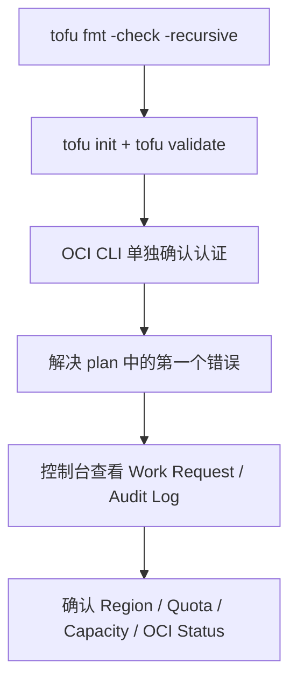

# Troubleshooting

遇到报错的时候，应该按什么顺序去排查？

## 核心要点

* 排查前先记录命令、完整错误信息、资源地址、Region、Provider 版本，并隐去敏感值；`TF_LOG=DEBUG` 可能包含凭证细节，分享前要脱敏
* 常见错误：401 通常是密钥/指纹/时间问题，403 通常是 IAM 权限或 Compartment 错误，QuotaExceeded/LimitExceeded 需要检查配额和限制页面，CIDR 重复、容量不足、镜像不兼容也很常见
* 切分排查顺序：先格式化和 init/validate，再单独用 OCI CLI 确认认证，然后解决 plan 里的第一个错误（后续错误可能是连锁反应），最后看控制台的 Work Request 和 Audit Log

---

## 本章测验

本章共 5 道单项选择题。

### 第 1 题

在排查错误之前，文档建议首先记录哪些信息？

- A. 只需要记录错误发生的具体时间点即可
- B. 只需要截图错误弹窗的颜色和样式
- C. 不需要记录任何信息，直接重新执行 apply 即可
- D. 命令、完整错误信息、资源地址、Region、Provider 版本，并隐去敏感值

选择答案后查看结果

正确答案：D

答案解析：文档明确要求“先记录 Command、完整的 Error、Resource Address、Region、Provider Version，并隐去秘密值”，这是排查问题的第一步。

### 第 2 题

401 NotAuthenticated 错误通常与什么有关？

- A. 密钥、指纹、User、Profile、或时间偏差等认证相关问题
- B. 网络带宽不足导致请求超时
- C. 所选择的 Compute Shape 在当前区域不可用
- D. Object Storage 的 Bucket 名称冲突

选择答案后查看结果

正确答案：A

答案解析：文档的错误对照表把 401 NotAuthenticated 的主要原因归结为 Key、Fingerprint、User、Profile、时刻ずれ（时间偏差）等认证层面的问题。

### 第 3 题

为什么共享 `TF_LOG=DEBUG` 的日志之前要先脱敏？

- A. 因为调试日志的文件格式与普通文本完全不兼容，无法分享
- B. 因为调试日志可能包含凭证和请求细节等敏感信息
- C. 因为调试日志只能在本地查看，任何情况下都无法导出
- D. 因为调试日志会自动加密，分享前需要先解密

选择答案后查看结果

正确答案：B

答案解析：文档提醒 `TF_LOG=DEBUG` 可能包含 Credential/Request Detail，分享前必须先做 sanitize（脱敏）处理，避免泄露敏感信息。

### 第 4 题

按照文档建议的切分排查顺序，第一步应该做什么？

- A. 直接跳过所有前置步骤，立刻联系云服务商客服
- B. 先执行 tofu destroy 清空所有资源后重新开始
- C. 先用 `tofu fmt -check -recursive` 确认语法层面之前的格式问题
- D. 先修改 Provider 的主版本号

选择答案后查看结果

正确答案：C

答案解析：文档给出的切分排查顺序第一步是用 `tofu fmt -check -recursive` 确认格式问题，然后才是 init/validate、OCI CLI 确认认证等后续步骤。

### 第 5 题

如果 plan 输出中出现了多个错误，应该优先处理哪一个？

- A. 应该同时随机处理所有错误，不需要考虑顺序
- B. 应该优先处理列表中的最后一个错误
- C. 应该完全忽略所有错误，直接强行执行 apply
- D. 优先解决第一个错误，因为后续错误可能是连锁反应

选择答案后查看结果

正确答案：D

答案解析：文档提示“解决 plan 的最初 Error，后续 Error 有可能是连锁反应”，说明优先处理第一个错误往往能连带解决后面的报错。

<!-- QUIZ_DATA_START
{
  "chapter": "28",
  "questions": [
    {
      "id": 1,
      "question": "在排查错误之前，文档建议首先记录哪些信息？",
      "options": {
        "A": "只需要记录错误发生的具体时间点即可",
        "B": "只需要截图错误弹窗的颜色和样式",
        "C": "不需要记录任何信息，直接重新执行 apply 即可",
        "D": "命令、完整错误信息、资源地址、Region、Provider 版本，并隐去敏感值"
      },
      "answer": "D",
      "explanation": "文档明确要求“先记录 Command、完整的 Error、Resource Address、Region、Provider Version，并隐去秘密值”，这是排查问题的第一步。"
    },
    {
      "id": 2,
      "question": "401 NotAuthenticated 错误通常与什么有关？",
      "options": {
        "A": "密钥、指纹、User、Profile、或时间偏差等认证相关问题",
        "B": "网络带宽不足导致请求超时",
        "C": "所选择的 Compute Shape 在当前区域不可用",
        "D": "Object Storage 的 Bucket 名称冲突"
      },
      "answer": "A",
      "explanation": "文档的错误对照表把 401 NotAuthenticated 的主要原因归结为 Key、Fingerprint、User、Profile、时刻ずれ（时间偏差）等认证层面的问题。"
    },
    {
      "id": 3,
      "question": "为什么共享 `TF_LOG=DEBUG` 的日志之前要先脱敏？",
      "options": {
        "A": "因为调试日志的文件格式与普通文本完全不兼容，无法分享",
        "B": "因为调试日志可能包含凭证和请求细节等敏感信息",
        "C": "因为调试日志只能在本地查看，任何情况下都无法导出",
        "D": "因为调试日志会自动加密，分享前需要先解密"
      },
      "answer": "B",
      "explanation": "文档提醒 `TF_LOG=DEBUG` 可能包含 Credential/Request Detail，分享前必须先做 sanitize（脱敏）处理，避免泄露敏感信息。"
    },
    {
      "id": 4,
      "question": "按照文档建议的切分排查顺序，第一步应该做什么？",
      "options": {
        "A": "直接跳过所有前置步骤，立刻联系云服务商客服",
        "B": "先执行 tofu destroy 清空所有资源后重新开始",
        "C": "先用 `tofu fmt -check -recursive` 确认语法层面之前的格式问题",
        "D": "先修改 Provider 的主版本号"
      },
      "answer": "C",
      "explanation": "文档给出的切分排查顺序第一步是用 `tofu fmt -check -recursive` 确认格式问题，然后才是 init/validate、OCI CLI 确认认证等后续步骤。"
    },
    {
      "id": 5,
      "question": "如果 plan 输出中出现了多个错误，应该优先处理哪一个？",
      "options": {
        "A": "应该同时随机处理所有错误，不需要考虑顺序",
        "B": "应该优先处理列表中的最后一个错误",
        "C": "应该完全忽略所有错误，直接强行执行 apply",
        "D": "优先解决第一个错误，因为后续错误可能是连锁反应"
      },
      "answer": "D",
      "explanation": "文档提示“解决 plan 的最初 Error，后续 Error 有可能是连锁反应”，说明优先处理第一个错误往往能连带解决后面的报错。"
    }
  ]
}
QUIZ_DATA_END -->
