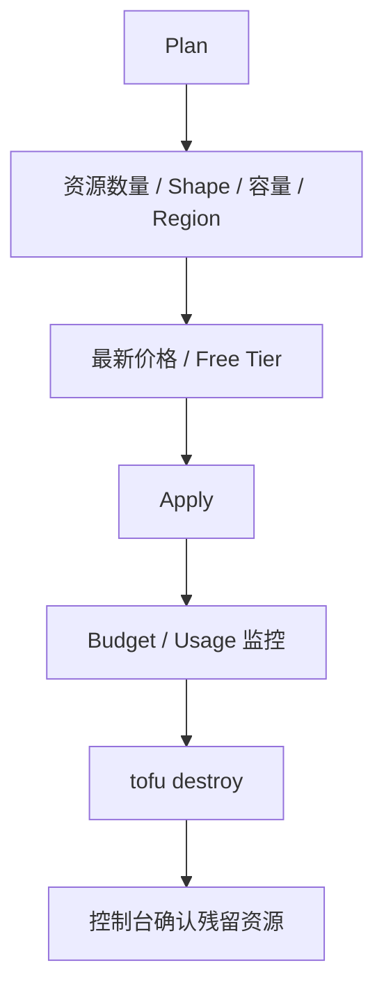

# Cost Guide

哪些资源风险低，哪些资源一不小心就会产生大额费用？

## 核心要点

* 低风险（但不保证一定免费）：Compartment、VCN、Subnet、Route Table、NSG、空的 Notifications Topic/Events Rule/Container Repository
* 可能产生费用：Object Storage 的容量与流量、Logging 的摄取与存储、Monitoring/Notifications/Events 的量、NAT Gateway 的网关与流量、DNS/Bastion/Container Registry 的相关操作
* 高费用风险且默认禁用：Load Balancer（时间/带宽）、Autonomous Database（ECPU/Storage/Backup）、Compute（Shape/Boot Volume/公网 IP）、Block Volume（容量/VPU/Backup）、Vault/Key（版本/操作）

---

## 本章测验

本章共 5 道单项选择题。

### 第 1 题

以下哪一组资源被文档列为“通常低风险，但不保证一定免费”？

- A. Compartment、VCN、Subnet、Route Table、NSG
- B. Load Balancer、Autonomous Database、Compute
- C. Block Volume、Vault/Key、NAT Gateway
- D. Object Storage、Logging、Monitoring

选择答案后查看结果

正确答案：A

答案解析：文档在“低 Risk（无料を保証しない）”部分列出的正是 Compartment、VCN、Subnet、Route Table、NSG，以及空的 Topic/Rule/Repository。

### 第 2 题

NAT Gateway 在成本分类中处于什么位置？

- A. 属于完全免费且没有任何风险的类别
- B. 属于“可能产生费用”的类别，需要在 Plan 时确认最新的网关和数据传输条件
- C. 属于高费用风险且默认禁用的类别
- D. 文档中完全没有提到 NAT Gateway 的费用问题

选择答案后查看结果

正确答案：B

答案解析：文档把 NAT Gateway 归入“课金される可能性”一类，并特别提醒它包含在默认网络配置中，需要在 Plan 时务必确认最新的费用条件。

### 第 3 题

以下哪一项资源被列为高费用注意、且默认禁用？

- A. Compartment
- B. Route Table
- C. Load Balancer
- D. 空的 Notifications Topic

选择答案后查看结果

正确答案：C

答案解析：Load Balancer 在文档的“高费用注意・既定無効”表格中，主要费用驱动因素是时间、带宽、数据传输，且默认禁用。

### 第 4 题

Compute 资源对应的主要费用驱动因素是什么？

- A. Zone/Query 相关操作
- B. Vault/Key Version/Operation
- C. GB 容量与 VPU 性能等级
- D. Shape、Boot Volume、公网 IPv4

选择答案后查看结果

正确答案：D

答案解析：文档在高费用注意表格中，把 Compute 的主要费用 Driver 列为 Shape、Boot Volume、Public IPv4，这与 Block Volume（GB/VPU/Backup）等其它资源的费用驱动因素不同。

### 第 5 题

学习结束后，文档建议采取的清理与确认步骤是什么？

- A. 阅读 `tofu plan -destroy`、执行 `tofu destroy`，并在控制台确认各区域的残留资源、卷、公网 IP、备份、日志、Bucket 对象、Vault 删除预约等
- B. 直接关闭浏览器标签页即可，不需要执行任何命令
- C. 只需要修改账户密码，不需要处理任何云端资源
- D. 只需要删除本地的 .tf 文件，不需要操作 OCI 控制台

选择答案后查看结果

正确答案：A

答案解析：文档明确建议学习后要先读懂 destroy 计划、执行 destroy，然后在控制台按区域确认各类残留资源，包括 Boot/Block Volume、公网 IP、备份、日志、Bucket 对象和 Vault 的删除预约状态，确保不留下持续产生费用的孤儿资源。

<!-- QUIZ_DATA_START
{
  "chapter": "29",
  "questions": [
    {
      "id": 1,
      "question": "以下哪一组资源被文档列为“通常低风险，但不保证一定免费”？",
      "options": {
        "A": "Compartment、VCN、Subnet、Route Table、NSG",
        "B": "Load Balancer、Autonomous Database、Compute",
        "C": "Block Volume、Vault/Key、NAT Gateway",
        "D": "Object Storage、Logging、Monitoring"
      },
      "answer": "A",
      "explanation": "文档在“低 Risk（无料を保証しない）”部分列出的正是 Compartment、VCN、Subnet、Route Table、NSG，以及空的 Topic/Rule/Repository。"
    },
    {
      "id": 2,
      "question": "NAT Gateway 在成本分类中处于什么位置？",
      "options": {
        "A": "属于完全免费且没有任何风险的类别",
        "B": "属于“可能产生费用”的类别，需要在 Plan 时确认最新的网关和数据传输条件",
        "C": "属于高费用风险且默认禁用的类别",
        "D": "文档中完全没有提到 NAT Gateway 的费用问题"
      },
      "answer": "B",
      "explanation": "文档把 NAT Gateway 归入“课金される可能性”一类，并特别提醒它包含在默认网络配置中，需要在 Plan 时务必确认最新的费用条件。"
    },
    {
      "id": 3,
      "question": "以下哪一项资源被列为高费用注意、且默认禁用？",
      "options": {
        "A": "Compartment",
        "B": "Route Table",
        "C": "Load Balancer",
        "D": "空的 Notifications Topic"
      },
      "answer": "C",
      "explanation": "Load Balancer 在文档的“高费用注意・既定無効”表格中，主要费用驱动因素是时间、带宽、数据传输，且默认禁用。"
    },
    {
      "id": 4,
      "question": "Compute 资源对应的主要费用驱动因素是什么？",
      "options": {
        "A": "Zone/Query 相关操作",
        "B": "Vault/Key Version/Operation",
        "C": "GB 容量与 VPU 性能等级",
        "D": "Shape、Boot Volume、公网 IPv4"
      },
      "answer": "D",
      "explanation": "文档在高费用注意表格中，把 Compute 的主要费用 Driver 列为 Shape、Boot Volume、Public IPv4，这与 Block Volume（GB/VPU/Backup）等其它资源的费用驱动因素不同。"
    },
    {
      "id": 5,
      "question": "学习结束后，文档建议采取的清理与确认步骤是什么？",
      "options": {
        "A": "阅读 `tofu plan -destroy`、执行 `tofu destroy`，并在控制台确认各区域的残留资源、卷、公网 IP、备份、日志、Bucket 对象、Vault 删除预约等",
        "B": "直接关闭浏览器标签页即可，不需要执行任何命令",
        "C": "只需要修改账户密码，不需要处理任何云端资源",
        "D": "只需要删除本地的 .tf 文件，不需要操作 OCI 控制台"
      },
      "answer": "A",
      "explanation": "文档明确建议学习后要先读懂 destroy 计划、执行 destroy，然后在控制台按区域确认各类残留资源，包括 Boot/Block Volume、公网 IP、备份、日志、Bucket 对象和 Vault 的删除预约状态，确保不留下持续产生费用的孤儿资源。"
    }
  ]
}
QUIZ_DATA_END -->
