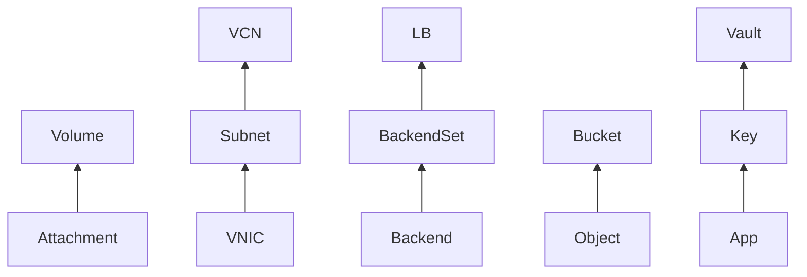

# Destroy Guide 与课程总结

怎么安全地把整个环境清理干净？以及，这门课我们都学到了什么？

## 核心要点

* 删除前要先导出/备份必要数据，确认对象的 Workspace/Region/Tenancy 和 State 备份；`plan -destroy` 只显示删除差异，不会改变资源，`destroy` 才会真正发出删除请求
* 容易失败的依赖包括非空 Bucket、卷挂载未解除、数据库处于中间状态、外部手动添加的依赖、以及删除保护/保留锁；本课程从 OpenTofu 语法、OCI 基础、网络到计算存储、数据库负载均衡、安全监控日志事件、再到 State/命令/排错/成本/销毁，构成了一条完整的学习路径
* 20 Step 学习路线图建议：先只运行默认配置做短时间的 apply/destroy，再一次只开启一个可选资源，避免同时开启多个导致错误、依赖、费用原因难以追踪

---

## 本章测验

本章共 5 道单项选择题。

### 第 1 题

`tofu plan -destroy` 与 `tofu destroy` 的核心区别是什么？

- A. 两者是完全相同的命令，只是名字不同
- B. `plan -destroy` 只显示删除差异不改变资源，`destroy` 才会真正发出删除请求
- C. `plan -destroy` 会立即删除资源，`destroy` 只是预览
- D. `destroy` 只能删除网络资源，`plan -destroy` 可以删除任何资源

选择答案后查看结果

正确答案：B

答案解析：文档明确说明 `plan -destroy` 是显示删除差异、不改变资源的预览步骤，真正发出删除请求并更新 State 的是 `tofu destroy`。

### 第 2 题

删除 Block Volume 之前必须先做什么？

- A. 先把整个 Compartment 删除
- B. 先修改 Provider 的版本号
- C. 从 Instance 上完成 Detach，解除 Volume Attachment
- D. 先把 Region 切换到另一个地区

选择答案后查看结果

正确答案：C

答案解析：文档明确列出典型失败依赖之一是“Volume Attachment”，要求先从 Instance 完成 Detach，才能删除 Volume。

### 第 3 题

按照课程的 20 Step Roadmap 建议，学习者应该怎样启用 Optional 资源？

- A. 一开始就把所有可选资源全部同时开启，方便一次性学完
- B. 完全不需要尝试任何可选资源，只学习默认配置即可
- C. 先开启费用最高的资源，再逐步降低费用
- D. 先只用默认配置做短时间的 apply/destroy，之后每次只开启一个可选资源

选择答案后查看结果

正确答案：D

答案解析：文档明确建议“最初は既定構成だけを短時間 apply/destroy します。次に Optional Resource を一度に一つだけ有効化します”，因为同时开启多个会让错误、依赖、费用原因难以追踪。

### 第 4 题

为什么“State 从中强行移除资源”被认为是危险操作？

- A. 可能导致仍在产生费用的资源变成孤儿资源，脱离管理却继续计费
- B. 因为这个操作在技术上根本无法执行，不存在风险
- C. 因为这样做会立即让所有 OCI 资源被物理删除
- D. 因为这只是一个纯装饰性的操作，没有任何实际影响

选择答案后查看结果

正确答案：A

答案解析：文档提醒“从 State 中强行移除，会让课金资源孤儿化”，即资源仍然存在并可能继续产生费用，但已经不在 OpenTofu 的管理和追踪范围内。

### 第 5 题

回顾整个课程的学习路径，下列哪个顺序最符合课程实际的组织逻辑？

- A. 直接从 Destroy 开始学，之后再倒着学习基础概念
- B. 先理解 OpenTofu 与 OCI 基础概念，再学习网络与计算存储资源，然后是数据库与负载均衡，接着是安全与可观测性，最后是 State、命令、排错、成本与销毁
- C. 所有章节内容彼此独立，没有任何先后逻辑关系
- D. 先学习成本与销毁，再学习具体资源，最后才学习基础概念

选择答案后查看结果

正确答案：B

答案解析：整个课程遵循了从基础概念，到具体资源分类（网络、计算存储、数据库负载均衡、安全监控日志事件），再到运维收尾（State、命令、排错、成本、销毁）的递进式学习路径，这也是原项目推荐的学习顺序。

<!-- QUIZ_DATA_START
{
  "chapter": "30",
  "questions": [
    {
      "id": 1,
      "question": "`tofu plan -destroy` 与 `tofu destroy` 的核心区别是什么？",
      "options": {
        "A": "两者是完全相同的命令，只是名字不同",
        "B": "`plan -destroy` 只显示删除差异不改变资源，`destroy` 才会真正发出删除请求",
        "C": "`plan -destroy` 会立即删除资源，`destroy` 只是预览",
        "D": "`destroy` 只能删除网络资源，`plan -destroy` 可以删除任何资源"
      },
      "answer": "B",
      "explanation": "文档明确说明 `plan -destroy` 是显示删除差异、不改变资源的预览步骤，真正发出删除请求并更新 State 的是 `tofu destroy`。"
    },
    {
      "id": 2,
      "question": "删除 Block Volume 之前必须先做什么？",
      "options": {
        "A": "先把整个 Compartment 删除",
        "B": "先修改 Provider 的版本号",
        "C": "从 Instance 上完成 Detach，解除 Volume Attachment",
        "D": "先把 Region 切换到另一个地区"
      },
      "answer": "C",
      "explanation": "文档明确列出典型失败依赖之一是“Volume Attachment”，要求先从 Instance 完成 Detach，才能删除 Volume。"
    },
    {
      "id": 3,
      "question": "按照课程的 20 Step Roadmap 建议，学习者应该怎样启用 Optional 资源？",
      "options": {
        "A": "一开始就把所有可选资源全部同时开启，方便一次性学完",
        "B": "完全不需要尝试任何可选资源，只学习默认配置即可",
        "C": "先开启费用最高的资源，再逐步降低费用",
        "D": "先只用默认配置做短时间的 apply/destroy，之后每次只开启一个可选资源"
      },
      "answer": "D",
      "explanation": "文档明确建议“最初は既定構成だけを短時間 apply/destroy します。次に Optional Resource を一度に一つだけ有効化します”，因为同时开启多个会让错误、依赖、费用原因难以追踪。"
    },
    {
      "id": 4,
      "question": "为什么“State 从中强行移除资源”被认为是危险操作？",
      "options": {
        "A": "可能导致仍在产生费用的资源变成孤儿资源，脱离管理却继续计费",
        "B": "因为这个操作在技术上根本无法执行，不存在风险",
        "C": "因为这样做会立即让所有 OCI 资源被物理删除",
        "D": "因为这只是一个纯装饰性的操作，没有任何实际影响"
      },
      "answer": "A",
      "explanation": "文档提醒“从 State 中强行移除，会让课金资源孤儿化”，即资源仍然存在并可能继续产生费用，但已经不在 OpenTofu 的管理和追踪范围内。"
    },
    {
      "id": 5,
      "question": "回顾整个课程的学习路径，下列哪个顺序最符合课程实际的组织逻辑？",
      "options": {
        "A": "直接从 Destroy 开始学，之后再倒着学习基础概念",
        "B": "先理解 OpenTofu 与 OCI 基础概念，再学习网络与计算存储资源，然后是数据库与负载均衡，接着是安全与可观测性，最后是 State、命令、排错、成本与销毁",
        "C": "所有章节内容彼此独立，没有任何先后逻辑关系",
        "D": "先学习成本与销毁，再学习具体资源，最后才学习基础概念"
      },
      "answer": "B",
      "explanation": "整个课程遵循了从基础概念，到具体资源分类（网络、计算存储、数据库负载均衡、安全监控日志事件），再到运维收尾（State、命令、排错、成本、销毁）的递进式学习路径，这也是原项目推荐的学习顺序。"
    }
  ]
}
QUIZ_DATA_END -->
