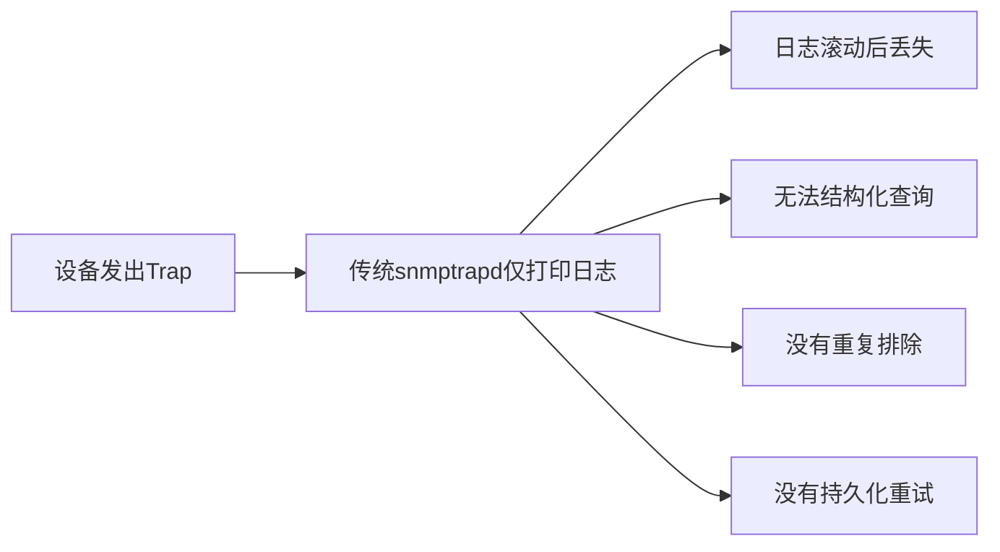

# 01. 为什么需要一个生产级的 SNMP Trap 接收平台

网络设备发出的告警如果只是打印在终端或日志文件里，运维团队就无法及时发现问题，也无法在事后追溯完整历史。

## 核心要点

* 传统方案只把Trap打印到日志文件，运维需要人工翻阅，效率低
* 网络抖动或后端API短暂故障时，未持久化的告警会直接丢失
* 缺少统一认证机制，理论上任何主机都可以发送伪造的Trap
* 本课程要学习的SNMP Trap Production Platform用SNMPv3认证、持久化重试队列、去重和Web展示解决了以上问题

---

## 本章测验

本章共 5 道单项选择题。

### 第 1 题

传统方案仅依赖 snmptrapd 把告警打印到日志文件，最主要的问题是什么？

- A. 告警难以持久化查询和追溯
- B. 只能在Linux系统运行
- C. 完全不能接收Trap
- D. 无法支持UDP协议

选择答案后查看结果

正确答案：A

答案解析：日志文件会滚动删除、缺乏结构化字段，运维无法高效检索历史告警，这正是本课程项目要解决的核心痛点。

### 第 2 题

相比传统方案，本课程项目在设计上新增了哪些能力？

- A. 仅仅是把日志换成了彩色输出
- B. 认证、去重、持久化重试、数据库存储的综合能力
- C. 取消了SNMP协议改用HTTP轮询
- D. 去掉了Web展示页面

选择答案后查看结果

正确答案：B

答案解析：项目围绕SNMPv3认证、Trap名称/VB转换、持久化重试队列、Oracle存储和Web展示构建了完整链路，而不是单点改进。

### 第 3 题

下列哪一项最准确地描述了“持久化重试队列”要解决的问题？

- A. 减少Oracle数据库表的字段数量
- B. 防止Trap被伪造
- C. 在后端API短暂不可用时避免告警丢失
- D. 加快Mermaid图形渲染速度

选择答案后查看结果

正确答案：C

答案解析：当API暂时不可达时，如果没有持久化重试机制，接收到的Trap数据会直接丢失；重试队列把数据先落盘，故障恢复后继续投递。

### 第 4 题

如果后端Spring Boot服务在接收Trap转发请求时短暂宕机2分钟，在没有持久化重试机制的旧方案中会发生什么？

- A. snmptrapd会自动重启后端服务
- B. Oracle数据库会自动补全缺失数据
- C. Trap会被自动缓存在网络设备上
- D. 这2分钟内到达的告警会永久丢失

选择答案后查看结果

正确答案：D

答案解析：旧方案没有落盘机制，一旦转发失败且没有重试逻辑，数据就彻底丢失，这也是本课程项目要重点解决的问题。

### 第 5 题

下列哪一句最准确地概括了本章的核心结论？

- A. 仅靠日志打印的传统方案在可靠性和可追溯性上不足以支撑生产环境
- B. 生产环境不需要认证机制
- C. Trap和Inform在功能上完全没有区别
- D. SNMP协议本身存在无法修复的缺陷

选择答案后查看结果

正确答案：A

答案解析：本章的核心是说明为什么需要在认证、持久化、去重和可查询性上做工程化增强，而不是简单地接收并打印Trap。

<!-- QUIZ_DATA_START
{
  "chapter": "01",
  "questions": [
    {
      "id": 1,
      "question": "传统方案仅依赖 snmptrapd 把告警打印到日志文件，最主要的问题是什么？",
      "options": {
        "A": "告警难以持久化查询和追溯",
        "B": "只能在Linux系统运行",
        "C": "完全不能接收Trap",
        "D": "无法支持UDP协议"
      },
      "answer": "A",
      "explanation": "日志文件会滚动删除、缺乏结构化字段，运维无法高效检索历史告警，这正是本课程项目要解决的核心痛点。"
    },
    {
      "id": 2,
      "question": "相比传统方案，本课程项目在设计上新增了哪些能力？",
      "options": {
        "A": "仅仅是把日志换成了彩色输出",
        "B": "认证、去重、持久化重试、数据库存储的综合能力",
        "C": "取消了SNMP协议改用HTTP轮询",
        "D": "去掉了Web展示页面"
      },
      "answer": "B",
      "explanation": "项目围绕SNMPv3认证、Trap名称/VB转换、持久化重试队列、Oracle存储和Web展示构建了完整链路，而不是单点改进。"
    },
    {
      "id": 3,
      "question": "下列哪一项最准确地描述了“持久化重试队列”要解决的问题？",
      "options": {
        "A": "减少Oracle数据库表的字段数量",
        "B": "防止Trap被伪造",
        "C": "在后端API短暂不可用时避免告警丢失",
        "D": "加快Mermaid图形渲染速度"
      },
      "answer": "C",
      "explanation": "当API暂时不可达时，如果没有持久化重试机制，接收到的Trap数据会直接丢失；重试队列把数据先落盘，故障恢复后继续投递。"
    },
    {
      "id": 4,
      "question": "如果后端Spring Boot服务在接收Trap转发请求时短暂宕机2分钟，在没有持久化重试机制的旧方案中会发生什么？",
      "options": {
        "A": "snmptrapd会自动重启后端服务",
        "B": "Oracle数据库会自动补全缺失数据",
        "C": "Trap会被自动缓存在网络设备上",
        "D": "这2分钟内到达的告警会永久丢失"
      },
      "answer": "D",
      "explanation": "旧方案没有落盘机制，一旦转发失败且没有重试逻辑，数据就彻底丢失，这也是本课程项目要重点解决的问题。"
    },
    {
      "id": 5,
      "question": "下列哪一句最准确地概括了本章的核心结论？",
      "options": {
        "A": "仅靠日志打印的传统方案在可靠性和可追溯性上不足以支撑生产环境",
        "B": "生产环境不需要认证机制",
        "C": "Trap和Inform在功能上完全没有区别",
        "D": "SNMP协议本身存在无法修复的缺陷"
      },
      "answer": "A",
      "explanation": "本章的核心是说明为什么需要在认证、持久化、去重和可查询性上做工程化增强，而不是简单地接收并打印Trap。"
    }
  ]
}
QUIZ_DATA_END -->
