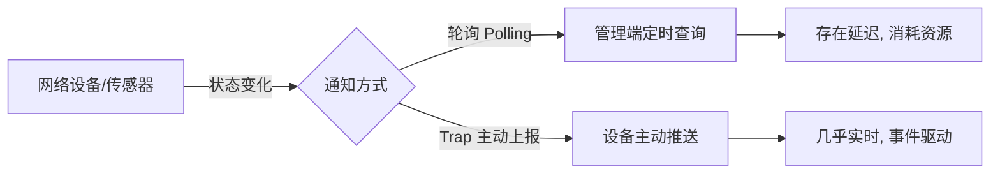

# 项目背景与问题：为什么需要 SNMP Trap 监控 Demo

当设备状态发生变化时，运维人员如何第一时间知道，而不是靠人工不断查询？

## 核心要点

* 监控系统获取设备状态有两种基本方式：轮询（Polling）和主动上报（Trap）。
* 本项目是一个演示 SNMP v2c Trap 端到端处理链路的 Demo，从发送、接收、转换、存储到展示。
* 整条链路涉及四个角色：IoT Simulator（模拟设备）、snmptrapd（接收与转换）、Spring Boot（业务存储与展示）、Oracle（持久化）。
* 项目明确声明这是 v2c 演示，不涉及加密认证、多节点、重试队列等生产级特性。

---

## 本章测验

本章共 5 道单项选择题。

### 第 1 题

在网络监控场景中，Trap 相比 Polling 最主要的优势是什么？

- A. Trap 由设备主动上报，事件更及时
- B. Trap 不需要管理端
- C. Trap 使用 TCP 因此更可靠
- D. Trap 不需要网络连接

选择答案后查看结果

正确答案：A

答案解析：Trap 是设备在状态变化时主动推送通知，不必等待管理端下一次轮询，因此响应更及时；Trap 仍需网络，且 SNMP Trap 使用 UDP。

### 第 2 题

本 Demo 项目一共涉及几个主要处理阶段（角色）？

- A. 三个：发送、转换、展示
- B. 五个：还包括负载均衡
- C. 四个：发送、接收转换、业务存储展示、持久化
- D. 两个：发送和接收

选择答案后查看结果

正确答案：C

答案解析：链路为 IoT Simulator（发送）→ snmptrapd（接收转换）→ Spring Boot（业务存储展示）→ Oracle（持久化），共四个角色。

### 第 3 题

以下哪一项属于该 Demo 明确声明不包含的内容？

- A. Trap 名称与 OID 的映射
- B. REST API 接收数据
- C. Trap 到 JSON 的字段转换
- D. SNMPv3 认证与多节点部署

选择答案后查看结果

正确答案：D

答案解析：README 中明确说明 SNMPv3、Inform、认证授权、重试队列、多节点是本 Demo 的范围之外。

### 第 4 题

如果一个监控系统只依赖轮询而设备状态变化很频繁，可能出现的问题是什么？

- A. 设备会拒绝连接
- B. 状态变化可能在两次轮询之间被错过或延迟发现
- C. 管理端会崩溃
- D. 不会有任何问题

选择答案后查看结果

正确答案：B

答案解析：轮询存在采样间隔，间隔期间发生的瞬时状态变化可能被延迟发现甚至完全错过，这正是 Trap 机制要解决的问题。

### 第 5 题

理解本章后，下列说法最准确的是？

- A. 本项目实现了完整的生产级监控平台
- B. 本项目只是一个前端页面展示 Demo
- C. 本项目主要用于压力测试
- D. 本项目是理解 SNMP Trap 端到端处理链路的教学性演示

选择答案后查看结果

正确答案：D

答案解析：项目定位是演示性质的端到端链路示例，用于学习 SNMP Trap 从发送到展示的完整流程，并非生产平台。

<!-- QUIZ_DATA_START
{
  "chapter": "01",
  "questions": [
    {
      "id": 1,
      "question": "在网络监控场景中，Trap 相比 Polling 最主要的优势是什么？",
      "options": {
        "A": "Trap 由设备主动上报，事件更及时",
        "B": "Trap 不需要管理端",
        "C": "Trap 使用 TCP 因此更可靠",
        "D": "Trap 不需要网络连接"
      },
      "answer": "A",
      "explanation": "Trap 是设备在状态变化时主动推送通知，不必等待管理端下一次轮询，因此响应更及时；Trap 仍需网络，且 SNMP Trap 使用 UDP。"
    },
    {
      "id": 2,
      "question": "本 Demo 项目一共涉及几个主要处理阶段（角色）？",
      "options": {
        "C": "四个：发送、接收转换、业务存储展示、持久化",
        "A": "三个：发送、转换、展示",
        "B": "五个：还包括负载均衡",
        "D": "两个：发送和接收"
      },
      "answer": "C",
      "explanation": "链路为 IoT Simulator（发送）→ snmptrapd（接收转换）→ Spring Boot（业务存储展示）→ Oracle（持久化），共四个角色。"
    },
    {
      "id": 3,
      "question": "以下哪一项属于该 Demo 明确声明不包含的内容？",
      "options": {
        "D": "SNMPv3 认证与多节点部署",
        "A": "Trap 名称与 OID 的映射",
        "B": "REST API 接收数据",
        "C": "Trap 到 JSON 的字段转换"
      },
      "answer": "D",
      "explanation": "README 中明确说明 SNMPv3、Inform、认证授权、重试队列、多节点是本 Demo 的范围之外。"
    },
    {
      "id": 4,
      "question": "如果一个监控系统只依赖轮询而设备状态变化很频繁，可能出现的问题是什么？",
      "options": {
        "B": "状态变化可能在两次轮询之间被错过或延迟发现",
        "A": "设备会拒绝连接",
        "C": "管理端会崩溃",
        "D": "不会有任何问题"
      },
      "answer": "B",
      "explanation": "轮询存在采样间隔，间隔期间发生的瞬时状态变化可能被延迟发现甚至完全错过，这正是 Trap 机制要解决的问题。"
    },
    {
      "id": 5,
      "question": "理解本章后，下列说法最准确的是？",
      "options": {
        "D": "本项目是理解 SNMP Trap 端到端处理链路的教学性演示",
        "A": "本项目实现了完整的生产级监控平台",
        "B": "本项目只是一个前端页面展示 Demo",
        "C": "本项目主要用于压力测试"
      },
      "answer": "D",
      "explanation": "项目定位是演示性质的端到端链路示例，用于学习 SNMP Trap 从发送到展示的完整流程，并非生产平台。"
    }
  ]
}
QUIZ_DATA_END -->
