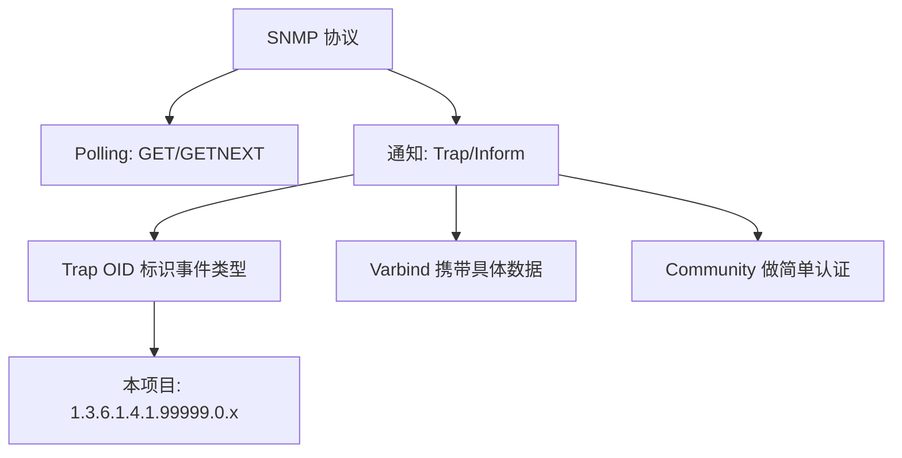

# SNMP Trap 核心概念：OID、Community 与 v2c

要读懂后面所有章节，需要先掌握 SNMP Trap 里几个反复出现的基本术语。

## 核心要点

* OID（Object Identifier）是一串数字，用来唯一标识一个通知类型或一个数据字段，例如 1.3.6.1.4.1.99999.0.1 代表 NORMAL 事件。
* Varbind（Variable Binding）是 Trap 报文中携带的具体键值数据，比如设备 ID、温度、消息内容。
* Community 是 SNMP v2c 里的简单口令机制，本项目固定使用 public，不提供加密或强认证。
* Trap 和 Inform 的区别：Trap 是单向发送不等确认，Inform 需要接收方回应；本项目使用的是 Trap。
* MIB（Management Information Base）文件把数字 OID 和有意义的名字对应起来，方便人阅读和工具解析。

---

## 本章测验

本章共 5 道单项选择题。

### 第 1 题

在 SNMP 中，OID 的作用是什么？

- A. 指定 UDP 端口号
- B. 加密报文内容
- C. 唯一标识一个通知类型或数据字段
- D. 生成随机密码

选择答案后查看结果

正确答案：C

答案解析：OID 是一串分层数字，作用是唯一标识某个通知（如某类 Trap）或某个数据对象，本身不涉及加密。

### 第 2 题

Varbind 在 Trap 报文中承担的角色是什么？

- A. 标识发送者身份
- B. 控制报文发送频率
- C. 决定报文使用 TCP 还是 UDP
- D. 携带具体的键值数据，比如设备名称和温度

选择答案后查看结果

正确答案：D

答案解析：Varbind 即 Variable Binding，是 Trap 中实际携带的数据字段，例如设备 ID、温度、消息内容等。

### 第 3 题

本项目中 SNMP v2c 的 Community 认证机制提供了什么级别的安全性？

- A. 强加密和身份认证
- B. 仅是简单口令，不提供加密和强认证
- C. 基于证书的双向认证
- D. 完全没有任何认证概念

选择答案后查看结果

正确答案：B

答案解析：README 明确说明 Community public 不提供加密和强认证，只是 SNMP v2c 里最基础的简单口令机制。

### 第 4 题

Trap 与 Inform 最主要的区别是什么？

- A. Trap 使用 TCP，Inform 使用 UDP
- B. 两者完全没有区别
- C. Inform 只能用于 v1 版本
- D. Trap 单向发送不等确认，Inform 需要接收方响应

选择答案后查看结果

正确答案：D

答案解析：Trap 是即发即弃、不等待确认的通知方式；Inform 则要求接收方回应确认，可靠性更高，但本项目使用的是 Trap。

### 第 5 题

假设你在 MIB 文件中看到 temperatureHighTrap 对应数字 OID 1.3.6.1.4.1.99999.0.2，这体现了 MIB 文件的什么作用？

- A. MIB 文件用于存储数据库密码
- B. MIB 文件负责实际发送网络报文
- C. MIB 文件把数字 OID 和可读名字对应起来，便于人和工具理解
- D. MIB 文件替代了 Community 认证

选择答案后查看结果

正确答案：C

答案解析：MIB 的核心作用正是维护数字 OID 与语义化名称之间的映射，使报文对人类可读、对工具可解析。

<!-- QUIZ_DATA_START
{
  "chapter": "02",
  "questions": [
    {
      "id": 1,
      "question": "在 SNMP 中，OID 的作用是什么？",
      "options": {
        "C": "唯一标识一个通知类型或数据字段",
        "A": "指定 UDP 端口号",
        "B": "加密报文内容",
        "D": "生成随机密码"
      },
      "answer": "C",
      "explanation": "OID 是一串分层数字，作用是唯一标识某个通知（如某类 Trap）或某个数据对象，本身不涉及加密。"
    },
    {
      "id": 2,
      "question": "Varbind 在 Trap 报文中承担的角色是什么？",
      "options": {
        "D": "携带具体的键值数据，比如设备名称和温度",
        "A": "标识发送者身份",
        "B": "控制报文发送频率",
        "C": "决定报文使用 TCP 还是 UDP"
      },
      "answer": "D",
      "explanation": "Varbind 即 Variable Binding，是 Trap 中实际携带的数据字段，例如设备 ID、温度、消息内容等。"
    },
    {
      "id": 3,
      "question": "本项目中 SNMP v2c 的 Community 认证机制提供了什么级别的安全性？",
      "options": {
        "B": "仅是简单口令，不提供加密和强认证",
        "A": "强加密和身份认证",
        "C": "基于证书的双向认证",
        "D": "完全没有任何认证概念"
      },
      "answer": "B",
      "explanation": "README 明确说明 Community public 不提供加密和强认证，只是 SNMP v2c 里最基础的简单口令机制。"
    },
    {
      "id": 4,
      "question": "Trap 与 Inform 最主要的区别是什么？",
      "options": {
        "D": "Trap 单向发送不等确认，Inform 需要接收方响应",
        "A": "Trap 使用 TCP，Inform 使用 UDP",
        "B": "两者完全没有区别",
        "C": "Inform 只能用于 v1 版本"
      },
      "answer": "D",
      "explanation": "Trap 是即发即弃、不等待确认的通知方式；Inform 则要求接收方回应确认，可靠性更高，但本项目使用的是 Trap。"
    },
    {
      "id": 5,
      "question": "假设你在 MIB 文件中看到 temperatureHighTrap 对应数字 OID 1.3.6.1.4.1.99999.0.2，这体现了 MIB 文件的什么作用？",
      "options": {
        "C": "MIB 文件把数字 OID 和可读名字对应起来，便于人和工具理解",
        "A": "MIB 文件用于存储数据库密码",
        "B": "MIB 文件负责实际发送网络报文",
        "D": "MIB 文件替代了 Community 认证"
      },
      "answer": "C",
      "explanation": "MIB 的核心作用正是维护数字 OID 与语义化名称之间的映射，使报文对人类可读、对工具可解析。"
    }
  ]
}
QUIZ_DATA_END -->
