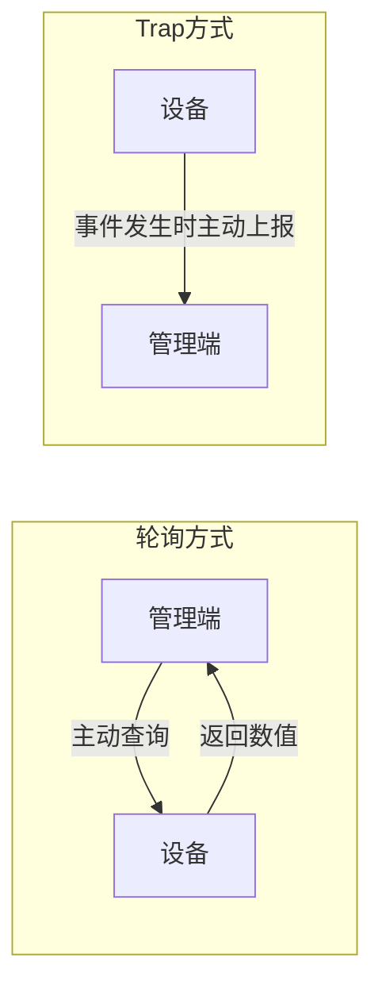

# 02 SNMP协议基础与Trap机制

在深入这个项目之前，先理解 SNMP 里 Trap 这种消息到底是什么、它和轮询有什么不同。

## 核心要点

* SNMP 有两种基本交互模式：管理端主动轮询设备（GET/GETNEXT），以及设备主动向管理端上报事件（Trap）。
* Trap 是设备侧发生某个事件后，异步、单向地向管理端发送的 UDP 消息，管理端不需要先发起请求。
* Trap 是基于 UDP 传输的，UDP 不保证送达，这意味着“发送成功”不代表“对方已经收到”。
* 本项目正是利用 Trap 机制模拟设备主动上报三类事件，而不是让管理端反复轮询设备状态。

---

## 本章测验

本章共 5 道单项选择题。

### 第 1 题

SNMP 中，Trap 消息与轮询（GET）方式的根本区别是什么？

- A. 两者没有本质区别，只是名字不同
- B. Trap 使用 TCP，轮询使用 UDP
- C. Trap 只能用于错误事件，轮询可以查询任意数据
- D. Trap 是设备主动上报，轮询是管理端主动查询

选择答案后查看结果

正确答案：D

答案解析：Trap 是设备侧主动、异步地向管理端上报事件，而轮询是管理端主动发起查询、设备被动响应，这是两者的根本区别。

### 第 2 题

SNMP Trap 消息底层依赖的传输协议是什么？

- A. UDP
- B. TCP
- C. WebSocket
- D. HTTP

选择答案后查看结果

正确答案：A

答案解析：Trap 基于 UDP 传输，UDP 是无连接、不保证送达的协议。

### 第 3 题

为什么说“Trap 发送成功”不等于“管理端已经收到”？

- A. 因为管理端总是需要人工确认
- B. 因为 Trap 消息会被自动重试三次
- C. 因为 SNMP 协议本身有加密延迟
- D. 因为 UDP 不提供送达确认机制

选择答案后查看结果

正确答案：D

答案解析：UDP 是无连接协议，不保证消息一定送达，因此发送端的“发送成功”只表示消息已经离开本地，不代表对方收到。

### 第 4 题

在本项目中，IoT Simulator 触发事件后采用的是哪种交互方式？

- A. 设备主动发送 Trap 通知管理端
- B. 设备与管理端建立长连接后双向推送
- C. 管理端通过 HTTP 请求获取设备日志
- D. 管理端定时轮询设备状态

选择答案后查看结果

正确答案：A

答案解析：IoT Simulator 模拟设备在事件发生时主动发送 SNMP v2c Trap，属于设备主动上报模式，不涉及管理端轮询。

### 第 5 题

由于 Trap 基于 UDP 且不保证送达，该项目建议如何确认一条 Trap 真正被处理？

- A. 结合 snmptrapd、Spring Boot 日志和网页展示逐层确认
- B. 只看 IoT Simulator 是否报错
- C. 无需确认，UDP 消息一定会到达
- D. 每次都重启所有容器来验证

选择答案后查看结果

正确答案：A

答案解析：由于 UDP 不提供送达保证，需要结合接收端日志、应用日志以及最终页面展示，逐层确认消息是否被正确处理。

<!-- QUIZ_DATA_START
{
  "chapter": "02",
  "questions": [
    {
      "id": 1,
      "question": "SNMP 中，Trap 消息与轮询（GET）方式的根本区别是什么？",
      "options": {
        "A": "两者没有本质区别，只是名字不同",
        "B": "Trap 使用 TCP，轮询使用 UDP",
        "C": "Trap 只能用于错误事件，轮询可以查询任意数据",
        "D": "Trap 是设备主动上报，轮询是管理端主动查询"
      },
      "answer": "D",
      "explanation": "Trap 是设备侧主动、异步地向管理端上报事件，而轮询是管理端主动发起查询、设备被动响应，这是两者的根本区别。"
    },
    {
      "id": 2,
      "question": "SNMP Trap 消息底层依赖的传输协议是什么？",
      "options": {
        "A": "UDP",
        "B": "TCP",
        "C": "WebSocket",
        "D": "HTTP"
      },
      "answer": "A",
      "explanation": "Trap 基于 UDP 传输，UDP 是无连接、不保证送达的协议。"
    },
    {
      "id": 3,
      "question": "为什么说“Trap 发送成功”不等于“管理端已经收到”？",
      "options": {
        "A": "因为管理端总是需要人工确认",
        "B": "因为 Trap 消息会被自动重试三次",
        "C": "因为 SNMP 协议本身有加密延迟",
        "D": "因为 UDP 不提供送达确认机制"
      },
      "answer": "D",
      "explanation": "UDP 是无连接协议，不保证消息一定送达，因此发送端的“发送成功”只表示消息已经离开本地，不代表对方收到。"
    },
    {
      "id": 4,
      "question": "在本项目中，IoT Simulator 触发事件后采用的是哪种交互方式？",
      "options": {
        "A": "设备主动发送 Trap 通知管理端",
        "B": "设备与管理端建立长连接后双向推送",
        "C": "管理端通过 HTTP 请求获取设备日志",
        "D": "管理端定时轮询设备状态"
      },
      "answer": "A",
      "explanation": "IoT Simulator 模拟设备在事件发生时主动发送 SNMP v2c Trap，属于设备主动上报模式，不涉及管理端轮询。"
    },
    {
      "id": 5,
      "question": "由于 Trap 基于 UDP 且不保证送达，该项目建议如何确认一条 Trap 真正被处理？",
      "options": {
        "A": "结合 snmptrapd、Spring Boot 日志和网页展示逐层确认",
        "B": "只看 IoT Simulator 是否报错",
        "C": "无需确认，UDP 消息一定会到达",
        "D": "每次都重启所有容器来验证"
      },
      "answer": "A",
      "explanation": "由于 UDP 不提供送达保证，需要结合接收端日志、应用日志以及最终页面展示，逐层确认消息是否被正确处理。"
    }
  ]
}
QUIZ_DATA_END -->
