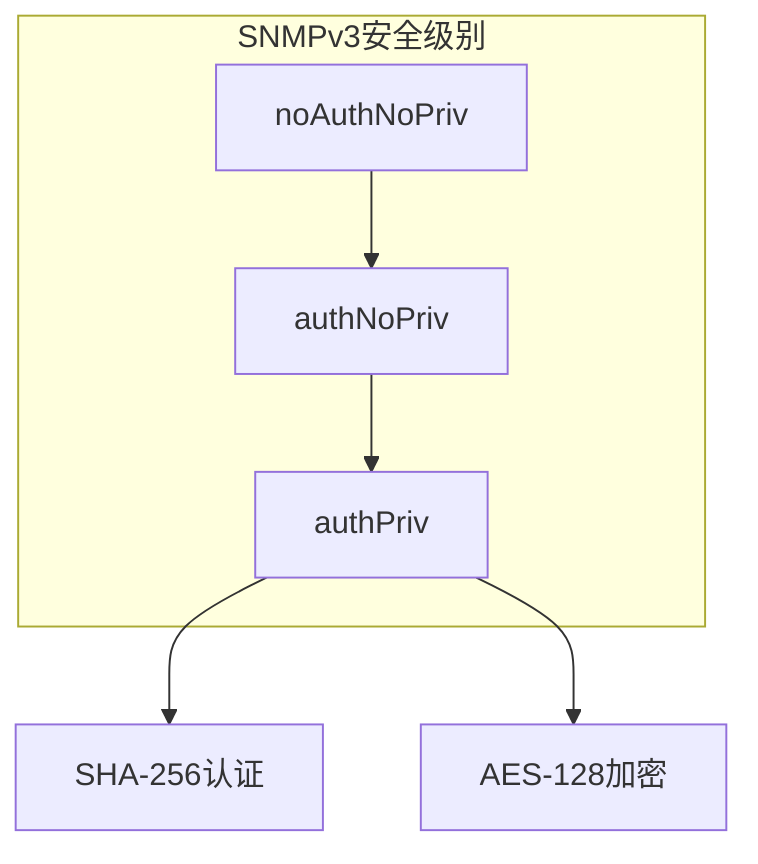

# 02. 核心概念：SNMPv3、authPriv 与 Trap / Inform 的区别

在深入架构之前，需要先理解SNMPv3的安全模型，以及Trap和Inform这两种通知方式的本质差异。

## 核心要点

* SNMPv3的安全级别从低到高依次是noAuthNoPriv、authNoPriv、authPriv
* 项目强制使用authPriv：SHA-256做身份认证，AES-128做数据加密
* Trap是单向通知，发送方不知道对方是否收到；Inform要求接收方回复Response
* 项目默认使用Inform，是因为它能确认送达（errorStatus=noError），而Trap没有送达确认

---

## 本章测验

本章共 5 道单项选择题。

### 第 1 题

SNMPv3的三种安全级别中，安全性最高的是哪一个？

- A. authNoPriv
- B. authPriv
- C. 三者安全性相同
- D. noAuthNoPriv

选择答案后查看结果

正确答案：B

答案解析：authPriv同时提供身份认证和数据加密，是三种级别中最安全的，本项目也强制只接受这一级别。

### 第 2 题

本项目中，authPriv具体使用了哪两种算法组合？

- A. 仅SHA-256认证，不加密
- B. MD5认证+DES加密
- C. SHA-256认证+AES-128加密
- D. 不认证+不加密

选择答案后查看结果

正确答案：C

答案解析：根据IotSimulator和container-entrypoint.sh的实现，认证算法是SHA-256（AuthHMAC192SHA256），加密算法是AES-128（PrivAES128）。

### 第 3 题

Trap和Inform最本质的区别是什么？

- A. Trap只能在IPv6网络中使用
- B. 两者完全相同，只是名字不同
- C. Trap使用TCP，Inform使用UDP
- D. Inform要求接收方返回Response确认，Trap没有确认机制

选择答案后查看结果

正确答案：D

答案解析：Inform是请求-响应模式，发送方能确认对方已收到；Trap是单向发送，发出后不知道是否到达。

### 第 4 题

如果网络中偶尔出现丢包，运维想确保设备发出的告警都能确认送达，应该优先选择哪种通知类型？

- A. Inform，因为它有送达确认机制
- B. 两者都不能确认送达
- C. 改用ICMP代替
- D. Trap，因为它速度更快

选择答案后查看结果

正确答案：A

答案解析：Inform模式下，发送方会等待接收方的SNMP RESPONSE且errorStatus=noError才算成功，这正是IotSimulator默认使用Inform的原因。

### 第 5 题

关于本项目的SNMPv3使用方式，下列说法正确的是？

- A. 项目同时兼容SNMPv2c的Community认证
- B. 项目只接受authPriv级别，拒绝SNMPv2c和明文Community
- C. 项目不使用任何加密
- D. 项目允许使用弱密码作为认证口令

选择答案后查看结果

正确答案：B

答案解析：README明确说明不接受SNMPv2c和Community public，Simulator也拒绝除SNMP_VERSION=3以外的版本，认证和加密口令都要求16位以上。

<!-- QUIZ_DATA_START
{
  "chapter": "02",
  "questions": [
    {
      "id": 1,
      "question": "SNMPv3的三种安全级别中，安全性最高的是哪一个？",
      "options": {
        "A": "authNoPriv",
        "B": "authPriv",
        "C": "三者安全性相同",
        "D": "noAuthNoPriv"
      },
      "answer": "B",
      "explanation": "authPriv同时提供身份认证和数据加密，是三种级别中最安全的，本项目也强制只接受这一级别。"
    },
    {
      "id": 2,
      "question": "本项目中，authPriv具体使用了哪两种算法组合？",
      "options": {
        "A": "仅SHA-256认证，不加密",
        "B": "MD5认证+DES加密",
        "C": "SHA-256认证+AES-128加密",
        "D": "不认证+不加密"
      },
      "answer": "C",
      "explanation": "根据IotSimulator和container-entrypoint.sh的实现，认证算法是SHA-256（AuthHMAC192SHA256），加密算法是AES-128（PrivAES128）。"
    },
    {
      "id": 3,
      "question": "Trap和Inform最本质的区别是什么？",
      "options": {
        "A": "Trap只能在IPv6网络中使用",
        "B": "两者完全相同，只是名字不同",
        "C": "Trap使用TCP，Inform使用UDP",
        "D": "Inform要求接收方返回Response确认，Trap没有确认机制"
      },
      "answer": "D",
      "explanation": "Inform是请求-响应模式，发送方能确认对方已收到；Trap是单向发送，发出后不知道是否到达。"
    },
    {
      "id": 4,
      "question": "如果网络中偶尔出现丢包，运维想确保设备发出的告警都能确认送达，应该优先选择哪种通知类型？",
      "options": {
        "A": "Inform，因为它有送达确认机制",
        "B": "两者都不能确认送达",
        "C": "改用ICMP代替",
        "D": "Trap，因为它速度更快"
      },
      "answer": "A",
      "explanation": "Inform模式下，发送方会等待接收方的SNMP RESPONSE且errorStatus=noError才算成功，这正是IotSimulator默认使用Inform的原因。"
    },
    {
      "id": 5,
      "question": "关于本项目的SNMPv3使用方式，下列说法正确的是？",
      "options": {
        "A": "项目同时兼容SNMPv2c的Community认证",
        "B": "项目只接受authPriv级别，拒绝SNMPv2c和明文Community",
        "C": "项目不使用任何加密",
        "D": "项目允许使用弱密码作为认证口令"
      },
      "answer": "B",
      "explanation": "README明确说明不接受SNMPv2c和Community public，Simulator也拒绝除SNMP_VERSION=3以外的版本，认证和加密口令都要求16位以上。"
    }
  ]
}
QUIZ_DATA_END -->
