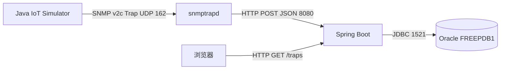

# 整体架构总览

把四个角色串成一条线，看看一个 Trap 事件是如何从设备走到浏览器页面的。

## 核心要点

* 整体架构由四个组件组成：Simulator、snmptrapd、Spring Boot、Oracle，各司其职、单向串联。
* 组件之间通过明确的协议边界通信：SNMP v2c（UDP 162）、HTTP JSON（8080）、JDBC（1521）。
* 浏览器不直接访问数据库，而是通过 Spring Boot 提供的 HTTP GET /traps 接口查看数据。
* 这种分层架构把 SNMP 协议处理和业务存储展示解耦，snmptrapd 只管转换，Spring Boot 只管业务。

---

## 本章测验

本章共 5 道单项选择题。

### 第 1 题

本项目架构中，Simulator 与 snmptrapd 之间使用什么协议和端口？

- A. JDBC，端口 1521
- B. HTTP，端口 8080
- C. HTTPS，端口 443
- D. SNMP v2c Trap，UDP 端口 162

选择答案后查看结果

正确答案：D

答案解析：架构图显示 Simulator 通过 SNMP v2c Trap 协议，经 UDP 162 端口把报文发送给 snmptrapd。

### 第 2 题

snmptrapd 与 Spring Boot 之间的数据传输方式是什么？

- A. 共享文件系统
- B. 直接写入 Oracle 数据库
- C. HTTP POST，携带 JSON，端口 8080
- D. SNMP GET 请求

选择答案后查看结果

正确答案：C

答案解析：snmptrapd 完成转换后，通过 HTTP POST 将 JSON 数据发送到 Spring Boot 的 8080 端口接口。

### 第 3 题

浏览器要查看 Trap 数据，走的是哪条路径？

- A. 浏览器直接连接 Oracle 数据库查询
- B. 浏览器直接连接 snmptrapd
- C. 浏览器需要单独安装 SNMP 客户端
- D. 浏览器通过 HTTP GET /traps 访问 Spring Boot

选择答案后查看结果

正确答案：D

答案解析：架构图明确显示浏览器通过 HTTP GET /traps 请求 Spring Boot，由 Spring Boot 负责查询数据库并返回展示页面。

### 第 4 题

这种四组件分层架构带来的主要好处是什么？

- A. 消除了对数据库的依赖
- B. 把 SNMP 协议处理和业务存储展示解耦，各组件职责单一
- C. 让所有组件共用同一个端口
- D. 减少了网络协议的种类

选择答案后查看结果

正确答案：B

答案解析：分层的价值在于职责分离：snmptrapd 专注协议转换，Spring Boot 专注业务逻辑和展示，互不干扰、便于分别维护。

### 第 5 题

如果 Oracle 数据库暂时不可用，按照当前架构，最先受到直接影响的是哪个环节？

- A. Spring Boot 保存数据到数据库这一步会失败
- B. 浏览器的 HTTP 请求会自动改用其他数据源
- C. Simulator 发送 Trap 会失败
- D. snmptrapd 接收 Trap 会失败

选择答案后查看结果

正确答案：A

答案解析：架构中只有 Spring Boot 通过 JDBC 直接依赖 Oracle，因此数据库不可用时最先受影响的是 Spring Boot 的保存环节；这也是本 Demo 未包含重试队列的原因之一，第 22 章会详细讨论。

<!-- QUIZ_DATA_START
{
  "chapter": "03",
  "questions": [
    {
      "id": 1,
      "question": "本项目架构中，Simulator 与 snmptrapd 之间使用什么协议和端口？",
      "options": {
        "D": "SNMP v2c Trap，UDP 端口 162",
        "A": "JDBC，端口 1521",
        "B": "HTTP，端口 8080",
        "C": "HTTPS，端口 443"
      },
      "answer": "D",
      "explanation": "架构图显示 Simulator 通过 SNMP v2c Trap 协议，经 UDP 162 端口把报文发送给 snmptrapd。"
    },
    {
      "id": 2,
      "question": "snmptrapd 与 Spring Boot 之间的数据传输方式是什么？",
      "options": {
        "C": "HTTP POST，携带 JSON，端口 8080",
        "A": "共享文件系统",
        "B": "直接写入 Oracle 数据库",
        "D": "SNMP GET 请求"
      },
      "answer": "C",
      "explanation": "snmptrapd 完成转换后，通过 HTTP POST 将 JSON 数据发送到 Spring Boot 的 8080 端口接口。"
    },
    {
      "id": 3,
      "question": "浏览器要查看 Trap 数据，走的是哪条路径？",
      "options": {
        "D": "浏览器通过 HTTP GET /traps 访问 Spring Boot",
        "A": "浏览器直接连接 Oracle 数据库查询",
        "B": "浏览器直接连接 snmptrapd",
        "C": "浏览器需要单独安装 SNMP 客户端"
      },
      "answer": "D",
      "explanation": "架构图明确显示浏览器通过 HTTP GET /traps 请求 Spring Boot，由 Spring Boot 负责查询数据库并返回展示页面。"
    },
    {
      "id": 4,
      "question": "这种四组件分层架构带来的主要好处是什么？",
      "options": {
        "B": "把 SNMP 协议处理和业务存储展示解耦，各组件职责单一",
        "A": "消除了对数据库的依赖",
        "C": "让所有组件共用同一个端口",
        "D": "减少了网络协议的种类"
      },
      "answer": "B",
      "explanation": "分层的价值在于职责分离：snmptrapd 专注协议转换，Spring Boot 专注业务逻辑和展示，互不干扰、便于分别维护。"
    },
    {
      "id": 5,
      "question": "如果 Oracle 数据库暂时不可用，按照当前架构，最先受到直接影响的是哪个环节？",
      "options": {
        "A": "Spring Boot 保存数据到数据库这一步会失败",
        "B": "浏览器的 HTTP 请求会自动改用其他数据源",
        "C": "Simulator 发送 Trap 会失败",
        "D": "snmptrapd 接收 Trap 会失败"
      },
      "answer": "A",
      "explanation": "架构中只有 Spring Boot 通过 JDBC 直接依赖 Oracle，因此数据库不可用时最先受影响的是 Spring Boot 的保存环节；这也是本 Demo 未包含重试队列的原因之一，第 22 章会详细讨论。"
    }
  ]
}
QUIZ_DATA_END -->
