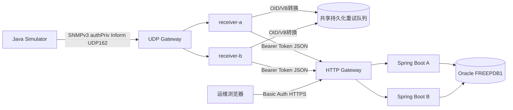

# 03. 整体架构总览

了解了核心概念之后，我们从最高层视角看一下整套系统的数据流转路径。

## 核心要点

* 整套系统分为四层：模拟发送端、UDP接收层、转换与队列层、Spring Boot存储与展示层
* 同一个nginx网关既做UDP 162端口的一致性哈希转发，也做HTTP 8080端口的负载均衡
* 两个snmptrapd接收节点(receiver-a/b)各自独立处理，互不依赖，实现高可用
* 所有节点最终都写入同一个Oracle数据库，保证数据一致性

---

## 本章测验

本章共 5 道单项选择题。

### 第 1 题

整体架构中，模拟设备发出的通知首先经过哪个组件？

- A. Web浏览器
- B. Oracle数据库
- C. UDP Gateway
- D. Spring Boot应用

选择答案后查看结果

正确答案：C

答案解析：根据架构图，Simulator通过UDP 162端口发送Inform，第一个经过的组件是UDP Gateway（nginx stream模块）。

### 第 2 题

架构中有几个snmptrapd接收节点？它们之间是什么关系？

- A. 3个，轮询调度
- B. 1个，单点运行
- C. 2个，互为主备且必须同步状态
- D. 2个，各自独立处理互不依赖

选择答案后查看结果

正确答案：D

答案解析：receiver-a和receiver-b是两个独立运行的节点，通过一致性哈希分流，互不依赖，这样任意一个节点故障不会影响另一个继续工作。

### 第 3 题

HTTP Gateway（nginx）在架构中承担的职责是什么？

- A. 对Web访问做负载均衡，转发到多个Spring Boot实例
- B. 直接读写Oracle数据库
- C. 替代SNMPv3做设备认证
- D. 仅做静态文件服务

选择答案后查看结果

正确答案：A

答案解析：nginx的http模块使用least_conn策略，把请求分发给monitoring-app-a和monitoring-app-b两个实例，自身不直接连接数据库。

### 第 4 题

如果trap-receiver-a节点临时不可用，会发生什么？

- A. 整个系统立刻停止接收所有Trap
- B. 一致性哈希会让新的连接流向仍然存活的trap-receiver-b
- C. Oracle数据库会自动重启receiver-a
- D. UDP Gateway会转发失败并丢弃所有数据

选择答案后查看结果

正确答案：B

答案解析：两个接收节点各自独立，配合一致性哈希路由，一个节点故障时新的Trap仍可以被另一个节点接收和处理，这是高可用设计的核心。

### 第 5 题

下列哪一项最准确地描述了这套架构的设计目标？

- A. 仅支持单机部署，不考虑扩展性
- B. 用最少的组件实现最简单的日志打印
- C. 通过冗余节点、统一存储和分层认证实现高可用与可追溯的告警平台
- D. 完全去除数据库依赖，只用文件系统

选择答案后查看结果

正确答案：C

答案解析：架构中的双接收节点、双应用节点、统一Oracle存储、以及每一层的认证机制，共同体现了高可用与安全可追溯的设计目标。

<!-- QUIZ_DATA_START
{
  "chapter": "03",
  "questions": [
    {
      "id": 1,
      "question": "整体架构中，模拟设备发出的通知首先经过哪个组件？",
      "options": {
        "A": "Web浏览器",
        "B": "Oracle数据库",
        "C": "UDP Gateway",
        "D": "Spring Boot应用"
      },
      "answer": "C",
      "explanation": "根据架构图，Simulator通过UDP 162端口发送Inform，第一个经过的组件是UDP Gateway（nginx stream模块）。"
    },
    {
      "id": 2,
      "question": "架构中有几个snmptrapd接收节点？它们之间是什么关系？",
      "options": {
        "A": "3个，轮询调度",
        "B": "1个，单点运行",
        "C": "2个，互为主备且必须同步状态",
        "D": "2个，各自独立处理互不依赖"
      },
      "answer": "D",
      "explanation": "receiver-a和receiver-b是两个独立运行的节点，通过一致性哈希分流，互不依赖，这样任意一个节点故障不会影响另一个继续工作。"
    },
    {
      "id": 3,
      "question": "HTTP Gateway（nginx）在架构中承担的职责是什么？",
      "options": {
        "A": "对Web访问做负载均衡，转发到多个Spring Boot实例",
        "B": "直接读写Oracle数据库",
        "C": "替代SNMPv3做设备认证",
        "D": "仅做静态文件服务"
      },
      "answer": "A",
      "explanation": "nginx的http模块使用least_conn策略，把请求分发给monitoring-app-a和monitoring-app-b两个实例，自身不直接连接数据库。"
    },
    {
      "id": 4,
      "question": "如果trap-receiver-a节点临时不可用，会发生什么？",
      "options": {
        "A": "整个系统立刻停止接收所有Trap",
        "B": "一致性哈希会让新的连接流向仍然存活的trap-receiver-b",
        "C": "Oracle数据库会自动重启receiver-a",
        "D": "UDP Gateway会转发失败并丢弃所有数据"
      },
      "answer": "B",
      "explanation": "两个接收节点各自独立，配合一致性哈希路由，一个节点故障时新的Trap仍可以被另一个节点接收和处理，这是高可用设计的核心。"
    },
    {
      "id": 5,
      "question": "下列哪一项最准确地描述了这套架构的设计目标？",
      "options": {
        "A": "仅支持单机部署，不考虑扩展性",
        "B": "用最少的组件实现最简单的日志打印",
        "C": "通过冗余节点、统一存储和分层认证实现高可用与可追溯的告警平台",
        "D": "完全去除数据库依赖，只用文件系统"
      },
      "answer": "C",
      "explanation": "架构中的双接收节点、双应用节点、统一Oracle存储、以及每一层的认证机制，共同体现了高可用与安全可追溯的设计目标。"
    }
  ]
}
QUIZ_DATA_END -->
