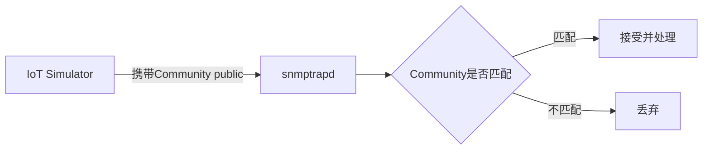

# 03 SNMP v2c与Community认证机制

本项目使用的是 SNMP v2c 版本，配合 Community 字符串做最简单的访问控制，本章讲清楚它的能力边界。

## 核心要点

* SNMP v2c 使用一个共享字符串（Community）作为访问凭证，本项目固定使用 public 这个值。
* Community 字符串在协议层面以明文传输，不提供加密，也不提供强身份认证。
* snmptrapd 通过 authCommunity 配置来声明允许哪些 Community 字符串执行日志记录、处理器执行和转发操作。
* 设计文档明确指出，Community 与固定密码属于演示专用配置，正式环境需要替换为 SNMPv3 等更安全的机制。

---

## 本章测验

本章共 5 道单项选择题。

### 第 1 题

本项目中，SNMP v2c 使用的 Community 字符串固定为什么？

- A. admin
- B. private
- C. public
- D. snmpv2c

选择答案后查看结果

正确答案：C

答案解析：项目文档中明确说明，Compose 的初始值将 SNMP_COMMUNITY 设为 public，这是 SNMP v2c 最常见的默认值。

### 第 2 题

SNMP v2c 的 Community 机制在安全性上有什么局限？

- A. 它以加密方式传输，只是密钥较短
- B. 它需要双向证书验证，配置复杂
- C. 它完全等同于 SNMPv3 的 authPriv 模式
- D. 它是明文传输，不提供加密也不提供强身份认证

选择答案后查看结果

正确答案：D

答案解析：Community 字符串以明文形式传输，既不加密也不做强身份认证，安全性远低于 SNMPv3。

### 第 3 题

snmptrapd 中用来声明允许哪些 Community 执行日志、处理器和转发操作的配置项是什么？

- A. snmpAccess
- B. trapCommunity
- C. communityAllow
- D. authCommunity

选择答案后查看结果

正确答案：D

答案解析：詳細設計書中提到 authCommunity log,execute,net public 用来允许 Community 为 public 的 Trap 进行日志记录、处理器执行和转发。

### 第 4 题

如果一条 Trap 携带的 Community 字符串与配置不匹配，snmptrapd 会如何处理？

- A. 自动将其替换为 public 后继续处理
- B. 不会被接受进入后续处理流程
- C. 会触发管理端重新发起轮询
- D. 记录警告日志但仍然转发

选择答案后查看结果

正确答案：B

答案解析：Community 不匹配的 Trap 不会通过校验，因此不会进入后续的日志记录、处理器执行和转发流程。

### 第 5 题

设计文档对 Community 和固定数据库密码给出了怎样的定位？

- A. 这些配置项在生产环境会被自动加密
- B. 文档未提及这些配置的安全定位
- C. 仅为演示专用配置，正式环境需要替换为更安全的机制
- D. 可以直接用于生产环境，无需修改

选择答案后查看结果

正确答案：C

答案解析：文档在“制約事項”和“セキュリティ上の注意”部分明确说明，Community 与固定密码是演示专用值，生产环境需要改用 SNMPv3、Secrets 管理等方案。

<!-- QUIZ_DATA_START
{
  "chapter": "03",
  "questions": [
    {
      "id": 1,
      "question": "本项目中，SNMP v2c 使用的 Community 字符串固定为什么？",
      "options": {
        "A": "admin",
        "B": "private",
        "C": "public",
        "D": "snmpv2c"
      },
      "answer": "C",
      "explanation": "项目文档中明确说明，Compose 的初始值将 SNMP_COMMUNITY 设为 public，这是 SNMP v2c 最常见的默认值。"
    },
    {
      "id": 2,
      "question": "SNMP v2c 的 Community 机制在安全性上有什么局限？",
      "options": {
        "A": "它以加密方式传输，只是密钥较短",
        "B": "它需要双向证书验证，配置复杂",
        "C": "它完全等同于 SNMPv3 的 authPriv 模式",
        "D": "它是明文传输，不提供加密也不提供强身份认证"
      },
      "answer": "D",
      "explanation": "Community 字符串以明文形式传输，既不加密也不做强身份认证，安全性远低于 SNMPv3。"
    },
    {
      "id": 3,
      "question": "snmptrapd 中用来声明允许哪些 Community 执行日志、处理器和转发操作的配置项是什么？",
      "options": {
        "A": "snmpAccess",
        "B": "trapCommunity",
        "C": "communityAllow",
        "D": "authCommunity"
      },
      "answer": "D",
      "explanation": "詳細設計書中提到 authCommunity log,execute,net public 用来允许 Community 为 public 的 Trap 进行日志记录、处理器执行和转发。"
    },
    {
      "id": 4,
      "question": "如果一条 Trap 携带的 Community 字符串与配置不匹配，snmptrapd 会如何处理？",
      "options": {
        "A": "自动将其替换为 public 后继续处理",
        "B": "不会被接受进入后续处理流程",
        "C": "会触发管理端重新发起轮询",
        "D": "记录警告日志但仍然转发"
      },
      "answer": "B",
      "explanation": "Community 不匹配的 Trap 不会通过校验，因此不会进入后续的日志记录、处理器执行和转发流程。"
    },
    {
      "id": 5,
      "question": "设计文档对 Community 和固定数据库密码给出了怎样的定位？",
      "options": {
        "A": "这些配置项在生产环境会被自动加密",
        "B": "文档未提及这些配置的安全定位",
        "C": "仅为演示专用配置，正式环境需要替换为更安全的机制",
        "D": "可以直接用于生产环境，无需修改"
      },
      "answer": "C",
      "explanation": "文档在“制約事項”和“セキュリティ上の注意”部分明确说明，Community 与固定密码是演示专用值，生产环境需要改用 SNMPv3、Secrets 管理等方案。"
    }
  ]
}
QUIZ_DATA_END -->
