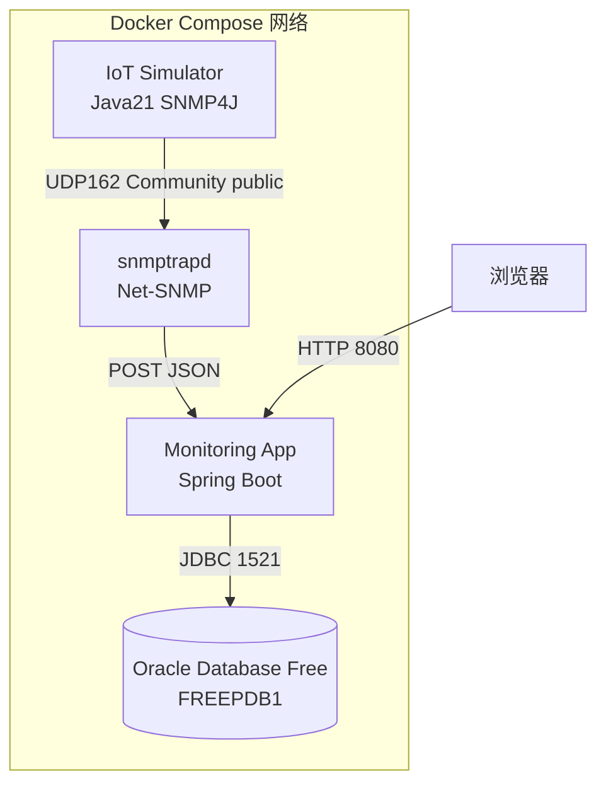

# 04 系统整体架构总览

把前几章的概念放到一起，看看这套系统由哪些组件组成，它们又是怎么连接起来的。

## 核心要点

* 整个系统运行在 Docker Compose 网络内，包含四个主要服务：iot-simulator、snmptrapd、monitoring-app、oracle-db。
* 数据从 IoT Simulator 出发，经 UDP 162 发送 Trap 给 snmptrapd，snmptrapd 转换后通过 HTTP POST 发给 Spring Boot，再由 JDBC 写入 Oracle。
* 浏览器只与 Spring Boot（monitoring-app）交互，通过 HTTP 8080 访问 /traps 页面查看数据，不直接接触底层的 SNMP 和数据库。
* 五个组件各自职责单一：模拟发送、协议接收转换、业务校验持久化、数据存储、页面展示，符合关注点分离的思路。

## 关键信息

| 组件 | 职责 |
| --- | --- |
| IoT Simulator | 把事件映射到 OID，发送一条 SNMP v2c Trap |
| snmptrapd | 在 UDP 162 接收，加载自包含 MIB，标准输出记录，并启动转发脚本 |
| 转发脚本 | 用 Trap/VB 辞书校验 OID、类型、长度、业务枚举值，向 Spring Boot API 发送 JSON |
| Monitoring App | 完成输入校验、JPA 持久化、按接收时间倒序展示列表 |
| Oracle Database Free | 持久化保存 SNMP_TRAP_EVENT 表 |

---

## 本章测验

本章共 5 道单项选择题。

### 第 1 题

整个 SNMP Trap Demo 系统运行在什么环境中？

- A. 单个 Kubernetes Pod
- B. 无服务器函数平台
- C. 裸机直接部署
- D. Docker Compose 网络

选择答案后查看结果

正确答案：D

答案解析：系统由多个 Docker Compose 服务组成，运行在同一个 Compose 网络内，包括 iot-simulator、snmptrapd、monitoring-app、oracle-db。

### 第 2 题

数据从 IoT Simulator 到 Oracle 数据库，依次经过哪些传输环节？

- A. 先经过浏览器中转，再写入 Oracle
- B. HTTP 到 snmptrapd，再 UDP 到 Spring Boot，再 JDBC 到 Oracle
- C. 直接 JDBC 写入 Oracle，不经过 snmptrapd 和 Spring Boot
- D. UDP 到 snmptrapd，再 HTTP POST 到 Spring Boot，再 JDBC 到 Oracle

选择答案后查看结果

正确答案：D

答案解析：数据流是：IoT Simulator 通过 UDP 162 发送 Trap 给 snmptrapd，snmptrapd 通过 HTTP POST 转发 JSON 给 Spring Boot，Spring Boot 再通过 JDBC 写入 Oracle。

### 第 3 题

浏览器在这套系统中直接连接的是哪个组件？

- A. snmptrapd
- B. Oracle Database Free
- C. Monitoring App（Spring Boot）
- D. IoT Simulator

选择答案后查看结果

正确答案：C

答案解析：浏览器通过 HTTP 8080 只与 Monitoring App 交互，不直接接触 SNMP 层或数据库。

### 第 4 题

以下哪一项正确描述了 snmptrapd 在整体架构中的职责？

- A. 负责把数据最终持久化到 Oracle 数据库
- B. 负责生成 SNMP v2c Trap 并发送给自身
- C. 负责在浏览器中渲染 HTML 页面
- D. 负责接收 UDP Trap、加载 MIB、标准输出记录并启动转发脚本

选择答案后查看结果

正确答案：D

答案解析：根据组件职责表，snmptrapd 负责在 UDP 162 接收 Trap、加载自包含 MIB、标准输出记录，并启动转发脚本进行后续处理。

### 第 5 题

这种“每个组件只负责一件事”的架构设计，主要带来的好处是什么？

- A. 职责边界清晰，出现问题时更容易定位是哪一环出错
- B. 可以减少 Docker 镜像的数量
- C. 可以完全省略日志记录
- D. 让所有组件共用同一个数据库连接池

选择答案后查看结果

正确答案：A

答案解析：职责单一的组件划分使得排查问题时可以按数据流顺序逐环节检查，快速定位故障发生的具体环节。

<!-- QUIZ_DATA_START
{
  "chapter": "04",
  "questions": [
    {
      "id": 1,
      "question": "整个 SNMP Trap Demo 系统运行在什么环境中？",
      "options": {
        "A": "单个 Kubernetes Pod",
        "B": "无服务器函数平台",
        "C": "裸机直接部署",
        "D": "Docker Compose 网络"
      },
      "answer": "D",
      "explanation": "系统由多个 Docker Compose 服务组成，运行在同一个 Compose 网络内，包括 iot-simulator、snmptrapd、monitoring-app、oracle-db。"
    },
    {
      "id": 2,
      "question": "数据从 IoT Simulator 到 Oracle 数据库，依次经过哪些传输环节？",
      "options": {
        "A": "先经过浏览器中转，再写入 Oracle",
        "B": "HTTP 到 snmptrapd，再 UDP 到 Spring Boot，再 JDBC 到 Oracle",
        "C": "直接 JDBC 写入 Oracle，不经过 snmptrapd 和 Spring Boot",
        "D": "UDP 到 snmptrapd，再 HTTP POST 到 Spring Boot，再 JDBC 到 Oracle"
      },
      "answer": "D",
      "explanation": "数据流是：IoT Simulator 通过 UDP 162 发送 Trap 给 snmptrapd，snmptrapd 通过 HTTP POST 转发 JSON 给 Spring Boot，Spring Boot 再通过 JDBC 写入 Oracle。"
    },
    {
      "id": 3,
      "question": "浏览器在这套系统中直接连接的是哪个组件？",
      "options": {
        "A": "snmptrapd",
        "B": "Oracle Database Free",
        "C": "Monitoring App（Spring Boot）",
        "D": "IoT Simulator"
      },
      "answer": "C",
      "explanation": "浏览器通过 HTTP 8080 只与 Monitoring App 交互，不直接接触 SNMP 层或数据库。"
    },
    {
      "id": 4,
      "question": "以下哪一项正确描述了 snmptrapd 在整体架构中的职责？",
      "options": {
        "A": "负责把数据最终持久化到 Oracle 数据库",
        "B": "负责生成 SNMP v2c Trap 并发送给自身",
        "C": "负责在浏览器中渲染 HTML 页面",
        "D": "负责接收 UDP Trap、加载 MIB、标准输出记录并启动转发脚本"
      },
      "answer": "D",
      "explanation": "根据组件职责表，snmptrapd 负责在 UDP 162 接收 Trap、加载自包含 MIB、标准输出记录，并启动转发脚本进行后续处理。"
    },
    {
      "id": 5,
      "question": "这种“每个组件只负责一件事”的架构设计，主要带来的好处是什么？",
      "options": {
        "A": "职责边界清晰，出现问题时更容易定位是哪一环出错",
        "B": "可以减少 Docker 镜像的数量",
        "C": "可以完全省略日志记录",
        "D": "让所有组件共用同一个数据库连接池"
      },
      "answer": "A",
      "explanation": "职责单一的组件划分使得排查问题时可以按数据流顺序逐环节检查，快速定位故障发生的具体环节。"
    }
  ]
}
QUIZ_DATA_END -->
