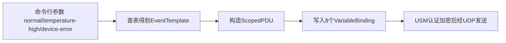

# 04. IoT Simulator：模拟设备发送SNMPv3通知

要测试整套接收链路，需要一个能正确构造SNMPv3 authPriv Inform/Trap报文的模拟器，这就是IotSimulator的职责。

## 核心要点

* 模拟器内置三种事件模板：normal、temperature-high、device-error，各自带有默认的温度和消息
* 每次发送都会生成一个新的随机UUID作为eventId，写入第8个VariableBinding
* 发送前会用USM添加安全用户，认证算法固定为AuthHMAC192SHA256，加密算法固定为PrivAES128
* 如果是Inform模式，代码会检查响应类型必须是RESPONSE且errorStatus为noError，否则视为失败并以非零状态码退出

---

## 本章测验

本章共 5 道单项选择题。

### 第 1 题

IotSimulator支持通过命令行参数选择几种预置事件类型？

- A. 5种
- B. 1种
- C. 2种
- D. 3种

选择答案后查看结果

正确答案：D

答案解析：代码中的EVENTS这个Map定义了normal、temperature-high、device-error三种事件模板。

### 第 2 题

每次运行模拟器发送的eventId是如何生成的？

- A. 每次调用UUID.randomUUID()生成新的随机值
- B. 由服务器端生成后返回
- C. 根据当前时间戳直接截取
- D. 固定写死在代码里，每次相同

选择答案后查看结果

正确答案：A

答案解析：代码中TrapEvent的构造使用了UUID.randomUUID()，保证每次发送的eventId都是唯一的，这个值也会被后端用来做去重。

### 第 3 题

IotSimulator在发送前配置USM用户时，使用的认证和加密算法分别是什么？

- A. MD5和DES
- B. AuthHMAC192SHA256和PrivAES128
- C. SHA-1和3DES
- D. 不使用任何算法，仅明文发送

选择答案后查看结果

正确答案：B

答案解析：代码里usm.addUser使用了AuthHMAC192SHA256.ID作为认证算法ID，PrivAES128.ID作为加密算法ID，与整个平台的authPriv要求一致。

### 第 4 题

如果模拟器以Inform模式发送，但收到的是一个SNMP REPORT而不是RESPONSE，会发生什么？

- A. 程序会忽略这个响应，继续等待
- B. 程序视为发送成功并正常退出
- C. 程序会抛出异常，提示收到的是Report而不是RESPONSE，最终以失败退出
- D. 程序会自动切换成Trap模式重试

选择答案后查看结果

正确答案：C

答案解析：代码明确判断response.getResponse().getType()是否等于PDU.RESPONSE，如果不是（比如收到unknown user、wrong digest导致的Report），就抛出IOException并以失败状态退出。

### 第 5 题

关于IotSimulator对SNMP版本的处理，下列说法正确的是？

- A. 默认使用v2c，仅在特殊配置下才用v3
- B. 版本号完全不影响程序行为
- C. 支持v1、v2c、v3三种版本自由切换
- D. 只允许SNMP_VERSION=3，其余版本会直接抛出异常

选择答案后查看结果

正确答案：D

答案解析：代码中如果读取到的version不等于\"3\"，会直接抛出IllegalArgumentException，强制整个链路只能使用SNMPv3。

<!-- QUIZ_DATA_START
{
  "chapter": "04",
  "questions": [
    {
      "id": 1,
      "question": "IotSimulator支持通过命令行参数选择几种预置事件类型？",
      "options": {
        "A": "5种",
        "B": "1种",
        "C": "2种",
        "D": "3种"
      },
      "answer": "D",
      "explanation": "代码中的EVENTS这个Map定义了normal、temperature-high、device-error三种事件模板。"
    },
    {
      "id": 2,
      "question": "每次运行模拟器发送的eventId是如何生成的？",
      "options": {
        "A": "每次调用UUID.randomUUID()生成新的随机值",
        "B": "由服务器端生成后返回",
        "C": "根据当前时间戳直接截取",
        "D": "固定写死在代码里，每次相同"
      },
      "answer": "A",
      "explanation": "代码中TrapEvent的构造使用了UUID.randomUUID()，保证每次发送的eventId都是唯一的，这个值也会被后端用来做去重。"
    },
    {
      "id": 3,
      "question": "IotSimulator在发送前配置USM用户时，使用的认证和加密算法分别是什么？",
      "options": {
        "A": "MD5和DES",
        "B": "AuthHMAC192SHA256和PrivAES128",
        "C": "SHA-1和3DES",
        "D": "不使用任何算法，仅明文发送"
      },
      "answer": "B",
      "explanation": "代码里usm.addUser使用了AuthHMAC192SHA256.ID作为认证算法ID，PrivAES128.ID作为加密算法ID，与整个平台的authPriv要求一致。"
    },
    {
      "id": 4,
      "question": "如果模拟器以Inform模式发送，但收到的是一个SNMP REPORT而不是RESPONSE，会发生什么？",
      "options": {
        "A": "程序会忽略这个响应，继续等待",
        "B": "程序视为发送成功并正常退出",
        "C": "程序会抛出异常，提示收到的是Report而不是RESPONSE，最终以失败退出",
        "D": "程序会自动切换成Trap模式重试"
      },
      "answer": "C",
      "explanation": "代码明确判断response.getResponse().getType()是否等于PDU.RESPONSE，如果不是（比如收到unknown user、wrong digest导致的Report），就抛出IOException并以失败状态退出。"
    },
    {
      "id": 5,
      "question": "关于IotSimulator对SNMP版本的处理，下列说法正确的是？",
      "options": {
        "A": "默认使用v2c，仅在特殊配置下才用v3",
        "B": "版本号完全不影响程序行为",
        "C": "支持v1、v2c、v3三种版本自由切换",
        "D": "只允许SNMP_VERSION=3，其余版本会直接抛出异常"
      },
      "answer": "D",
      "explanation": "代码中如果读取到的version不等于\\\"3\\\"，会直接抛出IllegalArgumentException，强制整个链路只能使用SNMPv3。"
    }
  ]
}
QUIZ_DATA_END -->
