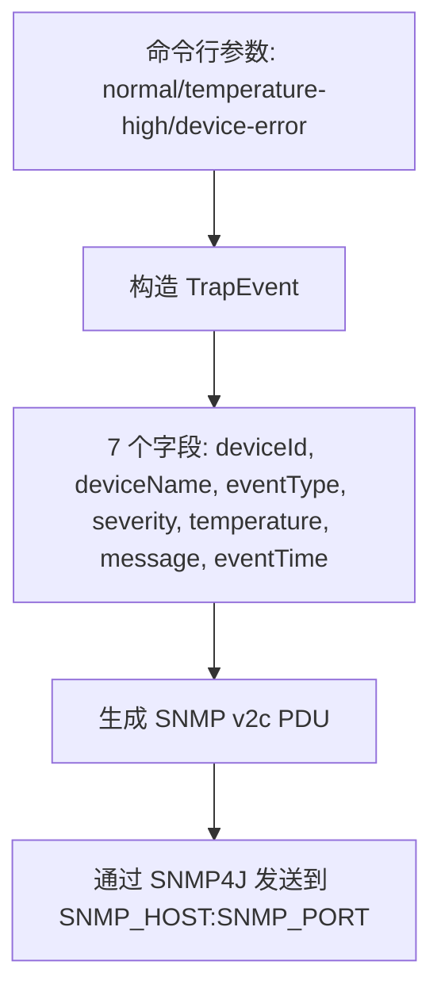

# 组件详解：IoT Simulator

Trap 的旅程从哪里开始？先看看模拟设备是怎么把一条事件打包成 SNMP 报文的。

## 核心要点

* IoT Simulator 是基于 Java 21 和 SNMP4J 库编写的命令行工具，用来模拟真实设备发送 SNMP v2c Trap。
* TrapEvent 类保存 7 项发送数据：deviceId、deviceName、eventType、severity、temperature、message、eventTime。
* 运行时通过命令行参数选择要发送的事件类型：normal、temperature-high、device-error，对应三种预置场景。
* 发送目标由环境变量 SNMP_HOST、SNMP_PORT、SNMP_COMMUNITY 决定，Docker Compose 默认值分别是 snmptrapd、162、public。

---

## 本章测验

本章共 5 道单项选择题。

### 第 1 题

IoT Simulator 是用什么技术实现的？

- A. Go 语言标准库
- B. Python 加 pysnmp
- C. Java 21 加 SNMP4J
- D. Node.js 加原生 UDP 库

选择答案后查看结果

正确答案：C

答案解析：README 明确说明 IoT Simulator 是 Java 21 编写、使用 SNMP4J 库来发送 SNMP v2c Trap 的命令行程序。

### 第 2 题

TrapEvent 类一共保存了多少项发送数据？

- A. 5 项
- B. 6 项
- C. 9 项
- D. 7 项

选择答案后查看结果

正确答案：D

答案解析：详细设计书列出 TrapEvent 保存的字段为 deviceId、deviceName、eventType、severity、temperature、message、eventTime，共 7 项。

### 第 3 题

运行 Simulator 时，如何指定要发送哪一种事件？

- A. 通过修改 Oracle 数据库配置
- B. 通过修改源码重新编译
- C. 通过命令行参数，如 normal、temperature-high、device-error
- D. 事件类型完全随机生成

选择答案后查看结果

正确答案：C

答案解析：README 的运行示例显示通过命令行参数（normal / temperature-high / device-error）选择要发送的预置事件场景。

### 第 4 题

如果要把 Simulator 的发送目标从默认的 snmptrapd 容器改成另一台主机，应该怎么做？

- A. 直接在浏览器地址栏输入新地址
- B. 调整环境变量 SNMP_HOST 和 SNMP_PORT
- C. 修改 Java 源码并重新打包镜像
- D. 无法修改发送目标

选择答案后查看结果

正确答案：B

答案解析：发送目标由 SNMP_HOST、SNMP_PORT、SNMP_COMMUNITY 三个环境变量控制，调整这些变量即可改变目标，无需改代码。

### 第 5 题

在整条数据链路中，IoT Simulator 处于什么位置，承担什么职责？

- A. 链路的最末端，负责展示数据
- B. 负责把 JSON 写入 Oracle 数据库
- C. 链路的起点，负责生成并发送模拟 Trap 事件
- D. 负责校验 Spring Boot 的 REST API 参数

选择答案后查看结果

正确答案：C

答案解析：Simulator 是整条数据链路的发起点，模拟真实设备产生事件并把它们封装成 SNMP Trap 报文发送出去。

<!-- QUIZ_DATA_START
{
  "chapter": "04",
  "questions": [
    {
      "id": 1,
      "question": "IoT Simulator 是用什么技术实现的？",
      "options": {
        "C": "Java 21 加 SNMP4J",
        "A": "Go 语言标准库",
        "B": "Python 加 pysnmp",
        "D": "Node.js 加原生 UDP 库"
      },
      "answer": "C",
      "explanation": "README 明确说明 IoT Simulator 是 Java 21 编写、使用 SNMP4J 库来发送 SNMP v2c Trap 的命令行程序。"
    },
    {
      "id": 2,
      "question": "TrapEvent 类一共保存了多少项发送数据？",
      "options": {
        "D": "7 项",
        "A": "5 项",
        "B": "6 项",
        "C": "9 项"
      },
      "answer": "D",
      "explanation": "详细设计书列出 TrapEvent 保存的字段为 deviceId、deviceName、eventType、severity、temperature、message、eventTime，共 7 项。"
    },
    {
      "id": 3,
      "question": "运行 Simulator 时，如何指定要发送哪一种事件？",
      "options": {
        "C": "通过命令行参数，如 normal、temperature-high、device-error",
        "A": "通过修改 Oracle 数据库配置",
        "B": "通过修改源码重新编译",
        "D": "事件类型完全随机生成"
      },
      "answer": "C",
      "explanation": "README 的运行示例显示通过命令行参数（normal / temperature-high / device-error）选择要发送的预置事件场景。"
    },
    {
      "id": 4,
      "question": "如果要把 Simulator 的发送目标从默认的 snmptrapd 容器改成另一台主机，应该怎么做？",
      "options": {
        "B": "调整环境变量 SNMP_HOST 和 SNMP_PORT",
        "A": "直接在浏览器地址栏输入新地址",
        "C": "修改 Java 源码并重新打包镜像",
        "D": "无法修改发送目标"
      },
      "answer": "B",
      "explanation": "发送目标由 SNMP_HOST、SNMP_PORT、SNMP_COMMUNITY 三个环境变量控制，调整这些变量即可改变目标，无需改代码。"
    },
    {
      "id": 5,
      "question": "在整条数据链路中，IoT Simulator 处于什么位置，承担什么职责？",
      "options": {
        "C": "链路的起点，负责生成并发送模拟 Trap 事件",
        "A": "链路的最末端，负责展示数据",
        "B": "负责把 JSON 写入 Oracle 数据库",
        "D": "负责校验 Spring Boot 的 REST API 参数"
      },
      "answer": "C",
      "explanation": "Simulator 是整条数据链路的发起点，模拟真实设备产生事件并把它们封装成 SNMP Trap 报文发送出去。"
    }
  ]
}
QUIZ_DATA_END -->
