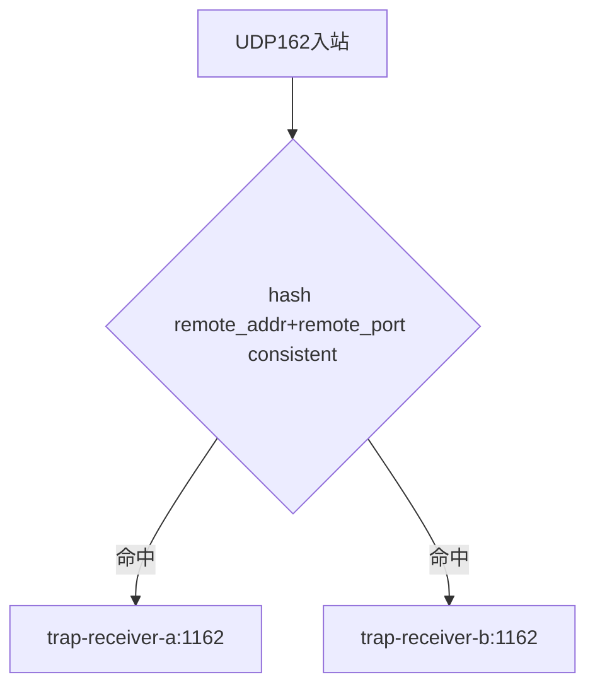

# 05. UDP Gateway：一致性哈希路由

UDP协议下的一致性哈希路由要保证同一台设备的discovery和后续Inform到达同一个接收节点，这是本章的重点。

## 核心要点

* nginx的stream模块用hash $remote_addr$remote_port consistent实现一致性哈希
* SNMPv3的discovery阶段和后续Inform必须到达同一个authoritative Engine ID，所以路由必须固定同一来源到同一节点
* consistent哈希算法在节点数量变化时，只有少部分映射关系会改变，减少USM状态失效的范围
* 监听端口用了reuseport选项，让多个worker进程可以共同监听UDP 162端口提高吞吐

---

## 本章测验

本章共 5 道单项选择题。

### 第 1 题

nginx stream模块中使用的哈希表达式是什么？

- A. hash $remote_addr$remote_port consistent
- B. round_robin
- C. least_conn
- D. hash $server_name

选择答案后查看结果

正确答案：A

答案解析：配置文件里明确写着hash $remote_addr$remote_port consistent，把来源地址和端口组合起来做一致性哈希。

### 第 2 题

为什么SNMPv3的Inform请求必须固定路由到同一个接收节点，而不能随意分发？

- A. 因为UDP协议本身要求必须固定路由
- B. 因为discovery阶段协商的Engine ID和USM状态需要在同一节点上保持一致
- C. 因为Oracle数据库只允许一个节点写入
- D. 因为nginx不支持多节点转发UDP

选择答案后查看结果

正确答案：B

答案解析：SNMPv3安全机制依赖Engine ID和USM本地状态，如果同一来源的请求被分发到不同节点，接收节点无法识别已经协商过的安全上下文，会导致认证失败。

### 第 3 题

一致性哈希相比简单取模哈希，最大的优势是什么？

- A. 可以完全避免所有网络延迟
- B. 计算速度更快
- C. 节点数量变化时，只有少部分映射关系需要重新分配
- D. 不需要计算来源地址

选择答案后查看结果

正确答案：C

答案解析：简单取模在节点数变化时几乎所有映射都会变化，一致性哈希则只影响环上相邻的一小部分范围，大幅降低状态失效的影响面。

### 第 4 题

配置中的reuseport选项起到什么作用？

- A. 让nginx自动重启失败的worker
- B. 关闭UDP校验和检查
- C. 强制所有连接走TCP协议
- D. 允许多个worker进程共同监听同一UDP端口，提升并发处理能力

选择答案后查看结果

正确答案：D

答案解析：reuseport允许操作系统内核把同一端口的流量分发给多个监听的worker进程，提高并发吞吐，这与哈希路由是两个独立但配合使用的机制。

### 第 5 题

如果没有一致性哈希，只是简单的轮询转发UDP请求，最可能出现的问题是什么？

- A. 同一设备的discovery和Inform可能被分发到不同节点，导致USM认证失败
- B. Oracle数据库连接数会翻倍
- C. Web页面无法加载
- D. 完全没有影响

选择答案后查看结果

正确答案：A

答案解析：轮询会打散同一来源的请求到不同节点，破坏SNMPv3依赖的Engine ID一致性，这正是本章要说明的路由设计动机。

<!-- QUIZ_DATA_START
{
  "chapter": "05",
  "questions": [
    {
      "id": 1,
      "question": "nginx stream模块中使用的哈希表达式是什么？",
      "options": {
        "A": "hash $remote_addr$remote_port consistent",
        "B": "round_robin",
        "C": "least_conn",
        "D": "hash $server_name"
      },
      "answer": "A",
      "explanation": "配置文件里明确写着hash $remote_addr$remote_port consistent，把来源地址和端口组合起来做一致性哈希。"
    },
    {
      "id": 2,
      "question": "为什么SNMPv3的Inform请求必须固定路由到同一个接收节点，而不能随意分发？",
      "options": {
        "A": "因为UDP协议本身要求必须固定路由",
        "B": "因为discovery阶段协商的Engine ID和USM状态需要在同一节点上保持一致",
        "C": "因为Oracle数据库只允许一个节点写入",
        "D": "因为nginx不支持多节点转发UDP"
      },
      "answer": "B",
      "explanation": "SNMPv3安全机制依赖Engine ID和USM本地状态，如果同一来源的请求被分发到不同节点，接收节点无法识别已经协商过的安全上下文，会导致认证失败。"
    },
    {
      "id": 3,
      "question": "一致性哈希相比简单取模哈希，最大的优势是什么？",
      "options": {
        "A": "可以完全避免所有网络延迟",
        "B": "计算速度更快",
        "C": "节点数量变化时，只有少部分映射关系需要重新分配",
        "D": "不需要计算来源地址"
      },
      "answer": "C",
      "explanation": "简单取模在节点数变化时几乎所有映射都会变化，一致性哈希则只影响环上相邻的一小部分范围，大幅降低状态失效的影响面。"
    },
    {
      "id": 4,
      "question": "配置中的reuseport选项起到什么作用？",
      "options": {
        "A": "让nginx自动重启失败的worker",
        "B": "关闭UDP校验和检查",
        "C": "强制所有连接走TCP协议",
        "D": "允许多个worker进程共同监听同一UDP端口，提升并发处理能力"
      },
      "answer": "D",
      "explanation": "reuseport允许操作系统内核把同一端口的流量分发给多个监听的worker进程，提高并发吞吐，这与哈希路由是两个独立但配合使用的机制。"
    },
    {
      "id": 5,
      "question": "如果没有一致性哈希，只是简单的轮询转发UDP请求，最可能出现的问题是什么？",
      "options": {
        "A": "同一设备的discovery和Inform可能被分发到不同节点，导致USM认证失败",
        "B": "Oracle数据库连接数会翻倍",
        "C": "Web页面无法加载",
        "D": "完全没有影响"
      },
      "answer": "A",
      "explanation": "轮询会打散同一来源的请求到不同节点，破坏SNMPv3依赖的Engine ID一致性，这正是本章要说明的路由设计动机。"
    }
  ]
}
QUIZ_DATA_END -->
