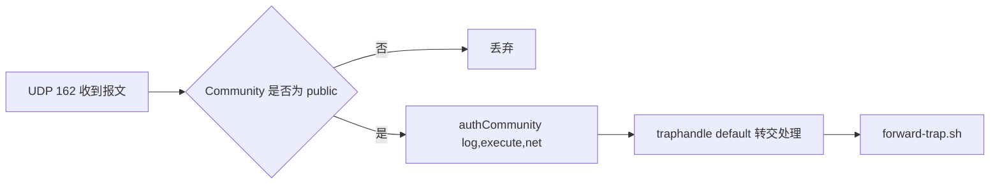

# 组件详解：snmptrapd 与 Community 认证

Trap 报文到达之后，第一个接收它的进程是谁？它凭什么决定要不要处理？

## 核心要点

* snmptrapd 是 Net-SNMP 5.9 系列自带的 Trap 接收服务，监听全部 IPv4 接口的 UDP 162 端口。
* authCommunity log,execute,net public 这行配置的含义是：Community 为 public 的报文允许记录日志、执行处理器、来自网络。
* traphandle default 表示所有类型的通知都统一转交给 forward-trap.sh 脚本处理，不区分具体 OID。
* 启动参数 -f -Lo -On 分别表示前台运行、日志输出到标准输出、以数字形式显示 OID；-C 避免和默认配置重复加载。
* snmptrapd 本身不负责数据库存储、业务查询、失败重试或 MIB 分发这些工作，职责边界很清楚。

---

## 本章测验

本章共 5 道单项选择题。

### 第 1 题

snmptrapd 默认监听哪个端口来接收 SNMP Trap？

- A. UDP 162
- B. TCP 1521
- C. TCP 8080
- D. UDP 161

选择答案后查看结果

正确答案：A

答案解析：详细设计书写明 snmptrapd 监听全部 IPv4 接口的 UDP 162 端口，这是 SNMP Trap 的标准端口（161 是普通 SNMP 查询端口）。

### 第 2 题

配置 authCommunity log,execute,net public 的含义是什么？

- A. 开启 SNMPv3 加密
- B. 把 public 报文转发给 Oracle
- C. 允许 Community 为 public 的报文记录日志、执行处理器、来自网络
- D. 禁止所有 Community 为 public 的报文

选择答案后查看结果

正确答案：C

答案解析：log,execute,net 三个关键字分别授权日志记录、执行 handler、接受来自网络的请求，且只对 Community 为 public 的报文生效。

### 第 3 题

traphandle default 的作用是什么？

- A. 拒绝处理所有未知 Trap
- B. 自动生成默认的 MIB 文件
- C. 只处理默认 OID 为 0 的 Trap
- D. 把所有通知统一转交给指定脚本处理

选择答案后查看结果

正确答案：D

答案解析：default 关键字表示不按具体 OID 区分，所有收到的通知都统一交给 forward-trap.sh 脚本去解析和转发。

### 第 4 题

启动参数中的 -On 具体起什么作用？

- A. 以数字形式显示 OID，而不是符号名
- B. 开启网络加密
- C. 限制并发连接数
- D. 指定输出文件路径

选择答案后查看结果

正确答案：A

答案解析：-On 让 snmptrapd 以数字 OID 输出，这样后续脚本可以用固定的数值比较，而不依赖 MIB 加载状态或本地化显示。

### 第 5 题

以下哪一项不属于 snmptrapd 的职责范围？

- A. 把报文转交给处理脚本
- B. 接收 UDP 162 上的 Trap 报文
- C. 根据 Community 做基础授权判断
- D. 把数据持久化写入 Oracle 数据库

选择答案后查看结果

正确答案：D

答案解析：详细设计书明确列出 snmptrapd 的"非担当"包括数据库持久化、业务检索、重试队列等，这些工作由 Spring Boot 和 Oracle 承担。

<!-- QUIZ_DATA_START
{
  "chapter": "05",
  "questions": [
    {
      "id": 1,
      "question": "snmptrapd 默认监听哪个端口来接收 SNMP Trap？",
      "options": {
        "A": "UDP 162",
        "B": "TCP 1521",
        "C": "TCP 8080",
        "D": "UDP 161"
      },
      "answer": "A",
      "explanation": "详细设计书写明 snmptrapd 监听全部 IPv4 接口的 UDP 162 端口，这是 SNMP Trap 的标准端口（161 是普通 SNMP 查询端口）。"
    },
    {
      "id": 2,
      "question": "配置 authCommunity log,execute,net public 的含义是什么？",
      "options": {
        "C": "允许 Community 为 public 的报文记录日志、执行处理器、来自网络",
        "A": "开启 SNMPv3 加密",
        "B": "把 public 报文转发给 Oracle",
        "D": "禁止所有 Community 为 public 的报文"
      },
      "answer": "C",
      "explanation": "log,execute,net 三个关键字分别授权日志记录、执行 handler、接受来自网络的请求，且只对 Community 为 public 的报文生效。"
    },
    {
      "id": 3,
      "question": "traphandle default 的作用是什么？",
      "options": {
        "D": "把所有通知统一转交给指定脚本处理",
        "A": "拒绝处理所有未知 Trap",
        "B": "自动生成默认的 MIB 文件",
        "C": "只处理默认 OID 为 0 的 Trap"
      },
      "answer": "D",
      "explanation": "default 关键字表示不按具体 OID 区分，所有收到的通知都统一交给 forward-trap.sh 脚本去解析和转发。"
    },
    {
      "id": 4,
      "question": "启动参数中的 -On 具体起什么作用？",
      "options": {
        "A": "以数字形式显示 OID，而不是符号名",
        "B": "开启网络加密",
        "C": "限制并发连接数",
        "D": "指定输出文件路径"
      },
      "answer": "A",
      "explanation": "-On 让 snmptrapd 以数字 OID 输出，这样后续脚本可以用固定的数值比较，而不依赖 MIB 加载状态或本地化显示。"
    },
    {
      "id": 5,
      "question": "以下哪一项不属于 snmptrapd 的职责范围？",
      "options": {
        "D": "把数据持久化写入 Oracle 数据库",
        "A": "把报文转交给处理脚本",
        "B": "接收 UDP 162 上的 Trap 报文",
        "C": "根据 Community 做基础授权判断"
      },
      "answer": "D",
      "explanation": "详细设计书明确列出 snmptrapd 的\"非担当\"包括数据库持久化、业务检索、重试队列等，这些工作由 Spring Boot 和 Oracle 承担。"
    }
  ]
}
QUIZ_DATA_END -->
