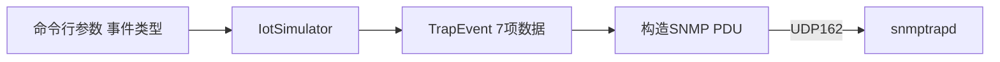

# 05 组件详解：IoT Simulator

IoT Simulator 是整条链路的起点，本章讲清楚它做了什么、怎么触发发送。

## 核心要点

* IoT Simulator 由 IotSimulator 类读取命令行参数和环境变量，构造 PDU 并发送 Trap。
* TrapEvent 类保存 7 项发送数据：设备编号、设备名称、事件类型、严重程度、温度、消息、事件时间。
* 运行方式是 docker compose run --rm iot-simulator 加事件名，例如 normal、temperature-high、device-error。
* 发送目标由环境变量 SNMP_HOST、SNMP_PORT、SNMP_COMMUNITY 控制，Compose 的默认值分别是 snmptrapd、162、public。
* 错误处理约定：命令行参数不合法时返回退出码 2，发送过程中出现异常时返回退出码 1，并输出日志说明原因。

---

## 本章测验

本章共 5 道单项选择题。

### 第 1 题

IoT Simulator 中，TrapEvent 类保存的数据一共有多少项？

- A. 7 项
- B. 6 项
- C. 5 项
- D. 8 项

选择答案后查看结果

正确答案：A

答案解析：详细设计文档说明 TrapEvent 保存 7 项发送数据：设备编号、设备名称、事件类型、严重程度、温度、消息、事件时间。

### 第 2 题

运行 IoT Simulator 发送一次 temperature-high 事件的命令是什么？

- A. docker compose exec snmptrapd temperature-high
- B. docker compose run --rm iot-simulator temperature-high
- C. docker compose start iot-simulator --event=high
- D. docker run iot-simulator.jar temperature-high

选择答案后查看结果

正确答案：B

答案解析：README 中给出的发送示例为 docker compose run --rm iot-simulator 加事件名，例如 temperature-high。

### 第 3 题

IoT Simulator 发送 Trap 时使用哪个环境变量决定目标端口？

- A. SNMP_HOST
- B. SNMP_PORT
- C. SNMP_COMMUNITY
- D. TRAP_API_URL

选择答案后查看结果

正确答案：B

答案解析：SNMP_PORT 环境变量控制发送目标端口，Compose 默认值为 162。

### 第 4 题

当命令行参数不合法时，IoT Simulator 会返回什么退出码？

- A. 2
- B. 127
- C. 1
- D. 0

选择答案后查看结果

正确答案：A

答案解析：基本设计文档规定：参数不正确的情况下返回退出码 2；发送过程中出现异常则返回退出码 1。

### 第 5 题

IoT Simulator 在发送过程中出现异常时的行为是什么？

- A. 静默失败，不输出任何日志
- B. 切换到 HTTP 协议重新发送
- C. 自动重试三次后再放弃
- D. 返回退出码 1，并输出说明原因的日志

选择答案后查看结果

正确答案：D

答案解析：设计文档规定，发送异常时返回退出码 1，并输出日志说明原因，该项目不包含自动重试机制。

<!-- QUIZ_DATA_START
{
  "chapter": "05",
  "questions": [
    {
      "id": 1,
      "question": "IoT Simulator 中，TrapEvent 类保存的数据一共有多少项？",
      "options": {
        "A": "7 项",
        "B": "6 项",
        "C": "5 项",
        "D": "8 项"
      },
      "answer": "A",
      "explanation": "详细设计文档说明 TrapEvent 保存 7 项发送数据：设备编号、设备名称、事件类型、严重程度、温度、消息、事件时间。"
    },
    {
      "id": 2,
      "question": "运行 IoT Simulator 发送一次 temperature-high 事件的命令是什么？",
      "options": {
        "A": "docker compose exec snmptrapd temperature-high",
        "B": "docker compose run --rm iot-simulator temperature-high",
        "C": "docker compose start iot-simulator --event=high",
        "D": "docker run iot-simulator.jar temperature-high"
      },
      "answer": "B",
      "explanation": "README 中给出的发送示例为 docker compose run --rm iot-simulator 加事件名，例如 temperature-high。"
    },
    {
      "id": 3,
      "question": "IoT Simulator 发送 Trap 时使用哪个环境变量决定目标端口？",
      "options": {
        "A": "SNMP_HOST",
        "B": "SNMP_PORT",
        "C": "SNMP_COMMUNITY",
        "D": "TRAP_API_URL"
      },
      "answer": "B",
      "explanation": "SNMP_PORT 环境变量控制发送目标端口，Compose 默认值为 162。"
    },
    {
      "id": 4,
      "question": "当命令行参数不合法时，IoT Simulator 会返回什么退出码？",
      "options": {
        "A": "2",
        "B": "127",
        "C": "1",
        "D": "0"
      },
      "answer": "A",
      "explanation": "基本设计文档规定：参数不正确的情况下返回退出码 2；发送过程中出现异常则返回退出码 1。"
    },
    {
      "id": 5,
      "question": "IoT Simulator 在发送过程中出现异常时的行为是什么？",
      "options": {
        "A": "静默失败，不输出任何日志",
        "B": "切换到 HTTP 协议重新发送",
        "C": "自动重试三次后再放弃",
        "D": "返回退出码 1，并输出说明原因的日志"
      },
      "answer": "D",
      "explanation": "设计文档规定，发送异常时返回退出码 1，并输出日志说明原因，该项目不包含自动重试机制。"
    }
  ]
}
QUIZ_DATA_END -->
