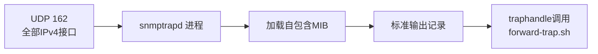

# 06 组件详解：snmptrapd

snmptrapd 是协议层的接收方，它负责监听、解析并把数据交给下一环，本章讲清楚它的边界。

## 核心要点

* snmptrapd 属于 Net-SNMP 5.9 系列（Debian bookworm 打包版本），部署在 Compose 服务 snmptrapd 中。
* 监听范围是全部 IPv4 接口的 UDP 162 端口，使用 SNMP v2c 协议，Community 为 public。
* 启动参数 -f -Lo -On 分别表示前台运行、输出到标准输出、使用数值形式的 OID；-C 用于避免与默认配置重复加载。
* snmptrapd 的职责边界很清楚：只负责协议接收、MIB 字典加载、OID/VB 提取、Trap 名称转换，不负责数据库持久化、业务检索、重试队列。
* traphandle default 配置让所有收到的通知都交给 forward-trap.sh 处理，这是连接协议层和业务层的关键一环。

---

## 本章测验

本章共 5 道单项选择题。

### 第 1 题

snmptrapd 在本项目中监听的端口和协议是什么？

- A. UDP 8080
- B. TCP 8080
- C. UDP 162
- D. TCP 1521

选择答案后查看结果

正确答案：C

答案解析：snmptrapd 在全部 IPv4 接口上监听 UDP 162 端口，接收 SNMP v2c Trap。

### 第 2 题

启动参数 -On 的作用是什么？

- A. 限制并发连接数
- B. 开启网络加密
- C. 以数值形式输出 OID，而不是符号名
- D. 启用 SNMPv3 支持

选择答案后查看结果

正确答案：C

答案解析：-On 让 snmptrapd 输出数值形式的 OID，使后续脚本的比较不依赖 MIB 显示配置或本地化设置。

### 第 3 题

以下哪一项不属于 snmptrapd 的职责？

- A. MIB 字典加载
- B. 协议接收
- C. OID/VB 提取
- D. 数据库持久化

选择答案后查看结果

正确答案：D

答案解析：详细设计文档明确列出 snmptrapd 的“非担当”事项包括数据库持久化、业务检索、重试队列等，这些由 Spring Boot 负责。

### 第 4 题

snmptrapd 中，将所有收到的通知交给转发脚本处理的配置是什么？

- A. dispatchScript default
- B. authCommunity default
- C. forwardAll enable
- D. traphandle default

选择答案后查看结果

正确答案：D

答案解析：traphandle default 配置指定所有收到的通知都调用 forward-trap.sh 进行后续处理。

### 第 5 题

启动参数 -f 的含义是什么？

- A. 以前台方式运行，不脱离终端
- B. 强制刷新 MIB 缓存
- C. 启用故障自动恢复
- D. 以后台守护进程方式运行

选择答案后查看结果

正确答案：A

答案解析：-f 表示 snmptrapd 在前台运行，这在容器化部署中是常见做法，便于容器生命周期与进程绑定。

<!-- QUIZ_DATA_START
{
  "chapter": "06",
  "questions": [
    {
      "id": 1,
      "question": "snmptrapd 在本项目中监听的端口和协议是什么？",
      "options": {
        "A": "UDP 8080",
        "B": "TCP 8080",
        "C": "UDP 162",
        "D": "TCP 1521"
      },
      "answer": "C",
      "explanation": "snmptrapd 在全部 IPv4 接口上监听 UDP 162 端口，接收 SNMP v2c Trap。"
    },
    {
      "id": 2,
      "question": "启动参数 -On 的作用是什么？",
      "options": {
        "A": "限制并发连接数",
        "B": "开启网络加密",
        "C": "以数值形式输出 OID，而不是符号名",
        "D": "启用 SNMPv3 支持"
      },
      "answer": "C",
      "explanation": "-On 让 snmptrapd 输出数值形式的 OID，使后续脚本的比较不依赖 MIB 显示配置或本地化设置。"
    },
    {
      "id": 3,
      "question": "以下哪一项不属于 snmptrapd 的职责？",
      "options": {
        "A": "MIB 字典加载",
        "B": "协议接收",
        "C": "OID/VB 提取",
        "D": "数据库持久化"
      },
      "answer": "D",
      "explanation": "详细设计文档明确列出 snmptrapd 的“非担当”事项包括数据库持久化、业务检索、重试队列等，这些由 Spring Boot 负责。"
    },
    {
      "id": 4,
      "question": "snmptrapd 中，将所有收到的通知交给转发脚本处理的配置是什么？",
      "options": {
        "A": "dispatchScript default",
        "B": "authCommunity default",
        "C": "forwardAll enable",
        "D": "traphandle default"
      },
      "answer": "D",
      "explanation": "traphandle default 配置指定所有收到的通知都调用 forward-trap.sh 进行后续处理。"
    },
    {
      "id": 5,
      "question": "启动参数 -f 的含义是什么？",
      "options": {
        "A": "以前台方式运行，不脱离终端",
        "B": "强制刷新 MIB 缓存",
        "C": "启用故障自动恢复",
        "D": "以后台守护进程方式运行"
      },
      "answer": "A",
      "explanation": "-f 表示 snmptrapd 在前台运行，这在容器化部署中是常见做法，便于容器生命周期与进程绑定。"
    }
  ]
}
QUIZ_DATA_END -->
