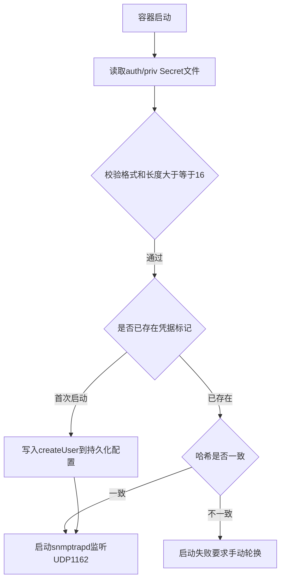

# 06. snmptrapd接收器与USM用户初始化

每个接收节点启动时都需要安全地初始化SNMPv3的USM用户凭据，这一步由container-entrypoint.sh完成。

## 核心要点

* 认证口令和加密口令都从Secret文件读取，且长度必须大于等于16位，格式只允许字母数字下划线连字符
* 首次启动时用createUser命令把用户写入持久化的snmptrapd.conf，之后重启会复用同一份配置
* 用sha256对security name、auth passphrase、priv passphrase做哈希，存成凭据标记文件，用来检测配置是否被意外更改
* 如果检测到已运行过的USM卷里存的哈希和当前传入的Secret不一致，容器会启动失败，提示需要按手册流程手动轮换，避免静默使用错误凭据

---

## 本章测验

本章共 5 道单项选择题。

### 第 1 题

container-entrypoint.sh要求认证口令和加密口令的最小长度是多少？

- A. 12个字符
- B. 16个字符
- C. 不限制长度
- D. 8个字符

选择答案后查看结果

正确答案：B

答案解析：脚本里明确用[ \"${#auth_passphrase}\" -ge 16 ]和同样的条件检查priv_passphrase，都要求至少16个字符。

### 第 2 题

USM用户的createUser命令首次执行后写入到哪里？

- A. 写入到镜像本身，每次构建都变化
- B. 仅写入内存，不持久化
- C. 写入持久化的snmptrapd.conf文件，供之后重启复用
- D. 直接写入Oracle数据库

选择答案后查看结果

正确答案：C

答案解析：脚本把createUser命令追加写入到persistent_config也就是/var/lib/snmp/snmptrapd.conf，这个文件挂载在USM持久卷上，重启容器也能复用。

### 第 3 题

脚本为什么要计算并保存security name、auth passphrase、priv passphrase的sha256哈希？

- A. 用来生成随机的Engine ID
- B. 仅用于日志记录，没有实际作用
- C. 用来加密网络流量
- D. 用来在下次启动时检测凭据是否被意外更改，防止USM状态和Secret不一致

选择答案后查看结果

正确答案：D

答案解析：credential_hash和stored_hash的比较机制正是为了防止运行中的USM卷已经用旧凭据创建了用户，而这次注入了不同的新Secret，从而产生难以排查的认证失败。

### 第 4 题

如果检测到已存在的凭据哈希和新传入的Secret不一致，容器会怎么处理？

- A. 直接启动失败，提示需要按手册手动轮换用户
- B. 忽略新Secret，继续使用旧配置正常启动
- C. 随机选择一个凭据继续运行
- D. 自动用新Secret覆盖旧配置并继续启动

选择答案后查看结果

正确答案：A

答案解析：脚本调用fail函数直接退出，要求运维按照专门的轮换流程处理，而不是自动覆盖，避免生产环境凭据被静默替换导致的安全和排查问题。

### 第 5 题

关于Engine ID的处理，脚本还额外做了什么？

- A. 完全忽略Engine ID，不做任何处理
- B. 为SNMP_TRAP_ENGINE_IDS中列出的每个合法Engine ID分别创建对应的USM用户
- C. 随机生成一个新的Engine ID替换配置
- D. 只支持一个固定不可配置的Engine ID

选择答案后查看结果

正确答案：B

答案解析：脚本会遍历SNMP_TRAP_ENGINE_IDS环境变量（用逗号分隔），校验格式后为每个Engine ID执行带-e参数的createUser，这是为了同时支持Inform（接收方Engine ID）和Trap（发送方Engine ID）两种模式。

<!-- QUIZ_DATA_START
{
  "chapter": "06",
  "questions": [
    {
      "id": 1,
      "question": "container-entrypoint.sh要求认证口令和加密口令的最小长度是多少？",
      "options": {
        "A": "12个字符",
        "B": "16个字符",
        "C": "不限制长度",
        "D": "8个字符"
      },
      "answer": "B",
      "explanation": "脚本里明确用[ \\\"${#auth_passphrase}\\\" -ge 16 ]和同样的条件检查priv_passphrase，都要求至少16个字符。"
    },
    {
      "id": 2,
      "question": "USM用户的createUser命令首次执行后写入到哪里？",
      "options": {
        "A": "写入到镜像本身，每次构建都变化",
        "B": "仅写入内存，不持久化",
        "C": "写入持久化的snmptrapd.conf文件，供之后重启复用",
        "D": "直接写入Oracle数据库"
      },
      "answer": "C",
      "explanation": "脚本把createUser命令追加写入到persistent_config也就是/var/lib/snmp/snmptrapd.conf，这个文件挂载在USM持久卷上，重启容器也能复用。"
    },
    {
      "id": 3,
      "question": "脚本为什么要计算并保存security name、auth passphrase、priv passphrase的sha256哈希？",
      "options": {
        "A": "用来生成随机的Engine ID",
        "B": "仅用于日志记录，没有实际作用",
        "C": "用来加密网络流量",
        "D": "用来在下次启动时检测凭据是否被意外更改，防止USM状态和Secret不一致"
      },
      "answer": "D",
      "explanation": "credential_hash和stored_hash的比较机制正是为了防止运行中的USM卷已经用旧凭据创建了用户，而这次注入了不同的新Secret，从而产生难以排查的认证失败。"
    },
    {
      "id": 4,
      "question": "如果检测到已存在的凭据哈希和新传入的Secret不一致，容器会怎么处理？",
      "options": {
        "A": "直接启动失败，提示需要按手册手动轮换用户",
        "B": "忽略新Secret，继续使用旧配置正常启动",
        "C": "随机选择一个凭据继续运行",
        "D": "自动用新Secret覆盖旧配置并继续启动"
      },
      "answer": "A",
      "explanation": "脚本调用fail函数直接退出，要求运维按照专门的轮换流程处理，而不是自动覆盖，避免生产环境凭据被静默替换导致的安全和排查问题。"
    },
    {
      "id": 5,
      "question": "关于Engine ID的处理，脚本还额外做了什么？",
      "options": {
        "A": "完全忽略Engine ID，不做任何处理",
        "B": "为SNMP_TRAP_ENGINE_IDS中列出的每个合法Engine ID分别创建对应的USM用户",
        "C": "随机生成一个新的Engine ID替换配置",
        "D": "只支持一个固定不可配置的Engine ID"
      },
      "answer": "B",
      "explanation": "脚本会遍历SNMP_TRAP_ENGINE_IDS环境变量（用逗号分隔），校验格式后为每个Engine ID执行带-e参数的createUser，这是为了同时支持Inform（接收方Engine ID）和Trap（发送方Engine ID）两种模式。"
    }
  ]
}
QUIZ_DATA_END -->
