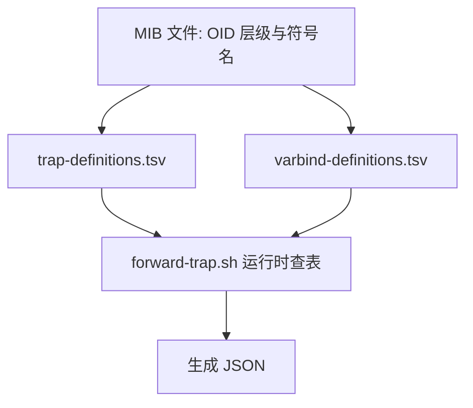

# 字典驱动的设计思想：为什么不把规则写死在代码里

每次新增一种 Trap 类型都要改代码重新编译吗？这一章解释项目如何用字典文件规避这个问题。

## 核心要点

* 项目把"规则"拆成三层：MIB 定义 OID 层级和符号名，两个 TSV 字典定义运行时的转换规则，脚本本身不硬编码任何 OID 判断逻辑。
* trap-definitions.tsv 负责"通知 OID → Trap 名 / eventType / severity"的映射。
* varbind-definitions.tsv 负责"VB OID → JSON 字段名 / 是否必填 / 类型 / 最大长度"的映射。
* 这种设计的好处是：新增或修改一种 Trap 类型时，只需要改字典文件，不需要改 forward-trap.sh 的代码逻辑。
* 镜像构建时会用 validate-dictionary.sh 校验字典的格式、重复项以及与 MIB 的一致性，把错误挡在部署之前。

---

## 本章测验

本章共 5 道单项选择题。

### 第 1 题

本项目把 Trap 转换规则拆分成几层？

- A. 三层：MIB、两个 TSV 字典、脚本
- B. 四层，还包括数据库表
- C. 两层：MIB 和脚本
- D. 一层，全部写在脚本里

选择答案后查看结果

正确答案：A

答案解析：设计文档明确把职责分为 MIB（OID 层级与符号名）、两个 TSV 字典（运行时转换规则）、脚本（读取字典执行转换）三层。

### 第 2 题

trap-definitions.tsv 主要负责哪种映射关系？

- A. 环境变量到默认值
- B. VB OID 到 JSON 字段名
- C. 通知 OID 到 Trap 名、eventType、severity
- D. 数据库列名到 Java 类型

选择答案后查看结果

正确答案：C

答案解析：trap-definitions.tsv 存的是通知级别的映射：某个通知 OID 对应哪个 Trap 名、期望的 eventType 和 severity。

### 第 3 题

采用字典驱动设计而不是把规则硬编码在脚本里，最大的好处是什么？

- A. 新增或修改 Trap 类型时只需改字典文件，无需改脚本逻辑
- B. 可以省略 MIB 文件
- C. 不再需要构建时校验
- D. 运行速度会更快

选择答案后查看结果

正确答案：A

答案解析：字典驱动把"是什么规则"和"怎么执行"分离，规则变化只需编辑 TSV 文件，脚本代码保持不变，降低了变更风险。

### 第 4 题

validate-dictionary.sh 在什么阶段起作用？

- A. 只在 Oracle 数据库启动时
- B. 只在用户点击浏览器页面时
- C. 在镜像构建阶段，校验字典格式与 MIB 一致性
- D. 在 Simulator 发送 Trap 之后立即执行

选择答案后查看结果

正确答案：C

答案解析：该脚本在镜像构建时运行，提前发现字典格式、重复项、与 MIB 不一致等问题，避免带着错误配置的镜像被部署。

### 第 5 题

如果开发者想新增一种 DEVICE_OFFLINE 事件类型，按照本项目的设计思路，最合理的操作路径是什么？

- A. 在 MIB 中新增 OID，同步更新两个 TSV 字典，再让 Simulator 支持新事件
- B. 无法新增，必须重写整个项目
- C. 只需要修改 Oracle 表结构即可
- D. 直接修改 forward-trap.sh 里的 if/else 逻辑

选择答案后查看结果

正确答案：A

答案解析：遵循字典驱动的设计，新增事件类型需要在 MIB 中登记新 OID、同步更新 trap-definitions.tsv 和 varbind-definitions.tsv，并让 Simulator 能生成对应事件，脚本代码本身无需改动。

<!-- QUIZ_DATA_START
{
  "chapter": "06",
  "questions": [
    {
      "id": 1,
      "question": "本项目把 Trap 转换规则拆分成几层？",
      "options": {
        "A": "三层：MIB、两个 TSV 字典、脚本",
        "B": "四层，还包括数据库表",
        "C": "两层：MIB 和脚本",
        "D": "一层，全部写在脚本里"
      },
      "answer": "A",
      "explanation": "设计文档明确把职责分为 MIB（OID 层级与符号名）、两个 TSV 字典（运行时转换规则）、脚本（读取字典执行转换）三层。"
    },
    {
      "id": 2,
      "question": "trap-definitions.tsv 主要负责哪种映射关系？",
      "options": {
        "C": "通知 OID 到 Trap 名、eventType、severity",
        "A": "环境变量到默认值",
        "B": "VB OID 到 JSON 字段名",
        "D": "数据库列名到 Java 类型"
      },
      "answer": "C",
      "explanation": "trap-definitions.tsv 存的是通知级别的映射：某个通知 OID 对应哪个 Trap 名、期望的 eventType 和 severity。"
    },
    {
      "id": 3,
      "question": "采用字典驱动设计而不是把规则硬编码在脚本里，最大的好处是什么？",
      "options": {
        "A": "新增或修改 Trap 类型时只需改字典文件，无需改脚本逻辑",
        "B": "可以省略 MIB 文件",
        "C": "不再需要构建时校验",
        "D": "运行速度会更快"
      },
      "answer": "A",
      "explanation": "字典驱动把\"是什么规则\"和\"怎么执行\"分离，规则变化只需编辑 TSV 文件，脚本代码保持不变，降低了变更风险。"
    },
    {
      "id": 4,
      "question": "validate-dictionary.sh 在什么阶段起作用？",
      "options": {
        "C": "在镜像构建阶段，校验字典格式与 MIB 一致性",
        "A": "只在 Oracle 数据库启动时",
        "B": "只在用户点击浏览器页面时",
        "D": "在 Simulator 发送 Trap 之后立即执行"
      },
      "answer": "C",
      "explanation": "该脚本在镜像构建时运行，提前发现字典格式、重复项、与 MIB 不一致等问题，避免带着错误配置的镜像被部署。"
    },
    {
      "id": 5,
      "question": "如果开发者想新增一种 DEVICE_OFFLINE 事件类型，按照本项目的设计思路，最合理的操作路径是什么？",
      "options": {
        "A": "在 MIB 中新增 OID，同步更新两个 TSV 字典，再让 Simulator 支持新事件",
        "B": "无法新增，必须重写整个项目",
        "C": "只需要修改 Oracle 表结构即可",
        "D": "直接修改 forward-trap.sh 里的 if/else 逻辑"
      },
      "answer": "A",
      "explanation": "遵循字典驱动的设计，新增事件类型需要在 MIB 中登记新 OID、同步更新 trap-definitions.tsv 和 varbind-definitions.tsv，并让 Simulator 能生成对应事件，脚本代码本身无需改动。"
    }
  ]
}
QUIZ_DATA_END -->
