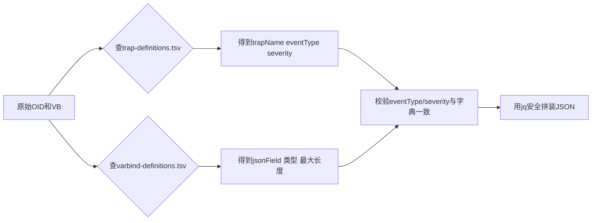

# 07. OID/VB/Trap名称转换机制

接收到的原始SNMP报文只有一串数字OID，forward-trap.sh要把它翻译成业务能理解的Trap名称和JSON字段。

## 核心要点

* trap-definitions.tsv把通知OID映射为trapName、eventType、severity三个业务字段
* varbind-definitions.tsv把每个VB的OID映射为JSON字段名、是否必填、值类型和最大长度
* 脚本会对number、datetime、uuid三种类型分别用正则校验格式是否正确
* 最后会交叉校验：报文里解析出的eventType和severity必须和字典里trapName对应的期望值一致，不一致就判定为整合性错误
* 使用jq而不是字符串拼接来生成JSON，是为了正确转义外部输入，防止JSON被破坏或注入

---

## 本章测验

本章共 5 道单项选择题。

### 第 1 题

trap-definitions.tsv这个字典文件的作用是什么？

- A. 记录每个设备的IP地址
- B. 存储Oracle数据库连接信息
- C. 把通知OID映射为trapName、eventType、severity
- D. 配置nginx的负载均衡策略

选择答案后查看结果

正确答案：C

答案解析：字典文件的表头注释写着notificationOid|trapName|eventType|severity，正是用来把数字OID翻译成有业务含义的字段。

### 第 2 题

varbind-definitions.tsv中每一行包含哪些信息？

- A. 仅设备的IP地址和端口
- B. Oracle表的索引定义
- C. 仅OID和JSON字段名两列
- D. OID、symbol、jsonField、required、valueType、maxLength六列

选择答案后查看结果

正确答案：D

答案解析：文件头部注释明确列出了oid|symbol|jsonField|required|valueType|maxLength六个字段，用来完整描述每个VB的解析规则。

### 第 3 题

脚本对value_type为datetime的字段是如何校验格式的？

- A. 用正则要求形如YYYY-MM-DDTHH:MM:SS的ISO-8601格式
- B. 要求必须是纯数字时间戳
- C. 直接调用Oracle函数校验
- D. 不做任何格式校验

选择答案后查看结果

正确答案：A

答案解析：forward-trap.sh里对datetime类型用awk正则匹配四位年-两位月-两位日T时:分:秒的格式，不匹配就调用fail终止处理。

### 第 4 题

如果解析出的eventType字段和trap-definitions.tsv中trapName对应的expected_event_type不一致，脚本会怎么处理？

- A. 忽略不一致，继续按报文中的值处理
- B. 调用fail函数报错终止，视为Trap的整合性错误
- C. 自动把expected_event_type覆盖到报文数据里
- D. 仅打印一条警告日志然后继续

选择答案后查看结果

正确答案：B

答案解析：脚本最后有一段专门的交叉校验：[ \"$event_type\" = \"$expected_event_type\" ] 不满足就fail，报错信息里会同时打印trapName、实际值和期望值，防止数据被篡改或字典配置漂移。

### 第 5 题

为什么脚本最终用jq而不是字符串拼接来生成要发送的JSON？

- A. 仅仅是历史遗留习惯，没有实际考量
- B. jq运行速度比字符串拼接快很多
- C. jq能正确转义特殊字符，避免因为外部输入内容破坏JSON结构或引发注入
- D. 字符串拼接在shell里根本无法实现

选择答案后查看结果

正确答案：C

答案解析：如果设备发来的message或deviceName里包含引号、换行等特殊字符，简单拼接字符串会破坏JSON格式甚至造成安全问题，jq -cn --arg等参数化写法能安全地转义这些内容。

<!-- QUIZ_DATA_START
{
  "chapter": "07",
  "questions": [
    {
      "id": 1,
      "question": "trap-definitions.tsv这个字典文件的作用是什么？",
      "options": {
        "A": "记录每个设备的IP地址",
        "B": "存储Oracle数据库连接信息",
        "C": "把通知OID映射为trapName、eventType、severity",
        "D": "配置nginx的负载均衡策略"
      },
      "answer": "C",
      "explanation": "字典文件的表头注释写着notificationOid|trapName|eventType|severity，正是用来把数字OID翻译成有业务含义的字段。"
    },
    {
      "id": 2,
      "question": "varbind-definitions.tsv中每一行包含哪些信息？",
      "options": {
        "A": "仅设备的IP地址和端口",
        "B": "Oracle表的索引定义",
        "C": "仅OID和JSON字段名两列",
        "D": "OID、symbol、jsonField、required、valueType、maxLength六列"
      },
      "answer": "D",
      "explanation": "文件头部注释明确列出了oid|symbol|jsonField|required|valueType|maxLength六个字段，用来完整描述每个VB的解析规则。"
    },
    {
      "id": 3,
      "question": "脚本对value_type为datetime的字段是如何校验格式的？",
      "options": {
        "A": "用正则要求形如YYYY-MM-DDTHH:MM:SS的ISO-8601格式",
        "B": "要求必须是纯数字时间戳",
        "C": "直接调用Oracle函数校验",
        "D": "不做任何格式校验"
      },
      "answer": "A",
      "explanation": "forward-trap.sh里对datetime类型用awk正则匹配四位年-两位月-两位日T时:分:秒的格式，不匹配就调用fail终止处理。"
    },
    {
      "id": 4,
      "question": "如果解析出的eventType字段和trap-definitions.tsv中trapName对应的expected_event_type不一致，脚本会怎么处理？",
      "options": {
        "A": "忽略不一致，继续按报文中的值处理",
        "B": "调用fail函数报错终止，视为Trap的整合性错误",
        "C": "自动把expected_event_type覆盖到报文数据里",
        "D": "仅打印一条警告日志然后继续"
      },
      "answer": "B",
      "explanation": "脚本最后有一段专门的交叉校验：[ \\\"$event_type\\\" = \\\"$expected_event_type\\\" ] 不满足就fail，报错信息里会同时打印trapName、实际值和期望值，防止数据被篡改或字典配置漂移。"
    },
    {
      "id": 5,
      "question": "为什么脚本最终用jq而不是字符串拼接来生成要发送的JSON？",
      "options": {
        "A": "仅仅是历史遗留习惯，没有实际考量",
        "B": "jq运行速度比字符串拼接快很多",
        "C": "jq能正确转义特殊字符，避免因为外部输入内容破坏JSON结构或引发注入",
        "D": "字符串拼接在shell里根本无法实现"
      },
      "answer": "C",
      "explanation": "如果设备发来的message或deviceName里包含引号、换行等特殊字符，简单拼接字符串会破坏JSON格式甚至造成安全问题，jq -cn --arg等参数化写法能安全地转义这些内容。"
    }
  ]
}
QUIZ_DATA_END -->
