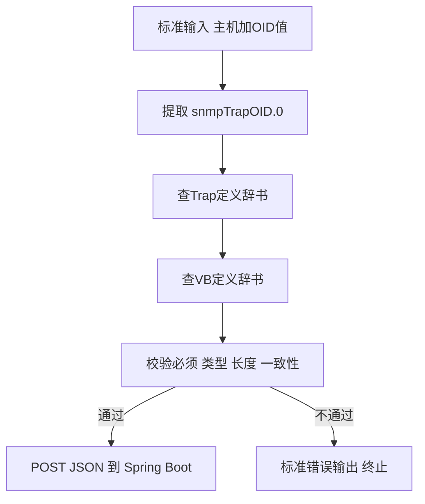

# 07 组件详解：转发脚本 forward-trap.sh

forward-trap.sh 是协议数据变成业务 JSON 的关键转换点，本章讲清楚它做了哪些校验。

## 核心要点

* forward-trap.sh 从标准输入读取受信元信息（前两行）和后续的“数值 OID 值”数据。
* 脚本先提取 snmpTrapOID.0 作为通知 OID，再逐一处理 7 个已知的 Variable Binding，用 VB 定义辞书转换成 JSON 字段。
* 校验内容包括：类型、最大长度、必须性、通知 OID 是否已注册、eventType 与 severity 是否与辞书期望一致。
* 校验全部通过后，用 curl --fail 把包含 trapOid 和 trapName 的固定格式 JSON 发送给 Spring Boot 的 /api/traps 接口。
* 任何一步校验失败都会把错误信息输出到标准错误，并以退出码 1 结束，不会继续向后转发。

---

## 本章测验

本章共 5 道单项选择题。

### 第 1 题

forward-trap.sh 用来确定这次 Trap 通知类型的关键字段是什么？

- A. eventType
- B. snmpTrapOID.0
- C. severity
- D. deviceId

选择答案后查看结果

正确答案：B

答案解析：脚本首先提取 snmpTrapOID.0 作为通知 OID，并以此为唯一检索键去查询 Trap 定义辞书。

### 第 2 题

forward-trap.sh 完成校验后，用什么方式把 JSON 发送给 Spring Boot？

- A. 使用 curl --fail 发起 POST 请求
- B. 调用 JDBC 直接写入数据库
- C. 写入共享文件由 Spring Boot 轮询读取
- D. 通过 UDP 广播 JSON 数据

选择答案后查看结果

正确答案：A

答案解析：详细设计文档说明脚本使用 curl --fail 发送 POST 请求，并以是否返回 2xx 状态码来判断是否成功。

### 第 3 题

以下哪一项属于 forward-trap.sh 会执行的交叉校验？

- A. 检查浏览器是否已经打开页面
- B. 检查 IoT Simulator 的 Java 版本
- C. 检查 eventType 与 severity 是否与辞书期望一致
- D. 检查数据库连接是否可用

选择答案后查看结果

正确答案：C

答案解析：脚本会用通知 OID 查询 Trap 定义辞书获取期望的 eventType 和 severity，并与实际收到的 VB 值进行一致性比对。

### 第 4 题

如果 forward-trap.sh 在处理过程中发现必须的 Variable Binding 缺失，会如何处理？

- A. 忽略缺失字段，仅发送已有字段
- B. 用默认值填充后继续发送
- C. 自动重新请求设备补发数据
- D. 标准错误输出原因并以退出码 1 终止，不再转发

选择答案后查看结果

正确答案：D

答案解析：任何一步校验失败（包括必须 VB 缺失）都会导致脚本输出错误信息到标准错误并以退出码 1 终止，不会继续转发。

### 第 5 题

forward-trap.sh 的标准输入中，从第几行开始是“数值 OID 加值”的内容？

- A. 第 3 行
- B. 第 1 行
- C. 第 2 行
- D. 第 4 行

选择答案后查看结果

正确答案：A

答案解析：标准输入前两行分别是受信元的主机和地址信息，从第 3 行开始才是逐行的“数值 OID 值”数据。

<!-- QUIZ_DATA_START
{
  "chapter": "07",
  "questions": [
    {
      "id": 1,
      "question": "forward-trap.sh 用来确定这次 Trap 通知类型的关键字段是什么？",
      "options": {
        "A": "eventType",
        "B": "snmpTrapOID.0",
        "C": "severity",
        "D": "deviceId"
      },
      "answer": "B",
      "explanation": "脚本首先提取 snmpTrapOID.0 作为通知 OID，并以此为唯一检索键去查询 Trap 定义辞书。"
    },
    {
      "id": 2,
      "question": "forward-trap.sh 完成校验后，用什么方式把 JSON 发送给 Spring Boot？",
      "options": {
        "A": "使用 curl --fail 发起 POST 请求",
        "B": "调用 JDBC 直接写入数据库",
        "C": "写入共享文件由 Spring Boot 轮询读取",
        "D": "通过 UDP 广播 JSON 数据"
      },
      "answer": "A",
      "explanation": "详细设计文档说明脚本使用 curl --fail 发送 POST 请求，并以是否返回 2xx 状态码来判断是否成功。"
    },
    {
      "id": 3,
      "question": "以下哪一项属于 forward-trap.sh 会执行的交叉校验？",
      "options": {
        "A": "检查浏览器是否已经打开页面",
        "B": "检查 IoT Simulator 的 Java 版本",
        "C": "检查 eventType 与 severity 是否与辞书期望一致",
        "D": "检查数据库连接是否可用"
      },
      "answer": "C",
      "explanation": "脚本会用通知 OID 查询 Trap 定义辞书获取期望的 eventType 和 severity，并与实际收到的 VB 值进行一致性比对。"
    },
    {
      "id": 4,
      "question": "如果 forward-trap.sh 在处理过程中发现必须的 Variable Binding 缺失，会如何处理？",
      "options": {
        "A": "忽略缺失字段，仅发送已有字段",
        "B": "用默认值填充后继续发送",
        "C": "自动重新请求设备补发数据",
        "D": "标准错误输出原因并以退出码 1 终止，不再转发"
      },
      "answer": "D",
      "explanation": "任何一步校验失败（包括必须 VB 缺失）都会导致脚本输出错误信息到标准错误并以退出码 1 终止，不会继续转发。"
    },
    {
      "id": 5,
      "question": "forward-trap.sh 的标准输入中，从第几行开始是“数值 OID 加值”的内容？",
      "options": {
        "A": "第 3 行",
        "B": "第 1 行",
        "C": "第 2 行",
        "D": "第 4 行"
      },
      "answer": "A",
      "explanation": "标准输入前两行分别是受信元的主机和地址信息，从第 3 行开始才是逐行的“数值 OID 值”数据。"
    }
  ]
}
QUIZ_DATA_END -->
