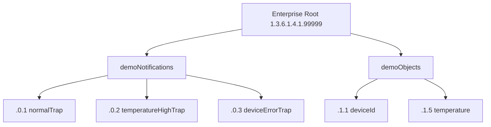

# MIB 文件与 OID 命名规范

字典里出现的那些 OID 数字，究竟是按什么规则分配和命名的？

## 核心要点

* 项目使用私有 Enterprise Root 1.3.6.1.4.1.99999，通知类 OID 挂在 demoNotifications 分支下，数据字段挂在 demoObjects 分支下。
* 模块命名规则：MIB 模块名用大写加连字符，如 SNMP-TRAP-DEMO-MIB；OBJECT-TYPE 和 NOTIFICATION-TYPE 用小驼峰命名，如 temperatureHighTrap。
* 既有 OID 的语义和类型一经发布不能修改；如果某个通知要废弃，不能复用它的编号，只能分配新的编号。
* MIB 文件被打包进容器镜像内的 /usr/share/snmp/mibs，通过 MIBDIRS 和 MIBS 环境变量让 Net-SNMP 加载，不支持外部卷动态替换。
* 本 Demo 使用的是自包含 MIB，不依赖外部标准 MIB 包（如 SNMPv2-SMI），因为 Debian 精简版 Net-SNMP 默认不自带这些标准 MIB。

---

## 本章测验

本章共 5 道单项选择题。

### 第 1 题

本项目使用的 Enterprise Root OID 是什么？

- A. 1.3.6.1.6.3
- B. 2.16.840.1
- C. 1.3.6.1.4.1.99999
- D. 1.3.6.1.2.1

选择答案后查看结果

正确答案：C

答案解析：详细设计书指定 Enterprise root 为 1.3.6.1.4.1.99999，所有本项目自定义的通知和字段 OID 都挂在这个根下面。

### 第 2 题

MIB 中 OBJECT-TYPE 和 NOTIFICATION-TYPE 的命名规则是什么？

- A. 使用中文拼音命名
- B. 小驼峰命名，如 temperatureHighTrap
- C. 全部使用数字编号
- D. 全部大写加下划线

选择答案后查看结果

正确答案：B

答案解析：命名规则文档规定 OBJECT-TYPE 与 NOTIFICATION-TYPE 采用 lowerCamelCase（小驼峰），模块名本身才用大写连字符形式。

### 第 3 题

如果某个已发布的通知 OID 要废弃，正确的做法是什么？

- A. 把编号改成负数表示废弃
- B. 把该 OID 直接删除并复用给新通知
- C. 不复用该编号，改为分配一个新的编号
- D. 无需处理，保持原样即可

选择答案后查看结果

正确答案：C

答案解析：命名规则明确规定既有 OID 的语义和类型不可更改，废弃时不重用该编号，而是采用新的编号，避免历史数据和新语义混淆。

### 第 4 题

本项目为什么不直接依赖外部标准 MIB（如 SNMPv2-SMI）？

- A. 标准 MIB 已经过时
- B. Debian 精简版 Net-SNMP 默认不自带这些标准 MIB，需自包含避免依赖
- C. 标准 MIB 只支持 SNMPv3
- D. 标准 MIB 与 Oracle 不兼容

选择答案后查看结果

正确答案：B

答案解析：详细设计书说明 Debian bookworm 的最小 Net-SNMP 包不同捆绑 SNMPv2-SMI、SNMPv2-TC 等标准 MIB（属于不同许可的独立分发），因此项目采用自包含、仅用 OBJECT IDENTIFIER 解析的 MIB。

### 第 5 题

MIB 文件在部署上的更新方式是怎样的？

- A. 可以通过网页界面在线编辑
- B. MIB 更新不需要重启任何服务
- C. 需要重新构建镜像，代码、MIB、运行镜像作为同一版本一起发布
- D. 支持挂载外部卷随时热替换

选择答案后查看结果

正确答案：C

答案解析：设计文档明确说明不支持外部卷动态差替，MIB 更新时需要重新构建镜像，把代码、MIB、镜像作为同一版本一起分发。

<!-- QUIZ_DATA_START
{
  "chapter": "07",
  "questions": [
    {
      "id": 1,
      "question": "本项目使用的 Enterprise Root OID 是什么？",
      "options": {
        "C": "1.3.6.1.4.1.99999",
        "A": "1.3.6.1.6.3",
        "B": "2.16.840.1",
        "D": "1.3.6.1.2.1"
      },
      "answer": "C",
      "explanation": "详细设计书指定 Enterprise root 为 1.3.6.1.4.1.99999，所有本项目自定义的通知和字段 OID 都挂在这个根下面。"
    },
    {
      "id": 2,
      "question": "MIB 中 OBJECT-TYPE 和 NOTIFICATION-TYPE 的命名规则是什么？",
      "options": {
        "B": "小驼峰命名，如 temperatureHighTrap",
        "A": "使用中文拼音命名",
        "C": "全部使用数字编号",
        "D": "全部大写加下划线"
      },
      "answer": "B",
      "explanation": "命名规则文档规定 OBJECT-TYPE 与 NOTIFICATION-TYPE 采用 lowerCamelCase（小驼峰），模块名本身才用大写连字符形式。"
    },
    {
      "id": 3,
      "question": "如果某个已发布的通知 OID 要废弃，正确的做法是什么？",
      "options": {
        "C": "不复用该编号，改为分配一个新的编号",
        "A": "把编号改成负数表示废弃",
        "B": "把该 OID 直接删除并复用给新通知",
        "D": "无需处理，保持原样即可"
      },
      "answer": "C",
      "explanation": "命名规则明确规定既有 OID 的语义和类型不可更改，废弃时不重用该编号，而是采用新的编号，避免历史数据和新语义混淆。"
    },
    {
      "id": 4,
      "question": "本项目为什么不直接依赖外部标准 MIB（如 SNMPv2-SMI）？",
      "options": {
        "B": "Debian 精简版 Net-SNMP 默认不自带这些标准 MIB，需自包含避免依赖",
        "A": "标准 MIB 已经过时",
        "C": "标准 MIB 只支持 SNMPv3",
        "D": "标准 MIB 与 Oracle 不兼容"
      },
      "answer": "B",
      "explanation": "详细设计书说明 Debian bookworm 的最小 Net-SNMP 包不同捆绑 SNMPv2-SMI、SNMPv2-TC 等标准 MIB（属于不同许可的独立分发），因此项目采用自包含、仅用 OBJECT IDENTIFIER 解析的 MIB。"
    },
    {
      "id": 5,
      "question": "MIB 文件在部署上的更新方式是怎样的？",
      "options": {
        "C": "需要重新构建镜像，代码、MIB、运行镜像作为同一版本一起发布",
        "A": "可以通过网页界面在线编辑",
        "B": "MIB 更新不需要重启任何服务",
        "D": "支持挂载外部卷随时热替换"
      },
      "answer": "C",
      "explanation": "设计文档明确说明不支持外部卷动态差替，MIB 更新时需要重新构建镜像，把代码、MIB、镜像作为同一版本一起分发。"
    }
  ]
}
QUIZ_DATA_END -->
