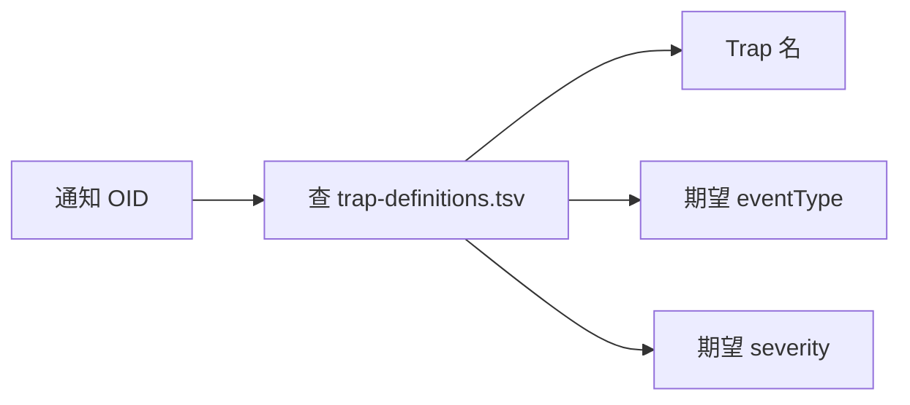

# 字典详解一：trap-definitions.tsv

这个文件是通知级别的"翻译表"，它决定了一个数字 OID 最终会变成哪个 Trap 名字。

## 核心要点

* trap-definitions.tsv 每一行包含四列：通知 OID、Trap 名、期望 eventType、期望 severity。
* 三条现有记录：.0.1 → normalTrap / NORMAL / INFO；.0.2 → temperatureHighTrap / TEMPERATURE_HIGH / WARNING；.0.3 → deviceErrorTrap / DEVICE_ERROR / CRITICAL。
* 这个字典不仅提供"名字翻译"，还提供了一份"期望值"，用于后续和实际收到的 eventType、severity 做一致性核对。
* 字典中通知 OID 和 Trap 名都必须唯一，且必须能在 MIB 中用 snmptranslate 解析到相同的数值 OID。

---

## 本章测验

本章共 5 道单项选择题。

### 第 1 题

trap-definitions.tsv 每行包含哪几列信息？

- A. 只有 OID 和名字两列
- B. 通知 OID、Trap 名、期望 eventType、期望 severity
- C. 设备 ID、温度、消息三列
- D. JSON 字段名和最大长度两列

选择答案后查看结果

正确答案：B

答案解析：该字典每行四列，分别是通知 OID、对应的 Trap 名，以及期望的 eventType 和 severity，用于后续核对。

### 第 2 题

按照字典，通知 OID .0.3 对应的期望 severity 是什么？

- A. INFO
- B. ERROR
- C. CRITICAL
- D. WARNING

选择答案后查看结果

正确答案：C

答案解析：文档中的映射表显示 .0.3 对应 deviceErrorTrap / DEVICE_ERROR，期望 severity 为 CRITICAL。

### 第 3 题

trap-definitions.tsv 中的"期望 eventType"字段用来做什么？

- A. 仅用于展示，不参与任何校验
- B. 用于和实际收到的 eventType 做一致性核对
- C. 决定 Oracle 表名
- D. 决定 UDP 端口号

选择答案后查看结果

正确答案：B

答案解析：字典里的期望值会在后续处理中与 Trap 实际携带的 eventType/severity 比对，不一致就视为异常，第 12 章会详细展开。

### 第 4 题

如果字典中出现两行使用相同的通知 OID，会造成什么问题？

- A. 会自动优先取字母序靠前的一行
- B. 只影响 Simulator，不影响 snmptrapd
- C. 违反了唯一性要求，构建校验应当拒绝
- D. 完全没有影响，系统会自动合并

选择答案后查看结果

正确答案：C

答案解析：设计要求通知 OID 和 Trap 名必须唯一，重复的 OID 属于字典格式错误，应当在构建时的校验环节被拒绝。

### 第 5 题

eventType 为 NORMAL 的事件，按字典对应的 Trap 名和通知 OID 分别是什么？

- A. temperatureHighTrap，.0.2
- B. normalTrap，.0.1
- C. normalTrap，.0.2
- D. deviceErrorTrap，.0.3

选择答案后查看结果

正确答案：B

答案解析：根据映射表，.0.1 对应 Trap 名 normalTrap，期望 eventType 正是 NORMAL。

<!-- QUIZ_DATA_START
{
  "chapter": "08",
  "questions": [
    {
      "id": 1,
      "question": "trap-definitions.tsv 每行包含哪几列信息？",
      "options": {
        "B": "通知 OID、Trap 名、期望 eventType、期望 severity",
        "A": "只有 OID 和名字两列",
        "C": "设备 ID、温度、消息三列",
        "D": "JSON 字段名和最大长度两列"
      },
      "answer": "B",
      "explanation": "该字典每行四列，分别是通知 OID、对应的 Trap 名，以及期望的 eventType 和 severity，用于后续核对。"
    },
    {
      "id": 2,
      "question": "按照字典，通知 OID .0.3 对应的期望 severity 是什么？",
      "options": {
        "C": "CRITICAL",
        "A": "INFO",
        "B": "ERROR",
        "D": "WARNING"
      },
      "answer": "C",
      "explanation": "文档中的映射表显示 .0.3 对应 deviceErrorTrap / DEVICE_ERROR，期望 severity 为 CRITICAL。"
    },
    {
      "id": 3,
      "question": "trap-definitions.tsv 中的\"期望 eventType\"字段用来做什么？",
      "options": {
        "B": "用于和实际收到的 eventType 做一致性核对",
        "A": "仅用于展示，不参与任何校验",
        "C": "决定 Oracle 表名",
        "D": "决定 UDP 端口号"
      },
      "answer": "B",
      "explanation": "字典里的期望值会在后续处理中与 Trap 实际携带的 eventType/severity 比对，不一致就视为异常，第 12 章会详细展开。"
    },
    {
      "id": 4,
      "question": "如果字典中出现两行使用相同的通知 OID，会造成什么问题？",
      "options": {
        "C": "违反了唯一性要求，构建校验应当拒绝",
        "A": "会自动优先取字母序靠前的一行",
        "B": "只影响 Simulator，不影响 snmptrapd",
        "D": "完全没有影响，系统会自动合并"
      },
      "answer": "C",
      "explanation": "设计要求通知 OID 和 Trap 名必须唯一，重复的 OID 属于字典格式错误，应当在构建时的校验环节被拒绝。"
    },
    {
      "id": 5,
      "question": "eventType 为 NORMAL 的事件，按字典对应的 Trap 名和通知 OID 分别是什么？",
      "options": {
        "B": "normalTrap，.0.1",
        "A": "temperatureHighTrap，.0.2",
        "C": "normalTrap，.0.2",
        "D": "deviceErrorTrap，.0.3"
      },
      "answer": "B",
      "explanation": "根据映射表，.0.1 对应 Trap 名 normalTrap，期望 eventType 正是 NORMAL。"
    }
  ]
}
QUIZ_DATA_END -->
