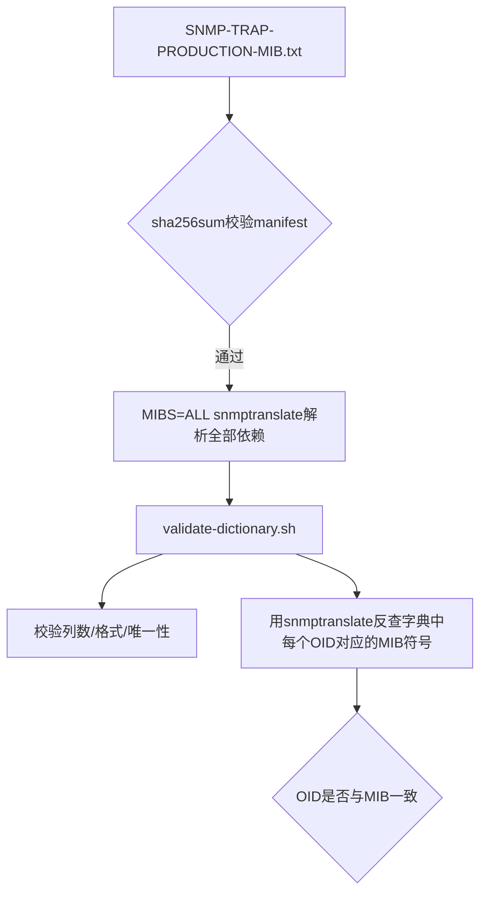

# 08. MIB模块与字典校验

字典文件和MIB定义必须保持完全一致，否则会出现Trap名称对得上但OID对不上的隐患，这一章讲验证机制。

## 核心要点

* SNMP-TRAP-PRODUCTION-MIB.txt定义了MODULE-IDENTITY、OBJECT-TYPE、NOTIFICATION-TYPE以及compliance/group
* vendor MIB和IETF依赖(SNMPv2-SMI、SNMPv2-TC、SNMPv2-CONF)都通过manifest.sha256做完整性校验，防止文件被篡改或替换
* validate-dictionary.sh先校验两个字典文件本身的格式、字段合法性和唯一性(不能有重复OID/名称)
* 校验的最后一步，用snmptranslate把字典里的symbol反查出对应OID，逐条比对是否与字典里写的OID一致

---

## 本章测验

本章共 5 道单项选择题。

### 第 1 题

manifest.sha256在MIB校验流程中起什么作用？

- A. 记录设备的IP白名单
- B. 配置nginx的路由规则
- C. 存储数据库密码
- D. 校验MIB文件的完整性，防止文件被篡改或替换

选择答案后查看结果

正确答案：D

答案解析：validate-mib-bundle.sh用sha256sum -c manifest.sha256对整个MIB目录做完整性校验，只有校验通过才会继续后续的解析和字典验证。

### 第 2 题

validate-dictionary.sh对trap-definitions.tsv做的第一层检查是什么？

- A. 用awk校验列数、OID格式、Trap名格式、severity取值范围以及是否有重复的OID/名称
- B. 检查文件的创建时间
- C. 仅仅统计文件行数
- D. 直接调用Oracle做检查

选择答案后查看结果

正确答案：A

答案解析：脚本用awk逐行检查列数是否为4、OID是否符合数字点分格式、Trap名格式、severity是否属于INFO/WARNING/CRITICAL枚举，并用关联数组检测重复。

### 第 3 题

字典和MIB之间的交叉校验是怎么做的？

- A. 完全靠人工比对
- B. 用snmptranslate把字典里的symbol翻译成OID，再和字典里写的OID逐条比对
- C. 直接比较两个文件的文件大小
- D. 不做交叉校验，只信任字典文件

选择答案后查看结果

正确答案：B

答案解析：脚本对trap-definitions.tsv和varbind-definitions.tsv中的每一行都执行snmptranslate -On \"SNMP-TRAP-PRODUCTION-MIB::symbol\"，把结果和字典里的OID比较，不一致就报错。

### 第 4 题

如果只更新了字典文件，却没有同步更新MIB定义，会发生什么？

- A. 字典优先级更高，MIB会被自动忽略
- B. 系统会自动检测并同步两者
- C. 交叉校验会失败，因为snmptranslate查出的OID和字典里的OID对不上
- D. 不会有任何影响，两者本来就互相独立

选择答案后查看结果

正确答案：C

答案解析：这正是validate-dictionary.sh最后一段交叉校验存在的意义——防止只修改一处而遗漏另一处，导致运行时出现Trap名转换成功但OID实际不匹配的隐患。

### 第 5 题

varbind-definitions.tsv中的jsonField字段有什么额外限制？

- A. 必须以数字开头
- B. 长度不能超过4个字符
- C. 可以是任意字符串，没有限制
- D. 必须是deviceId/deviceName/eventType/severity/temperature/message/eventTime/eventId这8个已实现字段之一

选择答案后查看结果

正确答案：D

答案解析：validate-dictionary.sh用正则限制jsonField只能是这8个已经在forward-trap.sh里实现处理逻辑的字段名，防止引入脚本尚未支持的新字段导致数据丢失。

<!-- QUIZ_DATA_START
{
  "chapter": "08",
  "questions": [
    {
      "id": 1,
      "question": "manifest.sha256在MIB校验流程中起什么作用？",
      "options": {
        "A": "记录设备的IP白名单",
        "B": "配置nginx的路由规则",
        "C": "存储数据库密码",
        "D": "校验MIB文件的完整性，防止文件被篡改或替换"
      },
      "answer": "D",
      "explanation": "validate-mib-bundle.sh用sha256sum -c manifest.sha256对整个MIB目录做完整性校验，只有校验通过才会继续后续的解析和字典验证。"
    },
    {
      "id": 2,
      "question": "validate-dictionary.sh对trap-definitions.tsv做的第一层检查是什么？",
      "options": {
        "A": "用awk校验列数、OID格式、Trap名格式、severity取值范围以及是否有重复的OID/名称",
        "B": "检查文件的创建时间",
        "C": "仅仅统计文件行数",
        "D": "直接调用Oracle做检查"
      },
      "answer": "A",
      "explanation": "脚本用awk逐行检查列数是否为4、OID是否符合数字点分格式、Trap名格式、severity是否属于INFO/WARNING/CRITICAL枚举，并用关联数组检测重复。"
    },
    {
      "id": 3,
      "question": "字典和MIB之间的交叉校验是怎么做的？",
      "options": {
        "A": "完全靠人工比对",
        "B": "用snmptranslate把字典里的symbol翻译成OID，再和字典里写的OID逐条比对",
        "C": "直接比较两个文件的文件大小",
        "D": "不做交叉校验，只信任字典文件"
      },
      "answer": "B",
      "explanation": "脚本对trap-definitions.tsv和varbind-definitions.tsv中的每一行都执行snmptranslate -On \\\"SNMP-TRAP-PRODUCTION-MIB::symbol\\\"，把结果和字典里的OID比较，不一致就报错。"
    },
    {
      "id": 4,
      "question": "如果只更新了字典文件，却没有同步更新MIB定义，会发生什么？",
      "options": {
        "A": "字典优先级更高，MIB会被自动忽略",
        "B": "系统会自动检测并同步两者",
        "C": "交叉校验会失败，因为snmptranslate查出的OID和字典里的OID对不上",
        "D": "不会有任何影响，两者本来就互相独立"
      },
      "answer": "C",
      "explanation": "这正是validate-dictionary.sh最后一段交叉校验存在的意义——防止只修改一处而遗漏另一处，导致运行时出现Trap名转换成功但OID实际不匹配的隐患。"
    },
    {
      "id": 5,
      "question": "varbind-definitions.tsv中的jsonField字段有什么额外限制？",
      "options": {
        "A": "必须以数字开头",
        "B": "长度不能超过4个字符",
        "C": "可以是任意字符串，没有限制",
        "D": "必须是deviceId/deviceName/eventType/severity/temperature/message/eventTime/eventId这8个已实现字段之一"
      },
      "answer": "D",
      "explanation": "validate-dictionary.sh用正则限制jsonField只能是这8个已经在forward-trap.sh里实现处理逻辑的字段名，防止引入脚本尚未支持的新字段导致数据丢失。"
    }
  ]
}
QUIZ_DATA_END -->
