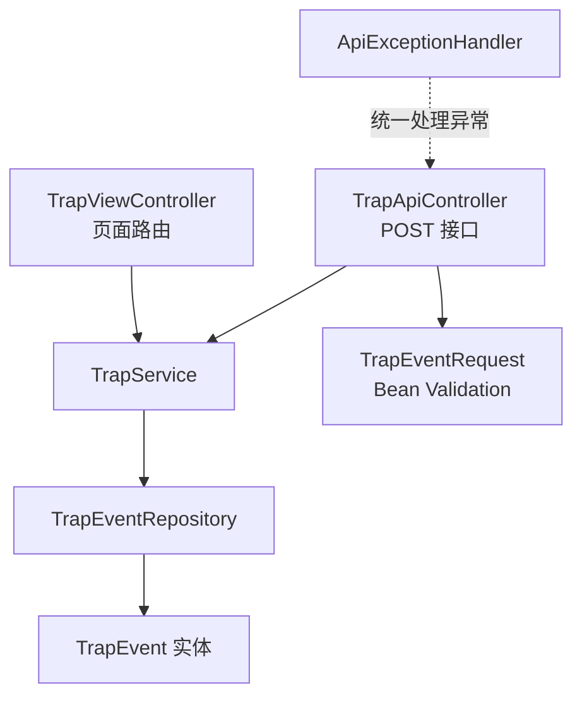

# 08 组件详解：Monitoring App（Spring Boot）

Monitoring App 是业务层的核心，负责校验、持久化和展示，本章梳理它内部的分层结构。

## 核心要点

* TrapApiController 负责接收 POST /api/traps 请求，TrapViewController 负责 / 和 /traps 两个页面路由。
* TrapEventRequest 是接收 JSON 的 DTO，使用 Bean Validation 做入参校验；TrapEvent 是对应数据库表的实体类。
* TrapService 负责 DTO 和 Entity 之间的转换、调用 Repository 保存以及查询数据。
* TrapEventRepository 基于 JPA 实现持久化，并支持按接收时间倒序检索。
* ApiExceptionHandler 统一处理输入错误和数据库错误，给出最简响应；页面模板 traps.html 不使用 JavaScript，是纯 HTML 表格。

---

## 本章测验

本章共 5 道单项选择题。

### 第 1 题

负责接收 POST /api/traps 请求的组件是哪一个？

- A. TrapViewController
- B. TrapEventRepository
- C. TrapApiController
- D. ApiExceptionHandler

选择答案后查看结果

正确答案：C

答案解析：详细设计文档中列出 TrapApiController 的职责就是接收 POST /api/traps 请求。

### 第 2 题

TrapEventRequest 这个 DTO 主要承担什么职责？

- A. 渲染 HTML 页面
- B. 映射数据库表结构
- C. 接收 JSON 并使用 Bean Validation 做入参校验
- D. 配置 Oracle 数据源连接

选择答案后查看结果

正确答案：C

答案解析：TrapEventRequest 是接收 JSON 请求体的 DTO，配合 Bean Validation 注解完成入参校验。

### 第 3 题

以下哪一层负责 DTO 与 Entity 之间的转换以及调用持久化操作？

- A. traps.html
- B. TrapService
- C. TrapEventRepository
- D. TrapApiController

选择答案后查看结果

正确答案：B

答案解析：TrapService 承担 DTO/Entity 转换、保存和查询的业务逻辑，是 Controller 和 Repository 之间的中间层。

### 第 4 题

TrapEventRepository 支持的一项关键检索能力是什么？

- A. 按严重程度自动分页
- B. 按设备编号分组统计
- C. 按温度范围过滤
- D. 按接收时间倒序检索

选择答案后查看结果

正确答案：D

答案解析：设计文档明确 TrapEventRepository 负责 JPA 持久化和“受信日时降順検索”，即按接收时间倒序查询。

### 第 5 题

页面模板 traps.html 的一个关键特征是什么？

- A. 通过 WebSocket 实时推送数据
- B. 需要浏览器安装插件才能显示
- C. 依赖前端框架 React 渲染数据
- D. 是不使用 JavaScript 的纯 HTML 表格

选择答案后查看结果

正确答案：D

答案解析：详细设计文档明确 templates/traps.html 是“JavaScript を使わない HTML 表”，即纯服务端渲染的 HTML 表格。

<!-- QUIZ_DATA_START
{
  "chapter": "08",
  "questions": [
    {
      "id": 1,
      "question": "负责接收 POST /api/traps 请求的组件是哪一个？",
      "options": {
        "A": "TrapViewController",
        "B": "TrapEventRepository",
        "C": "TrapApiController",
        "D": "ApiExceptionHandler"
      },
      "answer": "C",
      "explanation": "详细设计文档中列出 TrapApiController 的职责就是接收 POST /api/traps 请求。"
    },
    {
      "id": 2,
      "question": "TrapEventRequest 这个 DTO 主要承担什么职责？",
      "options": {
        "A": "渲染 HTML 页面",
        "B": "映射数据库表结构",
        "C": "接收 JSON 并使用 Bean Validation 做入参校验",
        "D": "配置 Oracle 数据源连接"
      },
      "answer": "C",
      "explanation": "TrapEventRequest 是接收 JSON 请求体的 DTO，配合 Bean Validation 注解完成入参校验。"
    },
    {
      "id": 3,
      "question": "以下哪一层负责 DTO 与 Entity 之间的转换以及调用持久化操作？",
      "options": {
        "A": "traps.html",
        "B": "TrapService",
        "C": "TrapEventRepository",
        "D": "TrapApiController"
      },
      "answer": "B",
      "explanation": "TrapService 承担 DTO/Entity 转换、保存和查询的业务逻辑，是 Controller 和 Repository 之间的中间层。"
    },
    {
      "id": 4,
      "question": "TrapEventRepository 支持的一项关键检索能力是什么？",
      "options": {
        "A": "按严重程度自动分页",
        "B": "按设备编号分组统计",
        "C": "按温度范围过滤",
        "D": "按接收时间倒序检索"
      },
      "answer": "D",
      "explanation": "设计文档明确 TrapEventRepository 负责 JPA 持久化和“受信日时降順検索”，即按接收时间倒序查询。"
    },
    {
      "id": 5,
      "question": "页面模板 traps.html 的一个关键特征是什么？",
      "options": {
        "A": "通过 WebSocket 实时推送数据",
        "B": "需要浏览器安装插件才能显示",
        "C": "依赖前端框架 React 渲染数据",
        "D": "是不使用 JavaScript 的纯 HTML 表格"
      },
      "answer": "D",
      "explanation": "详细设计文档明确 templates/traps.html 是“JavaScript を使わない HTML 表”，即纯服务端渲染的 HTML 表格。"
    }
  ]
}
QUIZ_DATA_END -->
