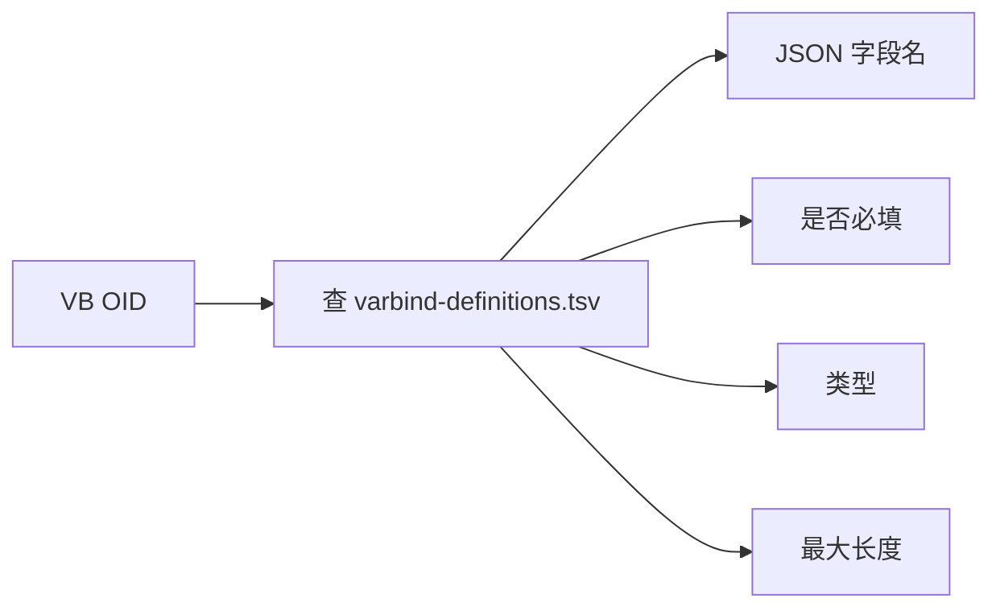

# 字典详解二：varbind-definitions.tsv

通知级别的名字有了，那具体每一个字段（比如温度）又是怎么从 VB 变成 JSON 字段的？

## 核心要点

* varbind-definitions.tsv 每行包含五列：VB OID、JSON 项目（字段名）、必须、型（类型）、最大长度。
* 举例：1.3.6.1.4.1.99999.1.5 对应 JSON 字段 temperature，类型是 OCTET STRING（十进制数字字符串），会被解析为数字。
* 七个已知 VB 覆盖：deviceId、deviceName、eventType、severity、temperature、message、eventTime。
* 这个字典的字段级校验（必填、类型、最大长度）是转发脚本判断数据是否合法、要不要中止转发的直接依据。

---

## 本章测验

本章共 5 道单项选择题。

### 第 1 题

varbind-definitions.tsv 每行包含哪五列信息？

- A. VB OID、JSON 字段名、是否必填、类型、最大长度
- B. 端口号、协议、超时、重试次数、日志级别
- C. 设备名、温度、消息、时间、状态
- D. 通知 OID、Trap 名、eventType、severity、备注

选择答案后查看结果

正确答案：A

答案解析：该字典的列定义为 VB OID、对应 JSON 项目名、是否必须、值的类型、最大长度，共五列。

### 第 2 题

OID 1.3.6.1.4.1.99999.1.5 对应哪个 JSON 字段？

- A. eventTime
- B. temperature
- C. deviceId
- D. message

选择答案后查看结果

正确答案：B

答案解析：详细设计书的 VB OID 映射表中，1.3.6.1.4.1.99999.1.5 对应 JSON 字段 temperature，类型为十进制数字字符串。

### 第 3 题

本项目一共定义了几个已知 VB 字段？

- A. 6 个
- B. 5 个
- C. 7 个
- D. 9 个

选择答案后查看结果

正确答案：C

答案解析：已知 VB 共 7 个：deviceId、deviceName、eventType、severity、temperature、message、eventTime。

### 第 4 题

varbind-definitions.tsv 中的"必填"和"最大长度"字段最终会被用来做什么？

- A. 决定 UDP 端口号
- B. 作为转发脚本判断数据是否合法、是否中止转发的依据
- C. 决定 Simulator 的发送频率
- D. 仅用于生成文档，不参与实际逻辑

选择答案后查看结果

正确答案：B

答案解析：转发脚本会依据字典中的必填和最大长度规则校验实际收到的 VB 值，不合规就中止转发，这是数据质量的第一道防线。

### 第 5 题

如果一个 VB 字段在字典中被标记为必填，但实际 Trap 报文中缺失该字段，按照设计应当如何处理？

- A. 该字段被忽略，其余字段正常转发
- B. 用空字符串代替，继续转发
- C. 转发中止，不生成 JSON
- D. 自动从 Oracle 中查找历史值填补

选择答案后查看结果

正确答案：C

答案解析：详细设计书中说明必须字段为空则"转発中止"，即整个转发流程会中止，不会生成不完整的 JSON 发给 Spring Boot。

<!-- QUIZ_DATA_START
{
  "chapter": "09",
  "questions": [
    {
      "id": 1,
      "question": "varbind-definitions.tsv 每行包含哪五列信息？",
      "options": {
        "A": "VB OID、JSON 字段名、是否必填、类型、最大长度",
        "B": "端口号、协议、超时、重试次数、日志级别",
        "C": "设备名、温度、消息、时间、状态",
        "D": "通知 OID、Trap 名、eventType、severity、备注"
      },
      "answer": "A",
      "explanation": "该字典的列定义为 VB OID、对应 JSON 项目名、是否必须、值的类型、最大长度，共五列。"
    },
    {
      "id": 2,
      "question": "OID 1.3.6.1.4.1.99999.1.5 对应哪个 JSON 字段？",
      "options": {
        "B": "temperature",
        "A": "eventTime",
        "C": "deviceId",
        "D": "message"
      },
      "answer": "B",
      "explanation": "详细设计书的 VB OID 映射表中，1.3.6.1.4.1.99999.1.5 对应 JSON 字段 temperature，类型为十进制数字字符串。"
    },
    {
      "id": 3,
      "question": "本项目一共定义了几个已知 VB 字段？",
      "options": {
        "C": "7 个",
        "A": "6 个",
        "B": "5 个",
        "D": "9 个"
      },
      "answer": "C",
      "explanation": "已知 VB 共 7 个：deviceId、deviceName、eventType、severity、temperature、message、eventTime。"
    },
    {
      "id": 4,
      "question": "varbind-definitions.tsv 中的\"必填\"和\"最大长度\"字段最终会被用来做什么？",
      "options": {
        "B": "作为转发脚本判断数据是否合法、是否中止转发的依据",
        "A": "决定 UDP 端口号",
        "C": "决定 Simulator 的发送频率",
        "D": "仅用于生成文档，不参与实际逻辑"
      },
      "answer": "B",
      "explanation": "转发脚本会依据字典中的必填和最大长度规则校验实际收到的 VB 值，不合规就中止转发，这是数据质量的第一道防线。"
    },
    {
      "id": 5,
      "question": "如果一个 VB 字段在字典中被标记为必填，但实际 Trap 报文中缺失该字段，按照设计应当如何处理？",
      "options": {
        "C": "转发中止，不生成 JSON",
        "A": "该字段被忽略，其余字段正常转发",
        "B": "用空字符串代替，继续转发",
        "D": "自动从 Oracle 中查找历史值填补"
      },
      "answer": "C",
      "explanation": "详细设计书中说明必须字段为空则\"转発中止\"，即整个转发流程会中止，不会生成不完整的 JSON 发给 Spring Boot。"
    }
  ]
}
QUIZ_DATA_END -->
