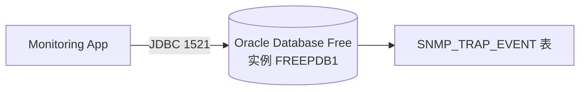

# 09 组件详解：Oracle Database Free

数据最终落地在 Oracle 里，本章先从组件角度了解它在这套系统中的角色，具体表结构留到后面章节详细展开。

## 核心要点

* 本项目使用的是 Oracle Database Free 23 版本，通过 Docker Compose 中的 oracle-db 服务提供。
* Spring Boot 通过 JDBC 连接到 Oracle 的可插拔数据库实例 FREEPDB1，端口固定为 1521。
* 数据库使用 JPA 的 ddl-auto=update 机制自动创建表结构，不需要手工执行建表脚本。
* Oracle 的职责范围很单一：只负责持久化 SNMP_TRAP_EVENT 表，不承担业务校验、检索排序之外的逻辑，这些都是 Spring Boot 的事。
* 停止服务时使用 docker compose down 不会清除数据卷；如果要连同数据一起清除，需要执行 docker compose down -v。

---

## 本章测验

本章共 5 道单项选择题。

### 第 1 题

本项目使用的 Oracle 数据库版本和实例名分别是什么？

- A. Oracle Database Free 23，实例 FREEPDB1
- B. Oracle Autonomous Database，实例 ADBPDB1
- C. Oracle XE 21c，实例 XEPDB1
- D. Oracle 19c，实例 ORCLPDB1

选择答案后查看结果

正确答案：A

答案解析：文档中明确使用 Oracle Database Free 23，可插拔数据库实例名为 FREEPDB1。

### 第 2 题

Spring Boot 连接 Oracle 数据库使用的端口是多少？

- A. 1521
- B. 162
- C. 3306
- D. 8080

选择答案后查看结果

正确答案：A

答案解析：JDBC 连接 Oracle 使用标准端口 1521，网络与端口设计表中也明确列出了这一端口。

### 第 3 题

本项目中数据库表结构是如何创建的？

- A. 由 snmptrapd 在启动时创建
- B. 由 IoT Simulator 首次发送 Trap 时创建
- C. 使用 JPA 的 ddl-auto=update 自动创建
- D. 手工执行 SQL 建表脚本

选择答案后查看结果

正确答案：C

答案解析：详细设计文档说明使用 JPA 的 ddl-auto=update 机制自动创建 SNMP_TRAP_EVENT 表，无需手工维护建表脚本。

### 第 4 题

如果只想停止所有容器但保留数据库中的数据，应该执行哪条命令？

- A. docker compose down
- B. docker compose kill
- C. docker compose down -v
- D. docker compose rm -f

选择答案后查看结果

正确答案：A

答案解析：docker compose down 只停止并移除容器，数据卷默认保留；加上 -v 参数才会连同数据卷一起删除。

### 第 5 题

以下哪一项不属于 Oracle Database Free 在本系统中的职责？

- A. 存储事件的严重程度字段
- B. 持久化 SNMP_TRAP_EVENT 表
- C. 对写入数据做业务层校验
- D. 存储事件的接收时间字段

选择答案后查看结果

正确答案：C

答案解析：业务校验（如 Bean Validation）由 Spring Boot 负责，Oracle 只承担数据持久化，不承担业务规则校验。

<!-- QUIZ_DATA_START
{
  "chapter": "09",
  "questions": [
    {
      "id": 1,
      "question": "本项目使用的 Oracle 数据库版本和实例名分别是什么？",
      "options": {
        "A": "Oracle Database Free 23，实例 FREEPDB1",
        "B": "Oracle Autonomous Database，实例 ADBPDB1",
        "C": "Oracle XE 21c，实例 XEPDB1",
        "D": "Oracle 19c，实例 ORCLPDB1"
      },
      "answer": "A",
      "explanation": "文档中明确使用 Oracle Database Free 23，可插拔数据库实例名为 FREEPDB1。"
    },
    {
      "id": 2,
      "question": "Spring Boot 连接 Oracle 数据库使用的端口是多少？",
      "options": {
        "A": "1521",
        "B": "162",
        "C": "3306",
        "D": "8080"
      },
      "answer": "A",
      "explanation": "JDBC 连接 Oracle 使用标准端口 1521，网络与端口设计表中也明确列出了这一端口。"
    },
    {
      "id": 3,
      "question": "本项目中数据库表结构是如何创建的？",
      "options": {
        "A": "由 snmptrapd 在启动时创建",
        "B": "由 IoT Simulator 首次发送 Trap 时创建",
        "C": "使用 JPA 的 ddl-auto=update 自动创建",
        "D": "手工执行 SQL 建表脚本"
      },
      "answer": "C",
      "explanation": "详细设计文档说明使用 JPA 的 ddl-auto=update 机制自动创建 SNMP_TRAP_EVENT 表，无需手工维护建表脚本。"
    },
    {
      "id": 4,
      "question": "如果只想停止所有容器但保留数据库中的数据，应该执行哪条命令？",
      "options": {
        "A": "docker compose down",
        "B": "docker compose kill",
        "C": "docker compose down -v",
        "D": "docker compose rm -f"
      },
      "answer": "A",
      "explanation": "docker compose down 只停止并移除容器，数据卷默认保留；加上 -v 参数才会连同数据卷一起删除。"
    },
    {
      "id": 5,
      "question": "以下哪一项不属于 Oracle Database Free 在本系统中的职责？",
      "options": {
        "A": "存储事件的严重程度字段",
        "B": "持久化 SNMP_TRAP_EVENT 表",
        "C": "对写入数据做业务层校验",
        "D": "存储事件的接收时间字段"
      },
      "answer": "C",
      "explanation": "业务校验（如 Bean Validation）由 Spring Boot 负责，Oracle 只承担数据持久化，不承担业务规则校验。"
    }
  ]
}
QUIZ_DATA_END -->
