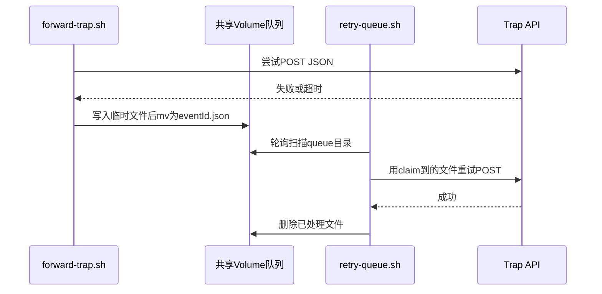

# 09. 持久化重试队列：不丢失一条告警

当后端API暂时不可用时，转发脚本不会丢弃数据，而是原子地落盘，由另一个后台进程持续重试。

## 核心要点

* forward-trap.sh转发失败时，先写入以.开头的临时文件，再用mv原子性地改名为eventId.json，避免半写文件被提前读取
* retry-queue.sh是一个独立的后台循环进程，每隔固定秒数(默认5秒)扫描队列目录里的所有.json文件
* retry-queue.sh用mv把文件改名加上.processing后缀来claim，这样两个retry-queue.sh进程不会重复处理同一个文件
* 重试成功后删除processing文件；失败则把文件改名换回原来的名字，等待下一轮重试
* 由于Oracle对eventId有唯一约束，即使同一条数据被重复投递多次，最终也只会保存一条记录，重试是幂等安全的

---

## 本章测验

本章共 5 道单项选择题。

### 第 1 题

forward-trap.sh在转发失败后，为什么要先写临时文件再用mv重命名，而不是直接写目标文件名？

- A. 利用mv在同一文件系统内的原子性，避免其他进程读到未写完的半截文件
- B. 因为直接写文件名会导致权限错误
- C. 这样做没有实际意义，只是历史习惯
- D. 为了压缩文件体积

选择答案后查看结果

正确答案：A

答案解析：如果直接写目标文件名，retry-queue.sh可能在文件还没写完时就读取到，造成数据损坏；先写临时文件再mv重命名，保证队列里出现的文件一定是完整的。

### 第 2 题

retry-queue.sh是怎样避免两个并发运行的实例重复处理同一个队列文件的？

- A. 用数据库锁
- B. 用mv把文件重命名加上.processing后缀来claim，mv失败说明已被别的实例占用
- C. 完全没有防重复机制
- D. 靠文件的创建时间判断

选择答案后查看结果

正确答案：B

答案解析：脚本执行mv \"$queued_file\" \"$processing_file\"，如果这个mv失败（说明文件已经被移走或不存在），当前循环会continue跳过，从而天然避免了竞争处理同一个文件。

### 第 3 题

如果retry-queue.sh重试投递失败，队列文件会怎么处理？

- A. 写入另一个错误专用目录
- B. 直接删除，放弃这条数据
- C. 把.processing文件重命名换回原来的文件名，留在队列里等待下一轮重试
- D. 发送邮件通知运维后终止进程

选择答案后查看结果

正确答案：C

答案解析：代码里失败分支执行mv \"$processing_file\" \"$queued_file\"，把文件放回原处，下一轮循环会继续尝试，直到API恢复正常。

### 第 4 题

为什么即使同一条Trap数据被反复重试并多次投递到API，最终Oracle里也只会保存一条记录？

- A. 因为retry-queue.sh每次都会生成新的eventId
- B. 因为Oracle会自动去除所有重复的时间戳
- C. 因为API每次都会随机丢弃重复请求
- D. 因为eventId在数据库层有唯一约束，加上TrapService会先查重再保存

选择答案后查看结果

正确答案：D

答案解析：V2迁移给SNMP_TRAP_EVENT表加了UK_SNMP_TRAP_EVENT_ID唯一约束，加上TrapService.save在写入前会调用existsByEventId查重，两层机制共同保证了重试的幂等性。

### 第 5 题

retry-queue.sh的轮询间隔由哪个环境变量控制？默认是多少秒？

- A. TRAP_RETRY_INTERVAL_SECONDS，默认5秒
- B. RETRY_TIMEOUT，默认30秒
- C. QUEUE_POLL_MS，默认1000毫秒
- D. 没有可配置项，固定写死在代码里

选择答案后查看结果

正确答案：A

答案解析：脚本里retry_interval=\"${TRAP_RETRY_INTERVAL_SECONDS:-5}\"，默认每5秒扫描一次队列目录，可以通过环境变量调整。

<!-- QUIZ_DATA_START
{
  "chapter": "09",
  "questions": [
    {
      "id": 1,
      "question": "forward-trap.sh在转发失败后，为什么要先写临时文件再用mv重命名，而不是直接写目标文件名？",
      "options": {
        "A": "利用mv在同一文件系统内的原子性，避免其他进程读到未写完的半截文件",
        "B": "因为直接写文件名会导致权限错误",
        "C": "这样做没有实际意义，只是历史习惯",
        "D": "为了压缩文件体积"
      },
      "answer": "A",
      "explanation": "如果直接写目标文件名，retry-queue.sh可能在文件还没写完时就读取到，造成数据损坏；先写临时文件再mv重命名，保证队列里出现的文件一定是完整的。"
    },
    {
      "id": 2,
      "question": "retry-queue.sh是怎样避免两个并发运行的实例重复处理同一个队列文件的？",
      "options": {
        "A": "用数据库锁",
        "B": "用mv把文件重命名加上.processing后缀来claim，mv失败说明已被别的实例占用",
        "C": "完全没有防重复机制",
        "D": "靠文件的创建时间判断"
      },
      "answer": "B",
      "explanation": "脚本执行mv \\\"$queued_file\\\" \\\"$processing_file\\\"，如果这个mv失败（说明文件已经被移走或不存在），当前循环会continue跳过，从而天然避免了竞争处理同一个文件。"
    },
    {
      "id": 3,
      "question": "如果retry-queue.sh重试投递失败，队列文件会怎么处理？",
      "options": {
        "A": "写入另一个错误专用目录",
        "B": "直接删除，放弃这条数据",
        "C": "把.processing文件重命名换回原来的文件名，留在队列里等待下一轮重试",
        "D": "发送邮件通知运维后终止进程"
      },
      "answer": "C",
      "explanation": "代码里失败分支执行mv \\\"$processing_file\\\" \\\"$queued_file\\\"，把文件放回原处，下一轮循环会继续尝试，直到API恢复正常。"
    },
    {
      "id": 4,
      "question": "为什么即使同一条Trap数据被反复重试并多次投递到API，最终Oracle里也只会保存一条记录？",
      "options": {
        "A": "因为retry-queue.sh每次都会生成新的eventId",
        "B": "因为Oracle会自动去除所有重复的时间戳",
        "C": "因为API每次都会随机丢弃重复请求",
        "D": "因为eventId在数据库层有唯一约束，加上TrapService会先查重再保存"
      },
      "answer": "D",
      "explanation": "V2迁移给SNMP_TRAP_EVENT表加了UK_SNMP_TRAP_EVENT_ID唯一约束，加上TrapService.save在写入前会调用existsByEventId查重，两层机制共同保证了重试的幂等性。"
    },
    {
      "id": 5,
      "question": "retry-queue.sh的轮询间隔由哪个环境变量控制？默认是多少秒？",
      "options": {
        "A": "TRAP_RETRY_INTERVAL_SECONDS，默认5秒",
        "B": "RETRY_TIMEOUT，默认30秒",
        "C": "QUEUE_POLL_MS，默认1000毫秒",
        "D": "没有可配置项，固定写死在代码里"
      },
      "answer": "A",
      "explanation": "脚本里retry_interval=\\\"${TRAP_RETRY_INTERVAL_SECONDS:-5}\\\"，默认每5秒扫描一次队列目录，可以通过环境变量调整。"
    }
  ]
}
QUIZ_DATA_END -->
