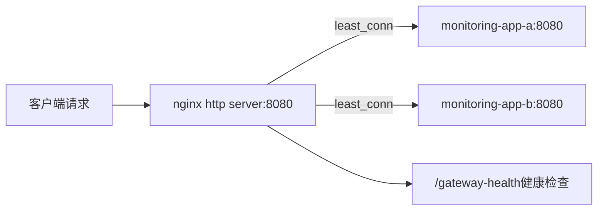

# 10. HTTP Gateway：nginx反向代理与负载均衡

同一个nginx进程同时承担UDP层的Trap转发和HTTP层的Web/API负载均衡，这一章聚焦它的http配置块。

## 核心要点

* http upstream使用least_conn策略，把请求转发给当前连接数最少的monitoring-app实例
* 代理时设置了X-Forwarded-For和X-Forwarded-Proto头，让后端应用能获取到真实客户端信息
* 单独定义了/gateway-health路径，直接返回200 ok，用于Docker健康检查探测网关自身是否存活，不经过后端
* 整个nginx以非root用户(101:101)运行，并且是read_only文件系统，配合tmpfs挂载可写目录，减少被攻破后的破坏面

---

## 本章测验

本章共 5 道单项选择题。

### 第 1 题

nginx的http upstream监控使用了什么负载均衡策略？

- A. round_robin轮询
- B. least_conn最少连接数
- C. ip_hash
- D. 随机分发

选择答案后查看结果

正确答案：B

答案解析：配置文件里upstream monitoring_apps块中写了least_conn，把新请求转发给当前活跃连接数最少的后端实例。

### 第 2 题

代理转发时设置X-Forwarded-For头的目的是什么？

- A. 用于DNS解析
- B. 加密传输内容
- C. 让后端Spring Boot应用能获取到客户端的真实IP地址
- D. 提高nginx的缓存命中率

选择答案后查看结果

正确答案：C

答案解析：因为请求经过nginx转发后，后端看到的直接来源IP会是nginx自身，通过X-Forwarded-For头把原始客户端IP传递下去，方便后端做日志记录或安全审计。

### 第 3 题

/gateway-health这个路径的作用是什么？

- A. 用于接收SNMP Trap
- B. 提供数据库管理界面
- C. 展示Trap事件列表
- D. 作为网关自身的健康检查端点，直接返回200不经过后端

选择答案后查看结果

正确答案：D

答案解析：配置里location = /gateway-health直接return 200 'ok'，且access_log off，专门用于Docker healthcheck探测nginx本身是否存活，和后端应用状态无关。

### 第 4 题

nginx容器采用了哪些安全加固措施？

- A. 非root用户运行、只读文件系统、no-new-privileges、丢弃所有capability后只保留NET_BIND_SERVICE
- B. 完全关闭日志记录
- C. 禁用所有健康检查
- D. 以root用户运行以获得最大权限

选择答案后查看结果

正确答案：A

答案解析：docker-compose.yml里gateway服务配置了user 101:101、read_only: true、security_opt no-new-privileges、cap_drop ALL、cap_add仅保留NET_BIND_SERVICE（用于监听1024以下端口），是典型的容器安全加固组合。

### 第 5 题

如果nginx是read_only文件系统，那些需要写入的临时目录（比如缓存和pid文件）是怎么处理的？

- A. 完全不允许写入，因此nginx无法启动
- B. 通过tmpfs挂载专门的可写临时目录
- C. 直接写到宿主机磁盘
- D. 每次写入前先临时关闭read_only

选择答案后查看结果

正确答案：B

答案解析：docker-compose.yml为gateway服务挂载了tmpfs类型的/var/cache/nginx、/var/run、/tmp，这些内存文件系统提供了必要的可写空间，同时不破坏容器整体只读的安全约束。

<!-- QUIZ_DATA_START
{
  "chapter": "10",
  "questions": [
    {
      "id": 1,
      "question": "nginx的http upstream监控使用了什么负载均衡策略？",
      "options": {
        "A": "round_robin轮询",
        "B": "least_conn最少连接数",
        "C": "ip_hash",
        "D": "随机分发"
      },
      "answer": "B",
      "explanation": "配置文件里upstream monitoring_apps块中写了least_conn，把新请求转发给当前活跃连接数最少的后端实例。"
    },
    {
      "id": 2,
      "question": "代理转发时设置X-Forwarded-For头的目的是什么？",
      "options": {
        "A": "用于DNS解析",
        "B": "加密传输内容",
        "C": "让后端Spring Boot应用能获取到客户端的真实IP地址",
        "D": "提高nginx的缓存命中率"
      },
      "answer": "C",
      "explanation": "因为请求经过nginx转发后，后端看到的直接来源IP会是nginx自身，通过X-Forwarded-For头把原始客户端IP传递下去，方便后端做日志记录或安全审计。"
    },
    {
      "id": 3,
      "question": "/gateway-health这个路径的作用是什么？",
      "options": {
        "A": "用于接收SNMP Trap",
        "B": "提供数据库管理界面",
        "C": "展示Trap事件列表",
        "D": "作为网关自身的健康检查端点，直接返回200不经过后端"
      },
      "answer": "D",
      "explanation": "配置里location = /gateway-health直接return 200 'ok'，且access_log off，专门用于Docker healthcheck探测nginx本身是否存活，和后端应用状态无关。"
    },
    {
      "id": 4,
      "question": "nginx容器采用了哪些安全加固措施？",
      "options": {
        "A": "非root用户运行、只读文件系统、no-new-privileges、丢弃所有capability后只保留NET_BIND_SERVICE",
        "B": "完全关闭日志记录",
        "C": "禁用所有健康检查",
        "D": "以root用户运行以获得最大权限"
      },
      "answer": "A",
      "explanation": "docker-compose.yml里gateway服务配置了user 101:101、read_only: true、security_opt no-new-privileges、cap_drop ALL、cap_add仅保留NET_BIND_SERVICE（用于监听1024以下端口），是典型的容器安全加固组合。"
    },
    {
      "id": 5,
      "question": "如果nginx是read_only文件系统，那些需要写入的临时目录（比如缓存和pid文件）是怎么处理的？",
      "options": {
        "A": "完全不允许写入，因此nginx无法启动",
        "B": "通过tmpfs挂载专门的可写临时目录",
        "C": "直接写到宿主机磁盘",
        "D": "每次写入前先临时关闭read_only"
      },
      "answer": "B",
      "explanation": "docker-compose.yml为gateway服务挂载了tmpfs类型的/var/cache/nginx、/var/run、/tmp，这些内存文件系统提供了必要的可写空间，同时不破坏容器整体只读的安全约束。"
    }
  ]
}
QUIZ_DATA_END -->
