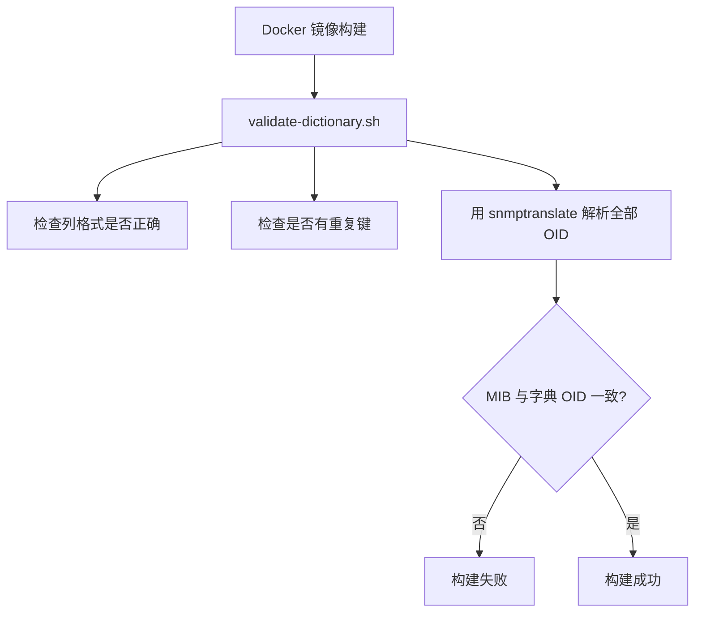

# 构建时校验：validate-dictionary.sh

字典文件写错了怎么办？这一章看项目如何在镜像构建阶段就把错误拦下来。

## 核心要点

* validate-dictionary.sh 在镜像构建阶段运行，而不是在运行时才发现问题。
* 校验内容包括：字典的列格式是否规范、是否存在重复的键、以及所有字典条目能否通过 snmptranslate 在 MIB 中正确解析。
* 核心校验点是数值 OID 的一致性：字典里写的 OID 必须和 MIB 里定义的完全对应，否则说明字典和 MIB 已经"漂移"。
* 任何一项不一致都会导致整个 Docker 镜像构建失败，从源头上避免带着错误配置的镜像被部署到运行环境。

---

## 本章测验

本章共 5 道单项选择题。

### 第 1 题

validate-dictionary.sh 是在哪个阶段执行的？

- A. 只在用户手动调用时执行
- B. 镜像构建阶段
- C. 在浏览器加载页面时执行
- D. 运行时，每次收到 Trap 都执行一次

选择答案后查看结果

正确答案：B

答案解析：该脚本在 Docker 镜像构建时运行，目的是把配置错误挡在部署之前，而不是等到运行时才暴露问题。

### 第 2 题

validate-dictionary.sh 用什么工具来校验字典中的 OID 是否能在 MIB 中正确解析？

- A. snmptranslate
- B. sha256sum
- C. jq
- D. curl

选择答案后查看结果

正确答案：A

答案解析：脚本使用 Net-SNMP 自带的 snmptranslate 命令，尝试解析字典中的每个符号或 OID，验证其与 MIB 定义是否一致。

### 第 3 题

如果字典中的 OID 与 MIB 中定义的实际数值不一致，会发生什么？

- A. 系统会忽略这个差异继续运行
- B. 校验失败，导致整个镜像构建失败
- C. 只在日志中打印警告，不影响构建
- D. 构建会自动修正 MIB 文件

选择答案后查看结果

正确答案：B

答案解析：设计原则是任何不一致都必须导致构建失败，这样可以从源头阻止字典与 MIB 漂移的镜像被部署。

### 第 4 题

把字典校验放在构建阶段而不是运行阶段，最大的价值是什么？

- A. 可以减少镜像体积
- B. 能自动加密所有 Trap 报文
- C. 可以省去 MIB 文件
- D. 能在问题影响生产流量之前就被发现和拦截

选择答案后查看结果

正确答案：D

答案解析：构建时校验是一种"提前失败"（fail fast）的策略，把可能的配置错误挡在部署流程之前，避免带着错误规则处理真实流量。

### 第 5 题

关于 validate-dictionary.sh 的校验范围，以下说法最准确的是？

- A. 检查格式、重复项，以及字典与 MIB 的 OID 一致性
- B. 只检查 Oracle 连接是否正常
- C. 只检查 Simulator 能否发送成功
- D. 只检查文件是否存在

选择答案后查看结果

正确答案：A

答案解析：该脚本综合检查字典格式规范性、重复键，以及最核心的字典 OID 与 MIB 定义之间的一致性，三方面缺一不可。

<!-- QUIZ_DATA_START
{
  "chapter": "10",
  "questions": [
    {
      "id": 1,
      "question": "validate-dictionary.sh 是在哪个阶段执行的？",
      "options": {
        "B": "镜像构建阶段",
        "A": "只在用户手动调用时执行",
        "C": "在浏览器加载页面时执行",
        "D": "运行时，每次收到 Trap 都执行一次"
      },
      "answer": "B",
      "explanation": "该脚本在 Docker 镜像构建时运行，目的是把配置错误挡在部署之前，而不是等到运行时才暴露问题。"
    },
    {
      "id": 2,
      "question": "validate-dictionary.sh 用什么工具来校验字典中的 OID 是否能在 MIB 中正确解析？",
      "options": {
        "A": "snmptranslate",
        "B": "sha256sum",
        "C": "jq",
        "D": "curl"
      },
      "answer": "A",
      "explanation": "脚本使用 Net-SNMP 自带的 snmptranslate 命令，尝试解析字典中的每个符号或 OID，验证其与 MIB 定义是否一致。"
    },
    {
      "id": 3,
      "question": "如果字典中的 OID 与 MIB 中定义的实际数值不一致，会发生什么？",
      "options": {
        "B": "校验失败，导致整个镜像构建失败",
        "A": "系统会忽略这个差异继续运行",
        "C": "只在日志中打印警告，不影响构建",
        "D": "构建会自动修正 MIB 文件"
      },
      "answer": "B",
      "explanation": "设计原则是任何不一致都必须导致构建失败，这样可以从源头阻止字典与 MIB 漂移的镜像被部署。"
    },
    {
      "id": 4,
      "question": "把字典校验放在构建阶段而不是运行阶段，最大的价值是什么？",
      "options": {
        "D": "能在问题影响生产流量之前就被发现和拦截",
        "A": "可以减少镜像体积",
        "B": "能自动加密所有 Trap 报文",
        "C": "可以省去 MIB 文件"
      },
      "answer": "D",
      "explanation": "构建时校验是一种\"提前失败\"（fail fast）的策略，把可能的配置错误挡在部署流程之前，避免带着错误规则处理真实流量。"
    },
    {
      "id": 5,
      "question": "关于 validate-dictionary.sh 的校验范围，以下说法最准确的是？",
      "options": {
        "A": "检查格式、重复项，以及字典与 MIB 的 OID 一致性",
        "B": "只检查 Oracle 连接是否正常",
        "C": "只检查 Simulator 能否发送成功",
        "D": "只检查文件是否存在"
      },
      "answer": "A",
      "explanation": "该脚本综合检查字典格式规范性、重复键，以及最核心的字典 OID 与 MIB 定义之间的一致性，三方面缺一不可。"
    }
  ]
}
QUIZ_DATA_END -->
