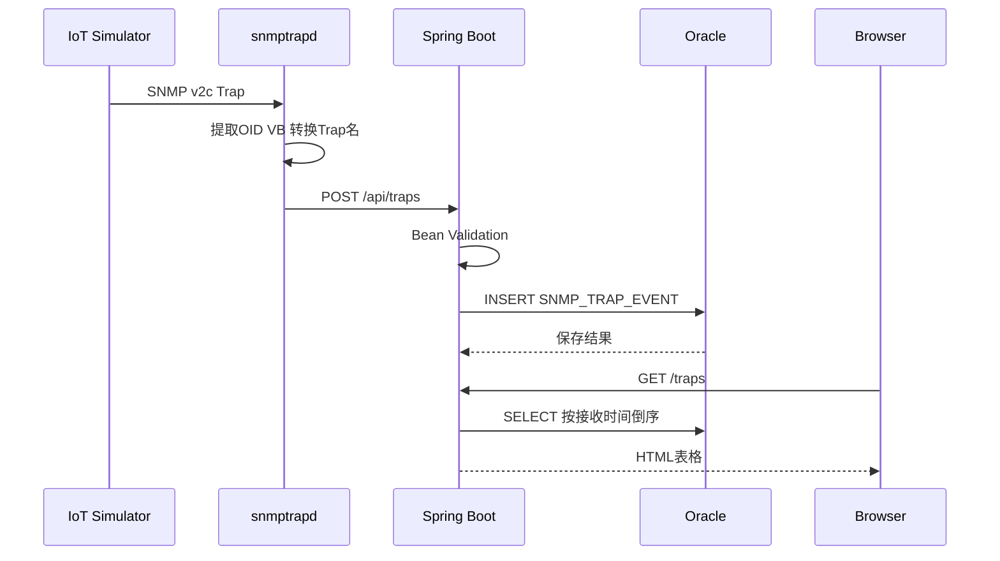

# 10 完整数据流：从Trap发送到页面显示

把前面拆开讲的每个组件重新串成一条时间线，看看一次完整请求经历了哪些步骤。

## 核心要点

* 一次完整流程分两个阶段：写入阶段（Simulator 到 Oracle）和查询阶段（浏览器到 Oracle）。
* 写入阶段依次是：发送 Trap、snmptrapd 提取转换、POST 到 Spring Boot、Bean Validation 校验、写入 Oracle、返回保存结果。
* 查询阶段是浏览器独立发起的：GET /traps、按接收时间倒序 SELECT、渲染 HTML 表格返回。
* 写入和查询是两条互不阻塞的路径，浏览器刷新页面时看到的是数据库里当前已经保存的最新状态，而不是实时推送。

---

## 本章测验

本章共 5 道单项选择题。

### 第 1 题

完整数据流可以划分为哪两个相对独立的阶段？

- A. 发送阶段和加密阶段
- B. 构建阶段和部署阶段
- C. 校验阶段和存储阶段
- D. 写入阶段和查询阶段

选择答案后查看结果

正确答案：D

答案解析：写入阶段涵盖从 Simulator 发送 Trap 到数据存入 Oracle；查询阶段是浏览器主动发起 GET 请求获取数据，两者相互独立。

### 第 2 题

在时序图中，Spring Boot 收到 POST 请求后紧接着做的第一件事是什么？

- A. 直接返回 201 Created
- B. 调用 snmptrapd 重新确认
- C. 查询浏览器会话状态
- D. 执行 Bean Validation

选择答案后查看结果

正确答案：D

答案解析：时序图显示 A->>A: Bean Validation 紧跟在收到 POST 请求之后，即先校验再写入数据库。

### 第 3 题

浏览器获取最新数据的方式是什么？

- A. 通过 WebSocket 实时推送
- B. 浏览器直接连接 Oracle 数据库查询
- C. 服务端定时轮询并主动推送到浏览器
- D. 浏览器主动发起 GET /traps 请求

选择答案后查看结果

正确答案：D

答案解析：查询阶段是浏览器主动发起 GET /traps 请求，Spring Boot 查询数据库后返回渲染好的 HTML，没有实时推送机制。

### 第 4 题

查询阶段中，Spring Boot 从 Oracle 检索数据时使用的排序方式是什么？

- A. 按严重程度降序
- B. 按设备编号升序
- C. 按接收时间倒序
- D. 不做排序，随机返回

选择答案后查看结果

正确答案：C

答案解析：时序图和详细设计文档都说明查询是“受信日时降順検索”，即按接收时间倒序排列。

### 第 5 题

为什么“发送了 Trap 但页面没有立即变化”不一定意味着系统出错？

- A. 因为 Trap 消息默认延迟 24 小时处理
- B. 因为 Oracle 数据库需要重启才能生效
- C. 因为写入和查询是相互独立的，页面只有在浏览器主动刷新时才会读取最新数据
- D. 因为系统没有查询阶段

选择答案后查看结果

正确答案：C

答案解析：系统没有实时推送机制，页面数据只在浏览器发起新的 GET 请求时更新，因此页面暂未刷新是常见的正常现象，而非故障。

<!-- QUIZ_DATA_START
{
  "chapter": "10",
  "questions": [
    {
      "id": 1,
      "question": "完整数据流可以划分为哪两个相对独立的阶段？",
      "options": {
        "A": "发送阶段和加密阶段",
        "B": "构建阶段和部署阶段",
        "C": "校验阶段和存储阶段",
        "D": "写入阶段和查询阶段"
      },
      "answer": "D",
      "explanation": "写入阶段涵盖从 Simulator 发送 Trap 到数据存入 Oracle；查询阶段是浏览器主动发起 GET 请求获取数据，两者相互独立。"
    },
    {
      "id": 2,
      "question": "在时序图中，Spring Boot 收到 POST 请求后紧接着做的第一件事是什么？",
      "options": {
        "A": "直接返回 201 Created",
        "B": "调用 snmptrapd 重新确认",
        "C": "查询浏览器会话状态",
        "D": "执行 Bean Validation"
      },
      "answer": "D",
      "explanation": "时序图显示 A->>A: Bean Validation 紧跟在收到 POST 请求之后，即先校验再写入数据库。"
    },
    {
      "id": 3,
      "question": "浏览器获取最新数据的方式是什么？",
      "options": {
        "A": "通过 WebSocket 实时推送",
        "B": "浏览器直接连接 Oracle 数据库查询",
        "C": "服务端定时轮询并主动推送到浏览器",
        "D": "浏览器主动发起 GET /traps 请求"
      },
      "answer": "D",
      "explanation": "查询阶段是浏览器主动发起 GET /traps 请求，Spring Boot 查询数据库后返回渲染好的 HTML，没有实时推送机制。"
    },
    {
      "id": 4,
      "question": "查询阶段中，Spring Boot 从 Oracle 检索数据时使用的排序方式是什么？",
      "options": {
        "A": "按严重程度降序",
        "B": "按设备编号升序",
        "C": "按接收时间倒序",
        "D": "不做排序，随机返回"
      },
      "answer": "C",
      "explanation": "时序图和详细设计文档都说明查询是“受信日时降順検索”，即按接收时间倒序排列。"
    },
    {
      "id": 5,
      "question": "为什么“发送了 Trap 但页面没有立即变化”不一定意味着系统出错？",
      "options": {
        "A": "因为 Trap 消息默认延迟 24 小时处理",
        "B": "因为 Oracle 数据库需要重启才能生效",
        "C": "因为写入和查询是相互独立的，页面只有在浏览器主动刷新时才会读取最新数据",
        "D": "因为系统没有查询阶段"
      },
      "answer": "C",
      "explanation": "系统没有实时推送机制，页面数据只在浏览器发起新的 GET 请求时更新，因此页面暂未刷新是常见的正常现象，而非故障。"
    }
  ]
}
QUIZ_DATA_END -->
