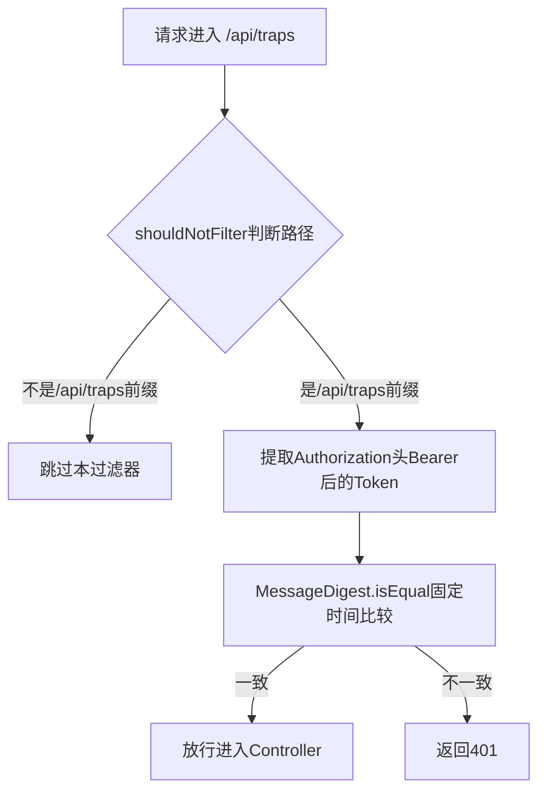

# 11. Trap API 认证：Bearer Token 与固定时间比较

Trap API是内部接口，只允许携带正确Token的接收节点调用，TrapApiTokenFilter实现了这一层防护。

## 核心要点

* TrapApiTokenFilter只对以/api/traps开头的路径生效，通过shouldNotFilter方法过滤其他路径
* 校验使用MessageDigest.isEqual做固定时间比较，避免通过响应时间差异被猜测出正确Token(时序攻击)
* Token本身来自Secret文件，构造函数里要求长度必须大于等于16个字符，否则应用启动直接失败
* 该过滤器的@Order设置为Ordered.HIGHEST_PRECEDENCE，确保它在其他Spring Security过滤器之前先执行

---

## 本章测验

本章共 5 道单项选择题。

### 第 1 题

TrapApiTokenFilter通过什么方法限定自己只处理/api/traps路径的请求？

- A. 通过Spring Security的antMatchers实现
- B. doFilterInternal方法内部用if判断所有路径
- C. 重写shouldNotFilter方法，只要不是以/api/traps开头就返回true跳过
- D. 在application.yml里配置路径白名单

选择答案后查看结果

正确答案：C

答案解析：代码里重写了shouldNotFilter，返回!request.getRequestURI().startsWith(\"/api/traps\")，也就是说只有Trap API路径才会真正执行这个过滤器的校验逻辑。

### 第 2 题

为什么Token比较使用MessageDigest.isEqual而不是直接用String.equals？

- A. String.equals无法比较字节数组
- B. 两者没有任何区别，只是编码习惯不同
- C. MessageDigest.isEqual运行速度更快
- D. MessageDigest.isEqual是固定时间比较，能防止攻击者通过响应时间差异逐字节猜测出正确Token

选择答案后查看结果

正确答案：D

答案解析：String.equals在发现第一个不匹配字符时就会提前返回，响应时间会随匹配字符数增加而变化，可能被用于时序攻击；MessageDigest.isEqual无论匹配与否都会比较完所有字节，时间基本恒定。

### 第 3 题

如果配置的Trap API Token长度小于16个字符，会发生什么？

- A. 应用启动时TrapApiTokenFilter的构造函数就会抛出IllegalArgumentException导致启动失败
- B. 自动补齐到16个字符后继续使用
- C. 忽略这个限制，仍然使用短Token
- D. 应用正常启动，仅在实际请求时报错

选择答案后查看结果

正确答案：A

答案解析：构造函数里有if (expectedToken == null || expectedToken.length() < 16) throw new IllegalArgumentException，这是一种\"fail fast\"设计，把配置错误尽早暴露在启动阶段。

### 第 4 题

@Order(Ordered.HIGHEST_PRECEDENCE)注解的作用是什么？

- A. 没有实际功能，只是注释性标记
- B. 让这个过滤器成为整个过滤器链中最先执行的一个
- C. 让这个过滤器变成异步执行
- D. 提高这个过滤器的日志打印优先级

选择答案后查看结果

正确答案：B

答案解析：这个注解确保TrapApiTokenFilter在Spring Security的其他过滤器之前先运行，尽早拦截未授权的Trap API请求。

### 第 5 题

如果请求头中没有携带Authorization，或者格式不是Bearer开头，过滤器会怎样处理？

- A. 抛出异常导致500错误
- B. 自动重定向到登录页面
- C. 当作Token为空字符串参与比较，最终返回401
- D. 直接放行，跳过校验

选择答案后查看结果

正确答案：C

答案解析：代码里suppliedToken默认取空字符串，如果Authorization不存在或不以Bearer 开头，suppliedToken就是空串，与expectedToken比较必然不相等，最终会返回401及JSON错误信息。

<!-- QUIZ_DATA_START
{
  "chapter": "11",
  "questions": [
    {
      "id": 1,
      "question": "TrapApiTokenFilter通过什么方法限定自己只处理/api/traps路径的请求？",
      "options": {
        "A": "通过Spring Security的antMatchers实现",
        "B": "doFilterInternal方法内部用if判断所有路径",
        "C": "重写shouldNotFilter方法，只要不是以/api/traps开头就返回true跳过",
        "D": "在application.yml里配置路径白名单"
      },
      "answer": "C",
      "explanation": "代码里重写了shouldNotFilter，返回!request.getRequestURI().startsWith(\\\"/api/traps\\\")，也就是说只有Trap API路径才会真正执行这个过滤器的校验逻辑。"
    },
    {
      "id": 2,
      "question": "为什么Token比较使用MessageDigest.isEqual而不是直接用String.equals？",
      "options": {
        "A": "String.equals无法比较字节数组",
        "B": "两者没有任何区别，只是编码习惯不同",
        "C": "MessageDigest.isEqual运行速度更快",
        "D": "MessageDigest.isEqual是固定时间比较，能防止攻击者通过响应时间差异逐字节猜测出正确Token"
      },
      "answer": "D",
      "explanation": "String.equals在发现第一个不匹配字符时就会提前返回，响应时间会随匹配字符数增加而变化，可能被用于时序攻击；MessageDigest.isEqual无论匹配与否都会比较完所有字节，时间基本恒定。"
    },
    {
      "id": 3,
      "question": "如果配置的Trap API Token长度小于16个字符，会发生什么？",
      "options": {
        "A": "应用启动时TrapApiTokenFilter的构造函数就会抛出IllegalArgumentException导致启动失败",
        "B": "自动补齐到16个字符后继续使用",
        "C": "忽略这个限制，仍然使用短Token",
        "D": "应用正常启动，仅在实际请求时报错"
      },
      "answer": "A",
      "explanation": "构造函数里有if (expectedToken == null || expectedToken.length() < 16) throw new IllegalArgumentException，这是一种\\\"fail fast\\\"设计，把配置错误尽早暴露在启动阶段。"
    },
    {
      "id": 4,
      "question": "@Order(Ordered.HIGHEST_PRECEDENCE)注解的作用是什么？",
      "options": {
        "A": "没有实际功能，只是注释性标记",
        "B": "让这个过滤器成为整个过滤器链中最先执行的一个",
        "C": "让这个过滤器变成异步执行",
        "D": "提高这个过滤器的日志打印优先级"
      },
      "answer": "B",
      "explanation": "这个注解确保TrapApiTokenFilter在Spring Security的其他过滤器之前先运行，尽早拦截未授权的Trap API请求。"
    },
    {
      "id": 5,
      "question": "如果请求头中没有携带Authorization，或者格式不是Bearer开头，过滤器会怎样处理？",
      "options": {
        "A": "抛出异常导致500错误",
        "B": "自动重定向到登录页面",
        "C": "当作Token为空字符串参与比较，最终返回401",
        "D": "直接放行，跳过校验"
      },
      "answer": "C",
      "explanation": "代码里suppliedToken默认取空字符串，如果Authorization不存在或不以Bearer 开头，suppliedToken就是空串，与expectedToken比较必然不相等，最终会返回401及JSON错误信息。"
    }
  ]
}
QUIZ_DATA_END -->
