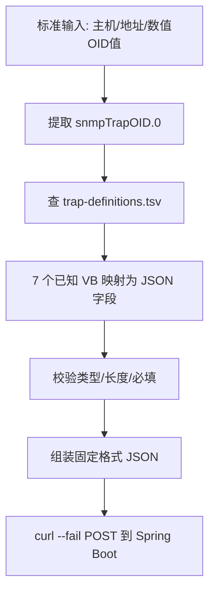

# 转发脚本流程：forward-trap.sh

字典和校验都到位了，现在看真正把一条 Trap 变成一条 JSON 请求的那段脚本逻辑。

## 核心要点

* snmptrapd 把标准输入的前两行（接收主机、接收地址）记录到日志，剩下的每一行是"数值 OID 值"格式的数据。
* 脚本先提取 snmpTrapOID.0，这是本条通知的类型标识，用它去查 trap-definitions.tsv 得到 Trap 名。
* 接着把 7 个已知 VB 按照 varbind-definitions.tsv 的规则逐一转换成 JSON 字段，同时做类型、长度、必填校验。
* 生成的 JSON 里同时包含 trapOid 和 trapName 两个字段，这两个值会一路保留到数据库和页面展示。
* 最后用 curl --fail 发起 POST 请求，--fail 意味着一旦 HTTP 状态码不是 2xx，curl 会以失败退出，方便脚本感知投递失败。

---

## 本章测验

本章共 5 道单项选择题。

### 第 1 题

forward-trap.sh 处理的第一步是什么？

- A. 直接连接 Oracle 数据库
- B. 生成 MIB 文件
- C. 重启 snmptrapd 服务
- D. 从标准输入中提取 snmpTrapOID.0，识别通知类型

选择答案后查看结果

正确答案：D

答案解析：脚本首先从标准输入的数值 OID 值数据里提取 snmpTrapOID.0，这是判断本条 Trap 属于哪种通知类型的关键标识。

### 第 2 题

脚本最终发出的 JSON 中包含 trapOid 和 trapName 两个字段，这体现了什么设计意图？

- A. 让原始 OID 和翻译后的可读名称都能一路保留到数据库和页面
- B. trapName 会被丢弃，只有 trapOid 有用
- C. 仅为了兼容旧版本 API
- D. 为了让 JSON 体积更大

选择答案后查看结果

正确答案：A

答案解析：同时保留数字 OID 和翻译后的名字，使得数据在数据库和展示层既有精确的技术标识，又有可读性，两者互为补充。

### 第 3 题

curl --fail 参数的作用是什么？

- A. 跳过 SSL 证书校验
- B. 当 HTTP 响应不是 2xx 时，curl 以失败状态退出
- C. 强制使用 HTTPS
- D. 自动重试 3 次

选择答案后查看结果

正确答案：B

答案解析：--fail 让 curl 在服务端返回非 2xx 状态码时判定为失败并返回非零退出码，方便脚本据此判断投递是否成功。

### 第 4 题

脚本处理 VB 数据时，需要同时做哪些校验？

- A. 只检查是否包含中文字符
- B. 不做任何校验，全部信任输入
- C. 只检查是否为空字符串
- D. 类型、最大长度、必填三方面的校验

选择答案后查看结果

正确答案：D

答案解析：按照 varbind-definitions.tsv 定义的规则，脚本要综合校验字段的类型、最大长度和是否必填，任一不满足都会导致处理失败。

### 第 5 题

如果 snmpTrapOID.0 在 trap-definitions.tsv 中找不到对应记录，最合理的处理方式是什么？

- A. 视为未注册 OID，记录日志并停止转发
- B. 假设它是 NORMAL 事件继续处理
- C. 自动在字典里新增一条记录
- D. 忽略这个字段继续处理其余 VB

选择答案后查看结果

正确答案：A

答案解析：未在字典中登记的通知 OID 属于未知类型，脚本应当记录日志并中止转发，而不是猜测性地当作已知事件处理，这也是第 12 章要讨论的一致性校验的一部分。

<!-- QUIZ_DATA_START
{
  "chapter": "11",
  "questions": [
    {
      "id": 1,
      "question": "forward-trap.sh 处理的第一步是什么？",
      "options": {
        "D": "从标准输入中提取 snmpTrapOID.0，识别通知类型",
        "A": "直接连接 Oracle 数据库",
        "B": "生成 MIB 文件",
        "C": "重启 snmptrapd 服务"
      },
      "answer": "D",
      "explanation": "脚本首先从标准输入的数值 OID 值数据里提取 snmpTrapOID.0，这是判断本条 Trap 属于哪种通知类型的关键标识。"
    },
    {
      "id": 2,
      "question": "脚本最终发出的 JSON 中包含 trapOid 和 trapName 两个字段，这体现了什么设计意图？",
      "options": {
        "A": "让原始 OID 和翻译后的可读名称都能一路保留到数据库和页面",
        "B": "trapName 会被丢弃，只有 trapOid 有用",
        "C": "仅为了兼容旧版本 API",
        "D": "为了让 JSON 体积更大"
      },
      "answer": "A",
      "explanation": "同时保留数字 OID 和翻译后的名字，使得数据在数据库和展示层既有精确的技术标识，又有可读性，两者互为补充。"
    },
    {
      "id": 3,
      "question": "curl --fail 参数的作用是什么？",
      "options": {
        "B": "当 HTTP 响应不是 2xx 时，curl 以失败状态退出",
        "A": "跳过 SSL 证书校验",
        "C": "强制使用 HTTPS",
        "D": "自动重试 3 次"
      },
      "answer": "B",
      "explanation": "--fail 让 curl 在服务端返回非 2xx 状态码时判定为失败并返回非零退出码，方便脚本据此判断投递是否成功。"
    },
    {
      "id": 4,
      "question": "脚本处理 VB 数据时，需要同时做哪些校验？",
      "options": {
        "D": "类型、最大长度、必填三方面的校验",
        "A": "只检查是否包含中文字符",
        "B": "不做任何校验，全部信任输入",
        "C": "只检查是否为空字符串"
      },
      "answer": "D",
      "explanation": "按照 varbind-definitions.tsv 定义的规则，脚本要综合校验字段的类型、最大长度和是否必填，任一不满足都会导致处理失败。"
    },
    {
      "id": 5,
      "question": "如果 snmpTrapOID.0 在 trap-definitions.tsv 中找不到对应记录，最合理的处理方式是什么？",
      "options": {
        "A": "视为未注册 OID，记录日志并停止转发",
        "B": "假设它是 NORMAL 事件继续处理",
        "C": "自动在字典里新增一条记录",
        "D": "忽略这个字段继续处理其余 VB"
      },
      "answer": "A",
      "explanation": "未在字典中登记的通知 OID 属于未知类型，脚本应当记录日志并中止转发，而不是猜测性地当作已知事件处理，这也是第 12 章要讨论的一致性校验的一部分。"
    }
  ]
}
QUIZ_DATA_END -->
