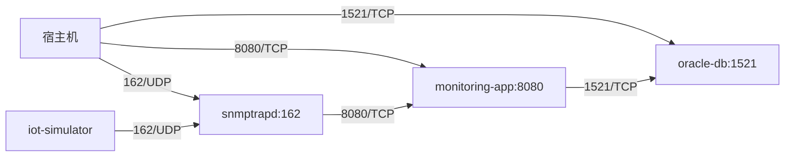

# 11 网络与端口设计

理清楚每个端口分别属于谁、承载什么协议，是排查网络问题的基础。

## 核心要点

* 对外暴露的三个端口分别是：162（UDP，SNMP Trap 接收）、8080（TCP/HTTP，REST API 与 Web 页面）、1521（TCP，Oracle JDBC）。
* 宿主机需要确保这三个端口未被占用，才能顺利完成首次 docker compose up 构建和启动。
* 容器间通信同样走这三个端口：iot-simulator 到 snmptrapd 走 UDP 162，snmptrapd 到 monitoring-app 走 TCP 8080，monitoring-app 到 oracle-db 走 TCP 1521。
* 浏览器只能触达宿主机映射出来的 8080 端口，无法直接访问 162 和 1521，这也符合前面讲到的职责隔离原则。

---

## 本章测验

本章共 5 道单项选择题。

### 第 1 题

本项目对外暴露的三个端口分别对应什么用途？

- A. 三个端口用途完全相同，互为备份
- B. 162 用于数据库，8080 用于 Trap 接收，1521 用于网页
- C. 162 用于 SNMP Trap 接收，8080 用于 REST API 与网页，1521 用于 Oracle JDBC
- D. 162 用于网页，8080 用于数据库，1521 用于 SNMP

选择答案后查看结果

正确答案：C

答案解析：网络与端口设计表明确列出：162/UDP 用于 SNMP Trap 接收，8080/TCP 用于 REST API 和 Web 页面，1521/TCP 用于 Oracle JDBC。

### 第 2 题

如果宿主机上的 8080 端口已被其他程序占用，最可能出现的问题是什么？

- A. snmptrapd 会拒绝接收所有 Trap
- B. monitoring-app 的端口映射失败，外部无法访问网页和 API
- C. Oracle 数据库无法启动
- D. IoT Simulator 会自动切换到 8081 端口

选择答案后查看结果

正确答案：B

答案解析：8080 端口冲突会导致 monitoring-app 服务的端口映射失败，从而无法从宿主机访问 REST API 和网页。

### 第 3 题

iot-simulator 与 snmptrapd 之间的通信使用什么端口和协议？

- A. TCP 8080
- B. UDP 1521
- C. TCP 1521
- D. UDP 162

选择答案后查看结果

正确答案：D

答案解析：iot-simulator 通过 UDP 162 向 snmptrapd 发送 SNMP Trap，这与宿主机对外暴露的 UDP 162 端口用途一致。

### 第 4 题

浏览器在本项目中可以直接访问的端口是哪一个？

- A. 1521
- B. 8080
- C. 以上都可以
- D. 162

选择答案后查看结果

正确答案：B

答案解析：浏览器只应通过 8080 端口访问 monitoring-app 的网页和 API，不直接接触 162（SNMP）和 1521（数据库）端口。

### 第 5 题

端口设计与组件职责隔离原则之间的关系是什么？

- A. 端口划分在物理层面强化了“谁该和谁通信”的职责边界
- B. 端口设计会削弱组件之间的职责隔离
- C. 两者没有关系，端口只是随机分配的
- D. 端口数量越多，职责隔离就越弱

选择答案后查看结果

正确答案：A

答案解析：只让浏览器访问 8080、只让内部服务访问 162 和 1521，这种端口划分方式在物理网络层面体现并强化了组件之间的职责边界。

<!-- QUIZ_DATA_START
{
  "chapter": "11",
  "questions": [
    {
      "id": 1,
      "question": "本项目对外暴露的三个端口分别对应什么用途？",
      "options": {
        "A": "三个端口用途完全相同，互为备份",
        "B": "162 用于数据库，8080 用于 Trap 接收，1521 用于网页",
        "C": "162 用于 SNMP Trap 接收，8080 用于 REST API 与网页，1521 用于 Oracle JDBC",
        "D": "162 用于网页，8080 用于数据库，1521 用于 SNMP"
      },
      "answer": "C",
      "explanation": "网络与端口设计表明确列出：162/UDP 用于 SNMP Trap 接收，8080/TCP 用于 REST API 和 Web 页面，1521/TCP 用于 Oracle JDBC。"
    },
    {
      "id": 2,
      "question": "如果宿主机上的 8080 端口已被其他程序占用，最可能出现的问题是什么？",
      "options": {
        "A": "snmptrapd 会拒绝接收所有 Trap",
        "B": "monitoring-app 的端口映射失败，外部无法访问网页和 API",
        "C": "Oracle 数据库无法启动",
        "D": "IoT Simulator 会自动切换到 8081 端口"
      },
      "answer": "B",
      "explanation": "8080 端口冲突会导致 monitoring-app 服务的端口映射失败，从而无法从宿主机访问 REST API 和网页。"
    },
    {
      "id": 3,
      "question": "iot-simulator 与 snmptrapd 之间的通信使用什么端口和协议？",
      "options": {
        "A": "TCP 8080",
        "B": "UDP 1521",
        "C": "TCP 1521",
        "D": "UDP 162"
      },
      "answer": "D",
      "explanation": "iot-simulator 通过 UDP 162 向 snmptrapd 发送 SNMP Trap，这与宿主机对外暴露的 UDP 162 端口用途一致。"
    },
    {
      "id": 4,
      "question": "浏览器在本项目中可以直接访问的端口是哪一个？",
      "options": {
        "A": "1521",
        "B": "8080",
        "C": "以上都可以",
        "D": "162"
      },
      "answer": "B",
      "explanation": "浏览器只应通过 8080 端口访问 monitoring-app 的网页和 API，不直接接触 162（SNMP）和 1521（数据库）端口。"
    },
    {
      "id": 5,
      "question": "端口设计与组件职责隔离原则之间的关系是什么？",
      "options": {
        "A": "端口划分在物理层面强化了“谁该和谁通信”的职责边界",
        "B": "端口设计会削弱组件之间的职责隔离",
        "C": "两者没有关系，端口只是随机分配的",
        "D": "端口数量越多，职责隔离就越弱"
      },
      "answer": "A",
      "explanation": "只让浏览器访问 8080、只让内部服务访问 162 和 1521，这种端口划分方式在物理网络层面体现并强化了组件之间的职责边界。"
    }
  ]
}
QUIZ_DATA_END -->
